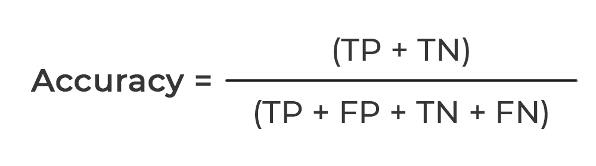

/ [Home](index.md)

# Accuracy

Accuracy is the fraction of predictions our model got right. Accuracy is defined as the number of correct predictions divided by the total number of predictions, multiplied by 100. Accuracy is a good metric to use if you are looking at a sample set that has closely balanced classes.

 

 

The percentage of instances where the model predicted the correct value. (Aka. Percent of cases correct in predicting a case would succeed or fail)

 

**Created by Sanjjushri**

---

 

[Accuracy - Santhosh Kannan](accuracy-santhosh.md)
