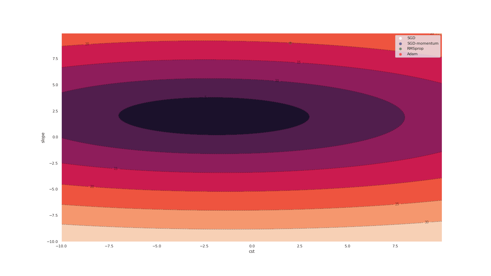
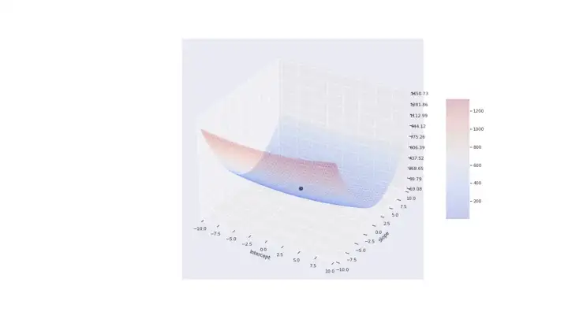
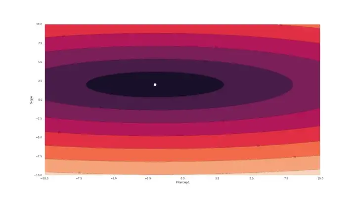
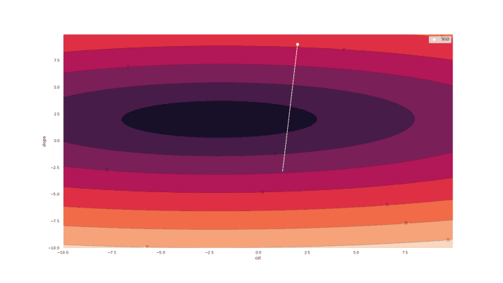
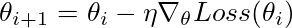
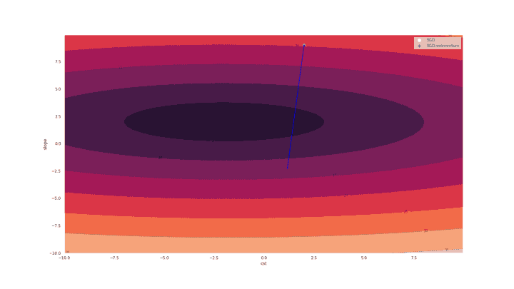
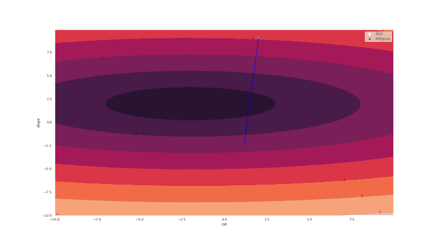
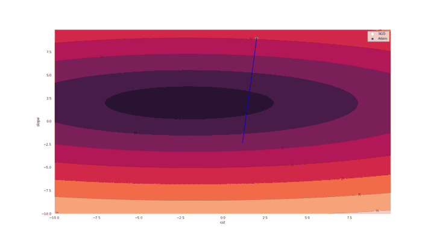

/ [Home](../index.md)

# A Visual Approach to Gradient Descent and other Optimization Algorithms

**Note:** Visualize the differences and similarities between gradient descent, gradient descent with momentum, RMSprop, and Adam

*Introduction*

If you are like me, equations do not speak for themselves. To understand them, I need to see what they do with a concrete example. In this blog post, I apply this visualization principle to popular optimization algorithms used in machine learning.

Nowadays, the Adam algorithm is a very popular choice. The Adam algorithm adds momentum and self-tuning of the learning rate to the plain-vanilla gradient descent algorithm. But what are momentum and self-tuning exactly?

Below is a visual preview of what these concepts refer to:


Linear Regression
To keep things simple, I use different optimization algorithms on the bivariate linear regression model:

y = a + bx

The variable y represents a quantity we try to predict/explain using another variable x. The unknown parameters are the intercept a and the slope b.

To fit the model to the data, we minimize the mean square of the difference between the model and the data, which can be compactly expressed as follows:

```
Loss(a,b)=1/m||y-a-bx||²
```

(assuming we have m observations and using the Euclidean norm)

By changing the value of a and b, we can hopefully improve the fit of the model to the data. With the bivariate regression model, a good thing is that we can plot the value of the loss function as a function of the unknown parameters a and b. Below is a surface plot of the loss function, with the black dot representing the minimum of the loss.



We can also visualize the loss function using a contour plot, where the lines are level sets (points such that Loss(a,b) = constant). Below, the white point represents the minimum of the loss function.



*Gradient Descent*

The plain-vanilla gradient descent algorithm consists in taking a step of size η in the direction of the steepest descent, which is given by the opposite value of the gradient. Mathematically, the update rule looks like:


In the next plot, I show one trajectory implied by the gradient descent algorithm. Points represent values of a and b across iterations, while arrows are gradients of the loss function, telling us where to move in the next iteration.

A key feature is that the gradient descent algorithm might create some oscillations between level sets. In a perfect world, we would like instead to move smoothly in the direction of the minimum. As we will see, adding momentum is one way to smooth the trajectory toward the minimum value.



*Gradient Descent with Momentum*

Momentum refers to the tendency of moving objects to continue moving in the same direction. In practice, we can add momentum to gradient descent by taking into consideration previous values of the gradient. This can be done as follows:



The higher the value for γ, the more past values of the gradient are taken into consideration in the current update.

In the next plot, I show the trajectories implied by the gradient descent algorithm with (in blue) and without momentum (in white).

Momentum reduces the fluctuations along the value of the slope coefficient. The big swings up and down tend to cancel out once the averaging effects of momentum start to kick in. As a result, with momentum we move faster in the direction of the true value.




*RMSprop*
Momentum is a nice twist to gradient descent. Another line of improvement consists in introducing a learning rate that is tailored to each parameter (in our example: one learning rate for the slope, one learning rate for the intercept).

But how to choose such a coefficient-specific learning rate? Note that the previous plots show that the gradient does not necessarily point toward the minimum. At least not during the first iterations.

Intuitively, we would like to give less weight to the moves in the up/down direction, and more weight to the moves in the left/right direction. The RMSprop updating rule embeds this desired property:

The first line just defines g to the be the gradient of the loss function. The second line says that we calculate a running average of the square of the gradient. In third line, we take a step in the direction given by the gradient, but rescaled by the square root of the running average of past gradients.

In our example, because the square of the gradient tends to be large for the slope coefficient, so we take small steps in that direction. The opposite is true for the intercept coefficient (small values, large moves).



*Adams*
The Adam optimization algorithm has momentum, as well as the adaptive learning rate of RMSprop. Below is almost what Adam does:


The updating rule is very similar to one of RMSprop. The key difference is momentum: the direction of change is given by a running average of the past gradient.

The actual Adam updating rule uses “bias-corrected” value for m and v. In the first step, Adam initialize m and v to be zero. To correct for the initialization bias, the authors suggest to use reweighed versions of m and v:

Below, we see that the trajectory induced by Adam is somewhat similar to the one given by RMSprop, but with a slower start.



*The master plot*
The next plot shows the trajectories induced by the four optimization algorithms described above.

Key results are as follows:

* Gradient descent with momentum has less fluctuations than gradient descent without momentum.
* Adam and RMSprop take a different route, moving slower in the slope dimension and faster in the intercept dimension.
* As expected, Adam displays some momentum: while RMSprop starts turning left towards the minimum, Adam has a harder time to turn because of the accumulated momentum.


Below is the same graph, but in 3d:


*Conclusion*
In this blog post, my aim was for the reader to build an intuitive understanding of key optimization algorithms used in machine learning.

Below you can find the code that was used to produce the graphs used in this post. Do not hesitate to modify the learning rate and/or the loss function to see how this affects the different trajectories.

---


*Code (Python)*
The following block of code loads dependencies, defines the loss function and does plots the loss function (surface and contour plots):

```
# A. Dependencies 
%matplotlib inline
import matplotlib.pyplot as plt
from matplotlib import cm
from matplotlib.ticker import LinearLocator

plot_scale = 1.25
plt.rcParams["figure.figsize"] = (plot_scale*16, plot_scale*9)

import numpy as np
import pandas as pd
import random
import scipy.stats
from itertools import product
import os
import time
from math import sqrt
import seaborn as sns; sns.set()
from tqdm import tqdm as tqdm       
import datetime
from typing import Tuple
class Vector: pass
from scipy.stats import norm
import torch
from torch import nn
from torch.utils.data import DataLoader
import copy
import matplotlib.ticker as mtick
from torchcontrib.optim import SWA
from numpy import linalg as LA
import imageio as io #create gif

# B. Create OLS problem
b0 = -2.0 #intercept
b1 = 2.0 #slope
beta_true = (b0 , b1)
nb_vals = 1000 #number draws

mu, sigma = 0, 0.001 # mean and standard deviation
shocks = np.random.normal(mu, sigma, nb_vals)

# covariate
x0 = np.ones(nb_vals) #cst
x1 = np.random.uniform(-5, 5, nb_vals)
X = np.column_stack((x0, x1))

# Data
y = b0*x0 + b1*x1 + shocks

A = np.linalg.inv(np.matmul(np.transpose(X), X))
B = np.matmul(np.transpose(X), y)
np.matmul(A, B)

X_torch = torch.from_numpy(X).float()
y_torch = torch.from_numpy(y).float()

# Loss function and gradient (for plotting)
def loss_function_OLS(beta_hat, X, y):
    loss = (1/len(y))*np.sum(np.square(y - np.matmul(X, beta_hat)))
    return loss

def grad_OLS(beta_hat, X, y):
    mse = loss_function_OLS(beta_hat, X, y)
    G = (2/len(y))*np.matmul(np.transpose(X), np.matmul(X, beta_hat) - y) 
    return G, mse

# C. Plots for the loss function
min_val=-10.0
max_val=10.0

delta_grid=0.05
x_grid = np.arange(min_val, max_val, delta_grid)
y_grid = np.arange(min_val, max_val, delta_grid)
X_grid, Y_grid = np.meshgrid(x_grid, y_grid)

Z = np.zeros((len(x_grid), len(y_grid)))

for (y_index, y_value) in enumerate(y_grid):
    for (x_index, x_value) in enumerate(x_grid):
        beta_local = np.array((x_value, y_value))
        Z[y_index, x_index] = loss_function_OLS(beta_local, X, y)

fig, ax = plt.subplots(subplot_kw={"projection": "3d"})

# Plot the surface.
surf = ax.plot_surface(X_grid, Y_grid, Z, cmap=cm.coolwarm, linewidth=0, antialiased=False, alpha=0.2)

ax.zaxis.set_major_locator(LinearLocator(10))
ax.zaxis.set_major_formatter('{x:.02f}')

ax.scatter([b0], [b1], [true_value], s=100, c='black', linewidth=0.5)

x_min = -10
x_max = -x_min
y_min = x_min
y_max = -x_min

plt.xlim(x_min, x_max)
plt.ylim(y_min, y_max)

plt.ylabel('Slope')
plt.xlabel('Intercept')

fig.colorbar(surf, shrink=0.5, aspect=5)

filename = "IMGS/surface_loss.png"
plt.savefig(filename)
plt.show()

# Plot contour
cp = plt.contour(X_grid, Y_grid, np.sqrt(Z), colors='black', linestyles='dashed', linewidths=1, alpha=0.5)
plt.clabel(cp, inline=1, fontsize=10)
cp = plt.contourf(X_grid, Y_grid, np.sqrt(Z))
plt.scatter([b0], [b1], s=100, c='white', linewidth=0.5)
plt.ylabel('Slope')
plt.xlabel('Intercept')
plt.xlim(x_min, x_max)
plt.ylim(y_min, y_max)

filename = "IMGS/countour_loss.png"
plt.savefig(filename)
plt.show()
```

The next block of code defines functions so that we can solve the OLS problem using Pytorch. Here, using Pytroch is an overkill, but the advantage is that we can use the pre-coded minimization algorithms (torch.optim):


```
def loss_OLS(model, y, X): 
    """
    Loss function for OLS
    """
    R_squared = torch.square(y.unsqueeze(1) - model(X[:,1].unsqueeze(1)))
    return torch.mean(R_squared)

def set_initial_values(model, w, b):
    """
    Function to set the weight and bias to certain values
    """
    with torch.no_grad():
        for name, param in model.named_parameters():
            if 'linear_relu_stack.0.weight' in name:
                param.copy_(torch.tensor([w]))
            elif 'linear_relu_stack.0.bias' in name:
                param.copy_(torch.tensor([b]))
    
def create_optimizer(model, optimizer_name, lr, momentum):
    """
    Function to define an optimizer
    """
    if optimizer_name == "Adam":
        optimizer = torch.optim.Adam(model.parameters(), lr) 
    elif optimizer_name == "SGD":
        optimizer = torch.optim.SGD(model.parameters(), lr)
    elif optimizer_name == "SGD-momentum":
        optimizer = torch.optim.SGD(model.parameters(), lr, momentum)
    elif optimizer_name == "Adadelta":
        optimizer = torch.optim.Adadelta(model.parameters(), lr)
    elif optimizer_name == "RMSprop":
        optimizer = torch.optim.RMSprop(model.parameters(), lr)
    else:
        raise("optimizer unknown")
    return optimizer

def train_model(optimizer_name, initial_guess, true_value, lr, momentum):
    """
    Function to train a model
    """
    # initialize a model
    model = NeuralNetwork().to(device)
    #print(model)

    set_initial_values(model, initial_guess[0], initial_guess[1])

    for name, param in model.named_parameters():
        print(name, param)

    model.train()

    nb_epochs = 100
    use_scheduler = False
    freq_scheduler = 100
    freq_gamma = 0.95
    true_b = torch.tensor([true_value[0], true_value[1]])

    print(optimizer_name)
    optimizer = create_optimizer(model, optimizer_name, lr, momentum)

    # A LOOP OVER EACH POINT OF THE CURRENT GRID
    # store mean loss by epoch
    scheduler = torch.optim.lr_scheduler.ExponentialLR(optimizer, gamma=freq_gamma)
    loss_epochs = torch.zeros(nb_epochs)
    list_perc_abs_error = [] #store abs value percentage error
    list_perc_abs_error_i = [] #store index i
    list_perc_abs_error_loss = [] #store loss
    list_norm_gradient = [] #store norm of gradient
    list_gradient = [] #store the gradient itself
    list_beta = [] #store parameters

    calculate_variance_grad = False 

    freq_loss = 1
    freq_display = 10

    for i in tqdm(range(0, nb_epochs)):

        optimizer.zero_grad()

        # Calculate the loss
        loss = loss_OLS(model, y_torch, X_torch)
        loss_epochs[[i]] = float(loss.item())

        # Store the loss
        with torch.no_grad():
            # Extract weight and bias
            b_current = np.array([k.item() for k in model.parameters()])
            b_current_ordered = np.array((b_current[1], b_current[0])) #reorder (bias, weight)
        list_beta.append(b_current_ordered)
        perc_abs_error = np.sum(np.square(b_current_ordered - true_b.detach().numpy()))
        list_perc_abs_error.append(np.median(perc_abs_error))
        list_perc_abs_error_i.append(i)
        list_perc_abs_error_loss.append(float(loss.item()))

        # Calculate the gradient
        loss.backward()

        # Store the gradient
        with torch.no_grad():
            grad = np.zeros(2)
            for (index_p, p) in enumerate(model.parameters()):
                grad[index_p] = p.grad.detach().data
            #reorder (bias, weight)
            grad_ordered = np.array((grad[1], grad[0]))
            list_gradient.append(grad_ordered)

        # Take a gradient steps
        optimizer.step()

        if i % freq_display == 0: #Monitor the loss
            loss, current = float(loss.item()), i
            print(f"loss: {loss:>7f}, percentage abs. error {list_perc_abs_error[-1]:>7f}, [{current:>5d}/{nb_epochs:>5d}]")
        if (i % freq_scheduler == 0) & (i != 0) & (use_scheduler == True):
            scheduler.step()
            print("i : {}. Decreasing learning rate: {}".format(i, scheduler.get_last_lr()))

    return model, list_beta, list_gradient 

def create_gif(filenames, output_name):
    """
    Function to create a gif, using a list of images
    """
    with io.get_writer(output_name, mode='I') as writer:
        for filename in filenames:
            image = io.imread(filename)
            writer.append_data(image)

    # Remove files, except the final one
    for index_file, filename in enumerate(set(filenames)):
        if index_file < len(filenames) - 1:
            os.remove(filename)
        
# Define a neural network with a single node  
# Get cpu or gpu device for training.
device = "cuda" if torch.cuda.is_available() else "cpu"
print(f"Using {device} device")

nb_nodes = 1
# Define model
class NeuralNetwork(nn.Module):
    def __init__(self):
        super(NeuralNetwork, self).__init__()
        self.flatten = nn.Flatten()
        self.linear_relu_stack = nn.Sequential(
            nn.Linear(1, nb_nodes)
        )

    def forward(self, x):
        out = self.linear_relu_stack(x)
        return out
```

Minimization using gradient descent:

```
lr = 0.10 #learning rate
alpha = lr
init = (9.0, 2.0) #initial guess
true_value = [-2.0, 2.0] #true value for parameters

# I. Solve
optimizer_name = "SGD"
momentum = 0.0
model_SGD, list_beta_SGD, list_gradient_SGD = train_model(optimizer_name , init, true_value, lr, momentum)

# II. Create gif
filenames = []
zoom=1 #to increase/decrease the length of vectors on the plot
max_index_plot = 30 #when to stop plotting

# Plot contour
cp = plt.contour(X_grid, Y_grid, np.sqrt(Z), colors='black', linestyles='dashed', linewidths=1, alpha=0.5)
plt.clabel(cp, inline=1, fontsize=10)
cp = plt.contourf(X_grid, Y_grid, np.sqrt(Z))

# Add points and arrows
for (index, (bb, grad)) in enumerate(zip(list_beta_SGD, list_gradient_SGD)):
    if index>max_index_plot:
        break
    if index == 0:
        label_1 = "SGD"
    else:
        label_1 = ""
    # Point
    plt.scatter([bb[0]], [bb[1]], s=10, c='white', linewidth=5.0, label=label_1)
    # Arrows
    plt.arrow(bb[0], bb[1], - zoom * alpha* grad[0], - zoom * alpha * grad[1], color='white')
    # Add arrows for gradient:
    # create file name and append it to a list
    filename = "IMGS/path_SGD_{}.png".format(index)
    filenames.append(filename)
    plt.xlabel('cst')
    plt.ylabel('slope')
    plt.legend()
    plt.savefig(filename)

filename = "IMGS/path_SGD.png"
plt.savefig(filename)
create_gif(filenames, "SGD.gif")
plt.show()
```

Minimization using gradient descent with momentum:

```
optimizer_name = "SGD-momentum"
momentum = 0.2

# I. Solve
model_momentum, list_beta_momentum, list_gradient_momentum = train_model(optimizer_name , init, true_value, lr, momentum)

# II. Create gif
filenames = []
zoom=1 #to increase/decrease the length of vectors on the plot
max_index_plot = 30 #when to stop plotting

# Plot contour
cp = plt.contour(X_grid, Y_grid, np.sqrt(Z), colors='black', linestyles='dashed', linewidths=1, alpha=0.5)
plt.clabel(cp, inline=1, fontsize=10)
cp = plt.contourf(X_grid, Y_grid, np.sqrt(Z))

# Add points and arrows
for (index, (bb, grad, bb_momentum, grad_momentum)) in enumerate(zip(list_beta_SGD, list_gradient_SGD, list_beta_momentum, list_gradient_momentum)):
    if index>max_index_plot:
        break
    if index == 0:
        label_1 = "SGD"
        label_2 = "SGD-momentum"
    else:
        label_1 = ""
        label_2 = ""
    # Point
    plt.scatter([bb[0]], [bb[1]], s=10, c='white', linewidth=5.0, label=label_1)
    plt.scatter([bb_momentum[0]], [bb_momentum[1]], s=10, c='blue', linewidth=5.0, alpha=0.5, label=label_2)
    # Arrows
    #plt.arrow(bb_momentum[0], bb_momentum[1], - zoom * alpha* grad[0], - zoom * alpha * grad[1], color='white')
    plt.arrow(bb_momentum[0], bb_momentum[1], - zoom * alpha* grad_momentum[0], - zoom * alpha * grad_momentum[1], color="blue")
    # create file name and append it to a list
    filename = "IMGS/path_SGD_momentum_{}.png".format(index)
    filenames.append(filename)
    plt.xlabel('cst')
    plt.ylabel('slope')
    plt.legend()
    plt.savefig(filename)

filename = "IMGS/path_SGD_momentum.png"
plt.savefig(filename)
create_gif(filenames, "SGD_momentum.gif")
plt.show()
```

Minimization using RMSprop:

```
optimizer_name = "RMSprop"
momentum = 0.0
# I. Solve
model_RMSprop, list_beta_RMSprop, list_gradient_RMSprop = train_model(optimizer_name , init, true_value, lr, momentum)

# II. Create gif
filenames = []
zoom=1 #to increase/decrease the length of vectors on the plot
max_index_plot = 30 #when to stop plotting

# Plot contour
cp = plt.contour(X_grid, Y_grid, np.sqrt(Z), colors='black', linestyles='dashed', linewidths=1, alpha=0.5)
plt.clabel(cp, inline=1, fontsize=10)
cp = plt.contourf(X_grid, Y_grid, np.sqrt(Z))

# Add points and arrows
for (index, (bb, grad, bb_RMSprop, grad_RMSprop)) in enumerate(zip(list_beta_SGD, list_gradient_SGD, list_beta_RMSprop, list_gradient_RMSprop)):
    if index>max_index_plot:
        break
    if index == 0:
        label_1 = "SGD"
        label_2 = "RMSprop"
    else:
        label_1 = ""
        label_2 = ""
    # Point
    plt.scatter([bb[0]], [bb[1]], s=10, c='white', linewidth=5.0, label=label_1)
    plt.scatter([bb_RMSprop[0]], [bb_RMSprop[1]], s=10, c='blue', linewidth=5.0, alpha=0.5, label=label_2)
    # Arrows
    plt.arrow(bb_RMSprop[0], bb_RMSprop[1], - zoom * alpha* grad_RMSprop[0], - zoom * alpha * grad_RMSprop[1], color="blue")
    # create file name and append it to a list
    filename = "IMGS/path_RMSprop_{}.png".format(index)
    filenames.append(filename)
    plt.xlabel('cst')
    plt.ylabel('slope')
    plt.legend()
    plt.savefig(filename)

filename = "IMGS/path_RMSprop.png"
plt.savefig(filename)
create_gif(filenames, "RMSprop.gif")
plt.show()
```

Minimization using Adam:

```
optimizer_name = "Adam"
momentum = 0.0

# I. Solve
model_Adam, list_beta_Adam, list_gradient_Adam = train_model(optimizer_name , init, true_value, lr, momentum)

# II. Create gif
filenames = []
zoom=1 #to increase/decrease the length of vectors on the plot
max_index_plot = 30 #when to stop plotting

# Plot contour
cp = plt.contour(X_grid, Y_grid, np.sqrt(Z), colors='black', linestyles='dashed', linewidths=1, alpha=0.5)
plt.clabel(cp, inline=1, fontsize=10)
cp = plt.contourf(X_grid, Y_grid, np.sqrt(Z))

# Add points and arrows
for (index, (bb, grad, bb_Adam, grad_Adam)) in enumerate(zip(list_beta_SGD, list_gradient_SGD, list_beta_Adam, list_gradient_Adam)):
    if index>max_index_plot:
        break
    if index == 0:
        label_1 = "SGD"
        label_2 = "Adam"
    else:
        label_1 = ""
        label_2 = ""
    # Point
    plt.scatter([bb[0]], [bb[1]], s=10, c='white', linewidth=5.0, label=label_1)
    plt.scatter([bb_Adam[0]], [bb_Adam[1]], s=10, c='blue', linewidth=5.0, alpha=0.5, label=label_2)
    # Arrows
    plt.arrow(bb_Adam[0], bb_Adam[1], - zoom * alpha* grad_Adam[0], - zoom * alpha * grad_Adam[1], color="blue")
    # create file name and append it to a list
    filename = "IMGS/path_Adam_{}.png".format(index)
    filenames.append(filename)
    plt.xlabel('cst')
    plt.ylabel('slope')
    plt.legend()
    plt.savefig(filename)

filename = "IMGS/path_Adam.png"
plt.savefig(filename)
create_gif(filenames, "Adam.gif")
plt.show()
```

Creating the “Master plot” with the four trajectories together:

```
max_iter = 100
filenames = []
cp = plt.contour(X_grid, Y_grid, np.sqrt(Z), colors='black', linestyles='dashed', linewidths=1, alpha=0.5)
plt.clabel(cp, inline=1, fontsize=10)
cp = plt.contourf(X_grid, Y_grid, np.sqrt(Z))
colors = ["white", "blue", "green", "red"]

# Add points:
for (index, (bb_SGD, bb_momentum, bb_RMSprop, bb_Adam)) in enumerate(zip(list_beta_SGD, list_beta_momentum, list_beta_RMSprop, list_beta_Adam)):
    if index % freq_plot == 0:
        if index == 0:
            label_1 = "SGD"
            label_2 = "SGD-momentum"
            label_3 = "RMSprop"
            label_4 = "Adam"
        else:
            label_1, label_2, label_3, label_4 = "", "", "", ""
        plt.scatter([bb_SGD[0]], [bb_SGD[1]], s=10, linewidth=5.0, label=label_1, color=colors[0])
        plt.scatter([bb_momentum[0]], [bb_momentum[1]], s=10, linewidth=5.0, alpha=0.5, label=label_2, color=colors[1])
        plt.scatter([bb_RMSprop[0]], [bb_RMSprop[1]], s=10, linewidth=5.0, alpha=0.5, label=label_3, color=colors[2])
        plt.scatter([bb_Adam[0]], [bb_Adam[1]], s=10, linewidth=5.0, alpha=0.5, label=label_4, color=colors[3])
    if index > max_iter:
        break
    # create file name and append it to a list
    filename = "IMGS/img_{}.png".format(index)
    filenames.append(filename)
    # Add arrows for gradient:
    plt.xlabel('cst')
    plt.ylabel('slope')
    plt.legend()

    # save frame
    plt.savefig(filename)
    #plt.close()# build gif
    
create_gif(filenames, "compare_optim_algos.gif")
```

Creating the 3D “Master plot”:

```
max_iter = 100
fig, ax = plt.subplots(subplot_kw={"projection": "3d"})

# Plot the surface.
surf = ax.plot_surface(X_grid, Y_grid, Z, cmap=cm.coolwarm, linewidth=0, antialiased=False, alpha=0.1)
ax.zaxis.set_major_locator(LinearLocator(10))
ax.zaxis.set_major_formatter('{x:.02f}')
ax.view_init(60, 35)

colors = ["black", "blue", "green", "red"]
x_min = -10
x_max = -x_min
y_min = x_min
y_max = -x_min

# Add points:
for (index, (bb_SGD, bb_momentum, bb_RMSprop, bb_Adam)) in enumerate(zip(list_beta_SGD, list_beta_momentum, list_beta_RMSprop, list_beta_Adam)):
    if index == 0:
        label_1 = "SGD"
        label_2 = "SGD-momentum"
        label_3 = "RMSprop"
        label_4 = "Adam"
    else:
        label_1, label_2, label_3, label_4 = "", "", "", ""
    ax.scatter([bb_SGD[0]], [bb_SGD[1]], s=100, linewidth=5.0, label=label_1, color=colors[0])
    ax.scatter([bb_momentum[0]], [bb_momentum[1]], s=100, linewidth=5.0, alpha=0.5, label=label_2, color=colors[1])
    ax.scatter([bb_RMSprop[0]], [bb_RMSprop[1]], s=100, linewidth=5.0, alpha=0.5, label=label_3, color=colors[2])
    ax.scatter([bb_Adam[0]], [bb_Adam[1]], s=100, linewidth=5.0, alpha=0.5, label=label_4, color=colors[3])
    if index > max_iter:
        break
    # create file name and append it to a list
    filename = "IMGS/img_{}.png".format(index)
    filenames.append(filename)
    # Add arrows for gradient:
    plt.xlim(x_min, x_max)
    plt.ylim(y_min, y_max)
    plt.ylabel('Slope')
    plt.xlabel('Intercept')
    plt.legend()
    # save frame
    plt.savefig(filename)

filename = "IMGS/surface_loss.png"
plt.savefig(filename)
plt.show()

create_gif(filenames, "surface_compare_optim_algos.gif")
```

References
* Ruder, Sebastian. “An overview of gradient descent optimization algorithms.” arXiv preprint arXiv:1609.04747 (2016)
* Sutskever, Ilya, et al. “On the importance of initialization and momentum in deep learning.” International conference on machine learning. PMLR, 2013.


https://towardsdatascience.com/a-visual-approach-to-gradient-descent-and-other-optimization-algorithms-c82f45b7fc87