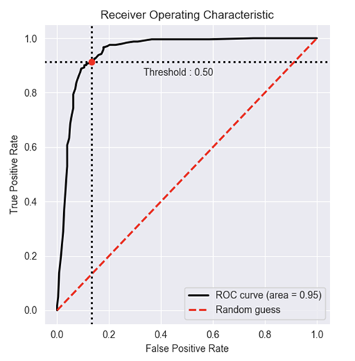

/ [Home](index.md)

# AUC-ROC Curve

The Receiver Operator Characteristic (ROC) curve is an evaluation metric for binary classification problems. It is a probability curve that plots the TPR against FPR at various threshold values and essentially separates the ‘signal’ from the ‘noise’. The Area Under the Curve (AUC) is the measure of the ability of a classifier to distinguish between classes and is used as a summary of the ROC curve.

TPR/Recall/Sensitivity is ratio of positive examples that are correctly identified and FPR is the ratio of negative examples that are incorrectly classified.

When AUC = 1, then the classifier is able to perfectly distinguish between all the Positive and the Negative class points correctly. If, however, the AUC had been 0, then the classifier would be predicting all Negatives as Positives, and all Positives as Negatives.

 

 

ROC is nothing but the plot between TPR and FPR across all possible thresholds and AUC is the entire area beneath this ROC curve.

In a ROC curve, a higher X-axis value indicates a higher number of False positives than True negatives. While a higher Y-axis value indicates a higher number of True positives than False negatives. So, the choice of the threshold depends on the ability to balance between False positives and False negatives.

AUC measures how well a model is able to distinguish between classes