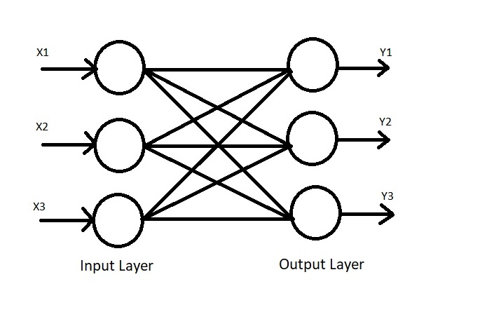

/ [Home](index.md)

# Auto-Associative Neural Networks

Auto-Associative Neural Networks are used to retrieve complete data from only a small part of available data. In other words, it can recognize and give the same output even if the input has been slightly modified or has missing data. They contain the same number of input as well as output nodes, and work on bipolar data(-1 and 1) and not binary data(0 and 1).

 

**Created by Santhosh Kannan**

---

 
