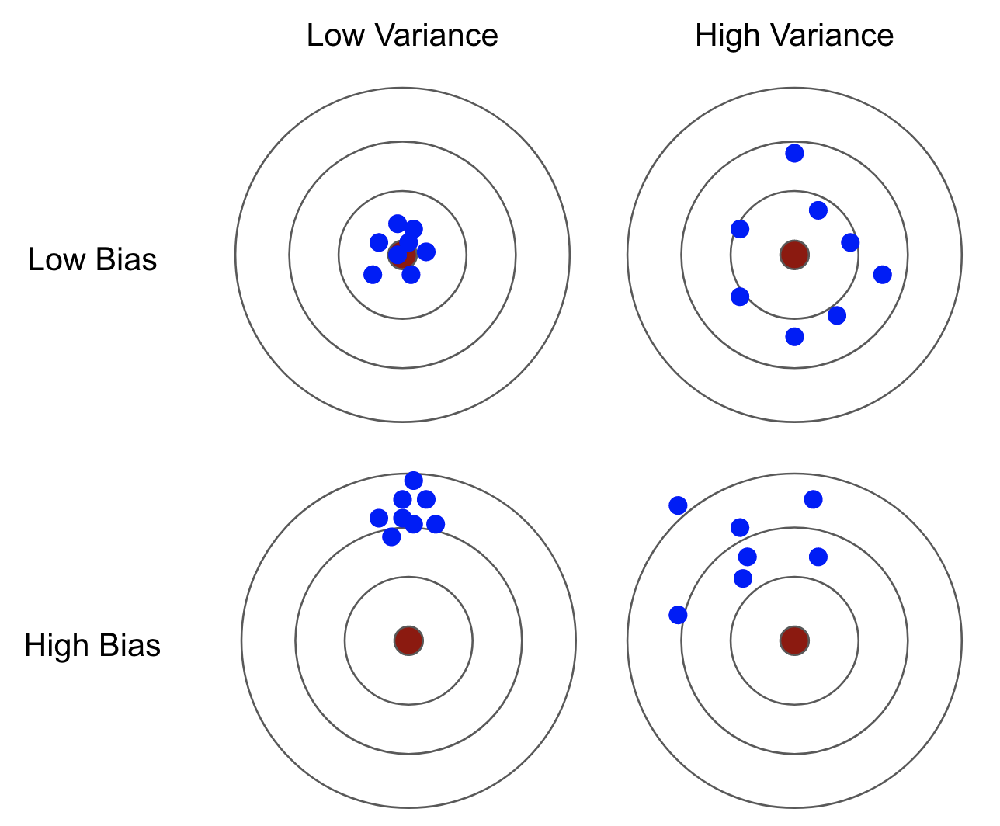

/ [Home](index.md)

# Bias

 

 

The bias will express how well a certain machine learning model fits a particular dataset. The bias of a specific machine learning model trained on a specific dataset describes how well this machine learning model can capture the relationship between the features and the targets.

* large training error -> large bias
* small training error -> small bias

When the Bias is high, assumptions made by our model are too basic, the model can’t capture the important features of our data. This means that our model hasn’t captured patterns in the training data and hence cannot perform well on the testing data too.

 

 

Fixing High Bias
* Adding more input features will help improve the data to fit better.
* Add more polynomial features to improve the complexity of the model.
* Decrease the regularization term to have a balance between bias and variance.