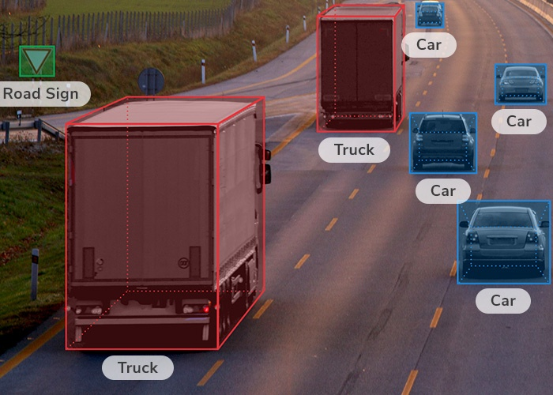

/ [Home](index.md)

# Bounding Box

A bounding box is a rectangle that surrounds an object, that specifies its position, class and confidence. Bounding boxes are mainly used in the task of object detection, where the aim is identifying the position and type of multiple objects in the image.

**Created by Santhosh Kannan**

---

 