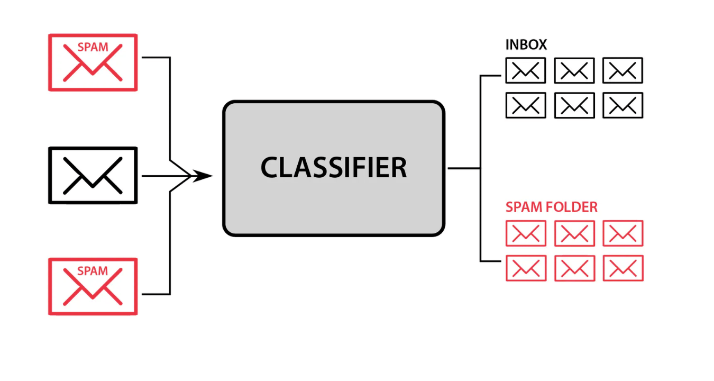

/ [Home](index.md)

# Classification

Classification is a process of categorizing a given set of data into classes, It can be performed on both structured or unstructured data. Classification algorithms used in machine learning utilize input training data for the purpose of predicting the likelihood or probability that the data that follows will fall into one of the predetermined categories. The aim of classification is to determine which category an observation belongs to, and this is done by understanding the relationship between the dependent variable and the independent variables
The classification process deal with the problems where the data can be divided into binary or multiple discrete labels. 

 

 