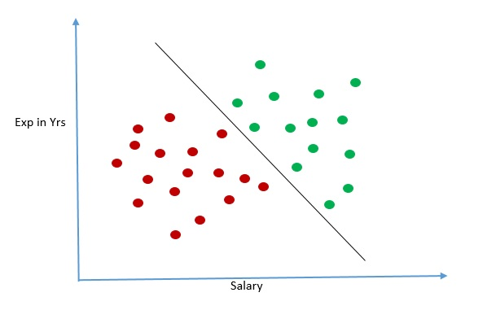

/ [Home](index.md)

# Decision Boundary

The set of hyper-planes used to classify data points into different classes in classification problems is called the decision boundary.

Examining decision boundary is a great way to learn how the training data we choose affects the performance and ability of our model to perform normally. Visualizing the decision boundary can show how sensitive models are for each datasets, which is a good way to understand how certain algorithms work, and their limitations on specific datasets.

 

**Created by Santhosh Kannan**

---

 
