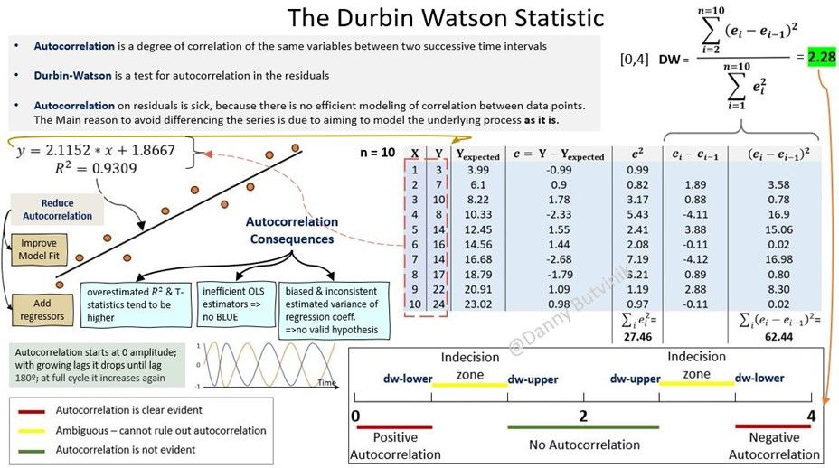

/ [Home](index.md)

# Durbin - Watson

 

In statistics, machine learning, and timeseries analysis, Durbin-Watson statistic tests autocorrelation in the residuals from a statistical regression analysis. Durbin-Watson's statistic will always have a value between 0 and 4.
 
·      0 < value < 2 indicate positive autocorrelation

·      2 <= value <= 4 indicate negative autocorrelation
 
Autocorrelation is the correlation between two observations at different points in a time series (aka serial correlation).
 
Autocorrelation can be a significant problem in analyzing historical data if one does not know to look out for it.
 
Moreover, the Durbin-Watson statistic can be utilized to assess the strength of the relationship between variables and for modeling the future relationship between them.
 
In this context, autocorrelation on the residuals is 'bad', because it means you are not modeling the correlation between data points well enough. The main reason why people don't differentiate the series is that they want to model the underlying process as it is.

Example:

Since stock prices tend not to change too radically from one day to another, the prices from one day to the next could potentially be highly correlated, even though there is little useful information in this observation.
 
To avoid autocorrelation issues, the easiest solution in finance is to simply convert a series of historical prices into a series of percentage-price changes from today.
 
Autocorrelation can show if there is a momentum factor associated with a stock. For example, if you know that a stock historically has a high positive autocorrelation value and you witnessed the stock making solid gains over the past several days, you might reasonably expect the movements over the upcoming several days (the leading time series) to match those of the lagging time series and to move upward.

 