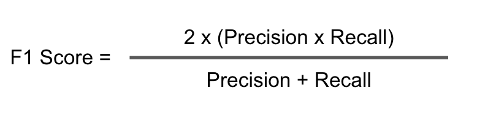

/ [Home](index.md)

# F1 Score

Precision and Recall are the two building blocks of the F1 score. The goal of the F1 score is to combine the precision and recall metrics into a single metric. At the same time, the F1 score has been designed to work well on imbalanced data. The F1 score is defined as the harmonic mean of precision and recall.

 

 

In the F1 score, we compute the average of precision and recall, it means that the F1 score gives equal weight to Precision and Recall:

* A model will obtain a high F1 score if both Precision and Recall are high.
* A model will obtain a low F1 score if both Precision and Recall are low.
* A model will obtain a medium F1 score if one of Precision and Recall is low and the other is high.

 F1 scores can range from 0 to 1, with 1 representing a model that perfectly classifies each observation into the correct class and 0 representing a model that is unable to classify any observation into the correct class.

 