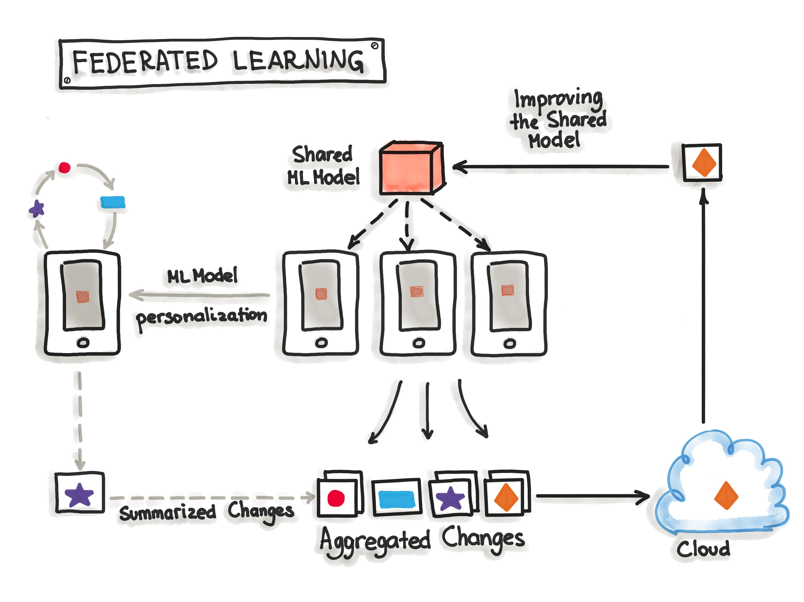

/ [Home](index.md)

# Federated Learning

Federated learning, also known as collaborative learning, is a machine learning technique that trains an algorithm across multiple decentralized devices or servers holding local data samples, without transferring them.

In federated learning, a device downloads the current model from a central server. The device then uses the examples stored on the device to make improvements to the model. The device then uploads the improved model, but not the training examples, to the central server, where they are aggregated with other updates to yield an improved global model. After the aggregation, the model updates computed by devices are no longer needed, and thus can be discarded.

 

**Created by Santhosh Kannan**

---

 
