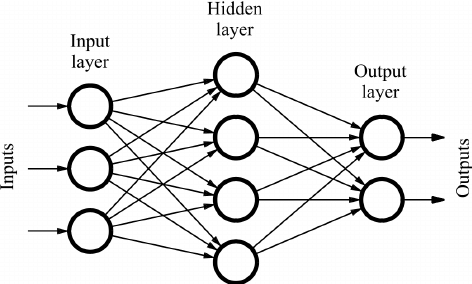

/ [Home](index.md)

# Feedforward Neural Network

A Feedforward Neural Network is a neural network in which the connections between nodes does not form a cycle. It is the simplest form of neural network as information is processed only in one direction and never backwards.

 

**Created by Santhosh Kannan**

---

 
