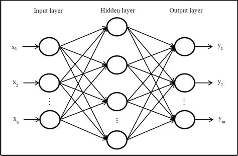

/ [Home](index.md)

# Feedforward propagation

Feedforward propagation is the process in which information flows from one layer to another layer in a sequential manner. In simple words, it is the flow of data through the neurons in neural networks. It helps to better understand the flow of data through the network and the relationship between the various layers.

 

**Created by Santhosh Kannan**

---

 
