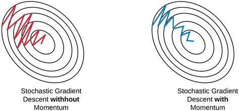

/ [Home](index.md)

# Gradient Descent with Momentum

Gradient Descent with Momentum or simply momentum is an extension of the gradient descent optimization technique. It is designed to accelerate the optimization process by reducing the number of function evaluations required to attain optimum value.

In this algorithm, the learning rate is not only dependent on the gradient of the current step, but also on the gradient of the previous step(s).

 

**Created by Santhosh Kannan**

---

 
