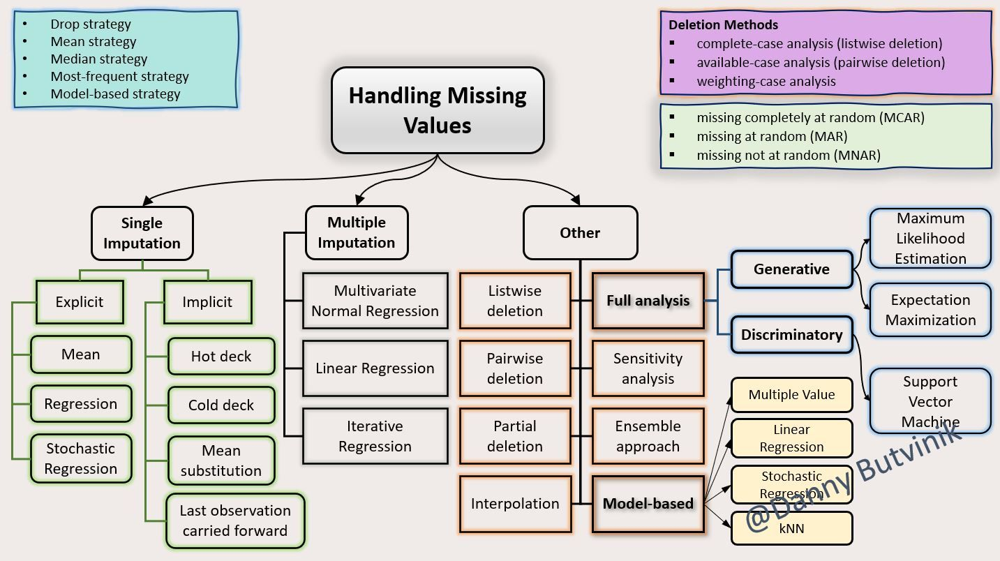

/ [Home](index.md)

# Handling Missing Data - Selected Techniques

·      reduction of statistical power, which refers to the probability that the test will reject the null hypothesis when it is false
 
·      lost data can cause bias in the estimation of parameters
 
·      it can reduce the representativeness of the samples
 
Understanding why data is missing is critical for correctly handling the remaining data.
 
For example, if values are missing completely at random, the data sample is likely still representative of the population. But if the values are missing systematically, the analysis may be biased.
 
However, if the dataset is relatively small, every data point counts. In these situations, a missing data point means losing valuable information.
 
Any way you look at it, missing data usually leads to unbalanced observations, skewed estimates, and in the worst cases, invalid conclusions.

 

 