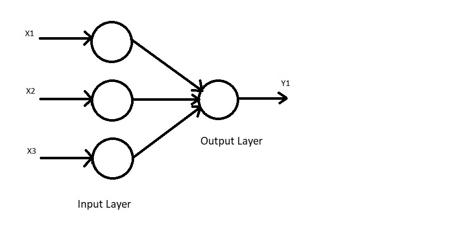

/ [Home](index.md)

# Hebbian Neural Networks

Hebbian Neural Networks, also known as Hebb Neural Networks, are one of the simplest forms of Artificial Neural Networks. They are feedforward Neural Networks, meaning that they are unsupervised, as there is no output label associated with the input data during the training process. It consists of one input layer (with multiple input neurons) and one output layer (with a singular output neuron). They work on bipolar data (-1 and 1) and NOT binary data (0 and 1).

This neural network is based on Hebb's rule which states that - If neuron 'A' frequently activates a nearby neuron 'B', then some growth process or metabolic change occurs which makes neuron 'A' more effective at activating neuron 'B'. The inverse also holds true.

 

**Created by Santhosh Kannan**

---

 
