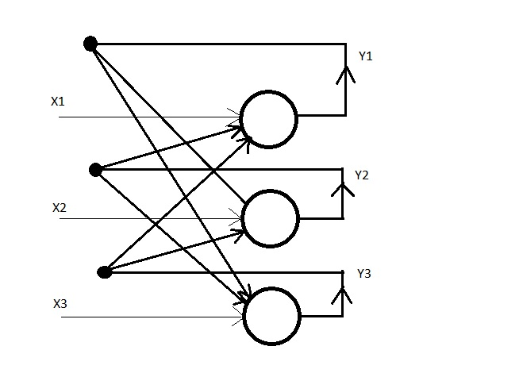

/ [Home](index.md)

# Hopfield Neural Networks

Hopfield Neural Networks are used to retrieve complete data from only a small part of available data. It is very similar to Auto-Associative Neural Networks with the major difference between the two being that there is an element of back propagation in Hopfield Neural Networks. The output of each neuron in the output layer is fed back to every other neuron in the output layer, except itself. Hopfield Neural Networks work with both bipolar(-1 and 1) as well as binary data(0 and 1).

 

**Created by Santhosh Kannan**

---

 
