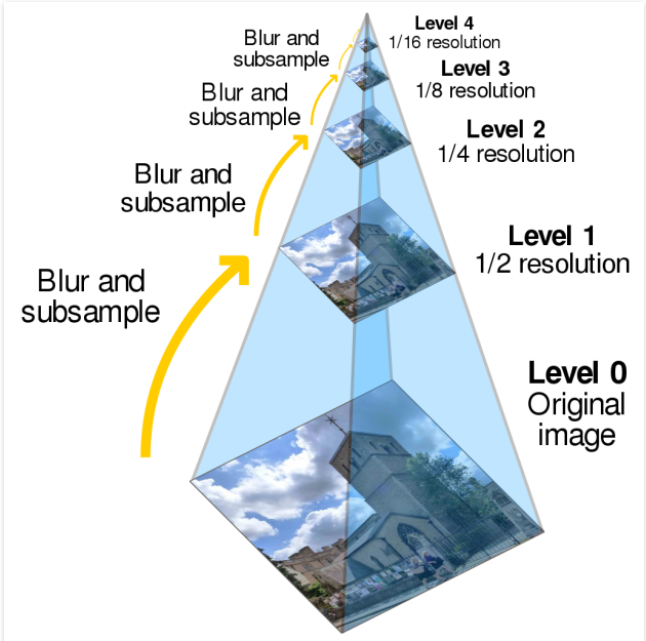

/ [Home](index.md)

# Image Pyramids

The representation of an image at several resolutions is referred to as an image pyramid. Image pyramids are based on the principle that evaluating the image at many resolutions can be advantageous if a picture contains both large and small objects of significance, in order to highlight hidden and undetected features in an image.

Applications

- Image compression
- Multi-Scale texture mapping
- Multi-focus composites
- Multi-scale detection
- Image blending
- Noise removal
- Hybrid images

 

**Created by Santhosh Kannan**

---

 
