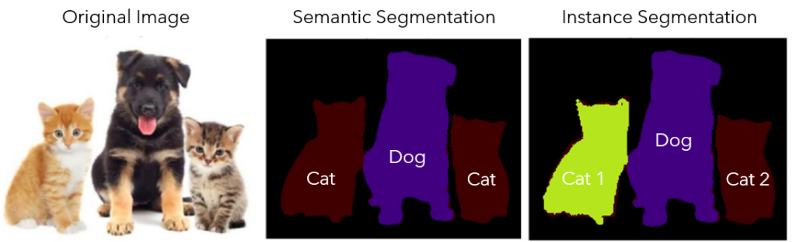

/ [Home](index.md)

# Instance Segmentation

Instance Segmentation is the technique of detecting, segmenting, and classifying every individual object in an image. It is a combination of semantic segmentation and object detection. Unlike semantic segmentation which does not distinguish multiple instances of same class, Instance segmentation distinguishes between different instances of the same class. Instance segmentation is usually done with the help of Mask R-CNN.

 

**Created by Santhosh Kannan**

---

 
