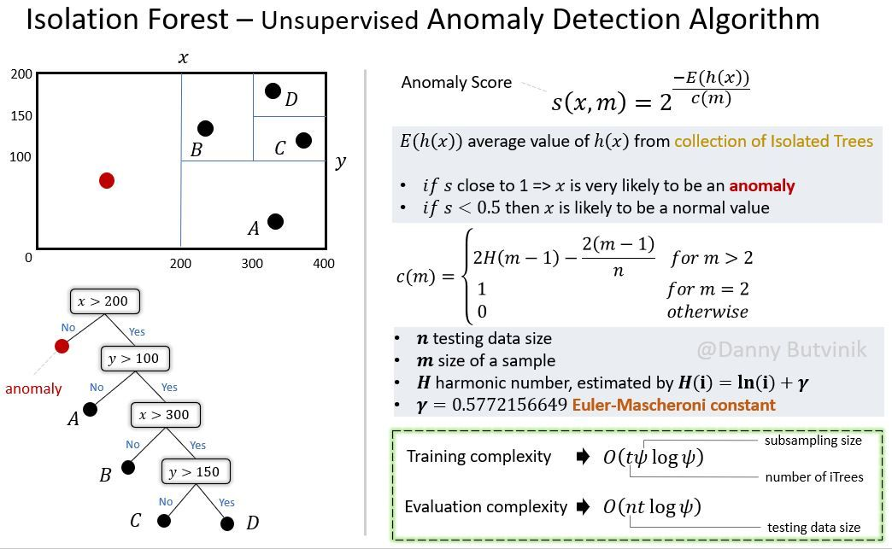

/ [Home](index.md)

# Isolation Forest

Content

 

In Data Science and Machine Learning, Isolation Forest is an anomaly detection algorithm. It detects anomalies using isolation rather than modeling the normal points.

In an Isolation Forest, randomly sub-sampled data is processed in a tree structure based on randomly selected features. The samples that travel deeper into the tree are less likely to be anomalies, as they require more cuts to isolate them.

Isolation forest introduces a different method that explicitly isolates anomalies using binary trees, demonstrating the possibility of a faster anomaly detector that targets anomalies without profiling all the normal instances.

The algorithm has a linear time complexity with a low constant and memory requirement, which works well with high-volume data.

 