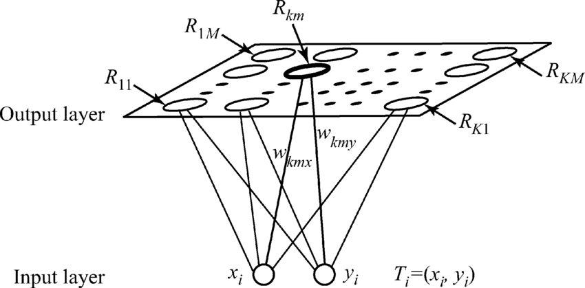

/ [Home](index.md)

# Kohonen's Neural Network

Kohonen's Neural Network is used to visualize extremely large datasets. It is done by dimensionally reducing the dataset, by grouping data into multiple clusters. All the elements in a cluster share similar characteristics and are referenced by a representative data point. Therefore, a large amount of data can be processed without making a large amount of references.

The neural network has an input layer and an output, but no hidden layers. Every neuron in the input layer is connected to every neuron in the output layer, thus giving rise to a fully interconnected neural network.

 

**Created by Santhosh Kannan**

---

 
