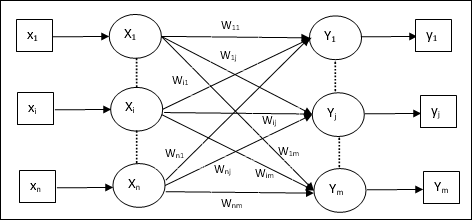

/ [Home](index.md)

# Learning Vector Quantization

The Learning Vector Quantization algorithm (or LVQ for short) is an artificial neural network algorithm that lets you choose how many training instances to hang onto and learns exactly what those instances should look like.
LVQ was developed and is best understood as a classification algorithm. It supports both binary (two-class) and multi-class classification problems. LVQ has two layers, one is the Input layer and the other one is the Output layer. The architecture of the Learning Vector Quantization with the number of classes in an input data and n number of input features. LVQ was is related to the k-nearest neighbor algorithm.

 

### Architecture:

 

* x = training vector (x1,...,xi,...,xn)

* T = class for training vector x

* wj = weight vector for jth output unit

* Cj = class associated with the jth output unit