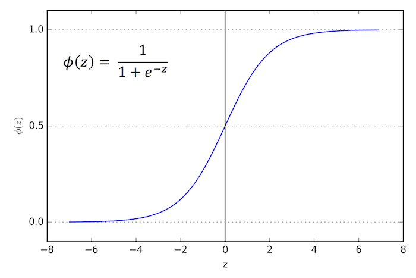

/ [Home](index.md)

# Logistic Function

Logistic function is an activation function that maps the entire number line into a small range such as between 0 and 1 or -1 and 1. It is used to convert a real value into a probability. A Logistic function is usually placed as the last layer of a machine learning model to convert the output into probability which is easy to interpret. Logistic regression works on the principle of logistic function.

Advantages

- Smooth Gradient
- normalizes the output of a neuron

Disadvantages

- Vanishing gradient - only little change in predictions for large values
- Computationally expensive
- Not zero centered

 

**Created by Santhosh Kannan**

---

 
