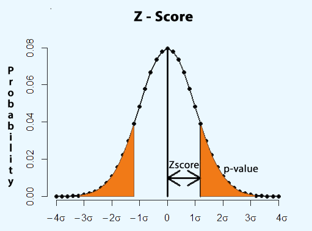
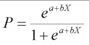
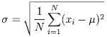
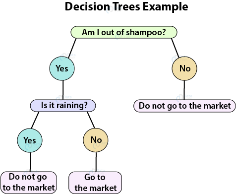
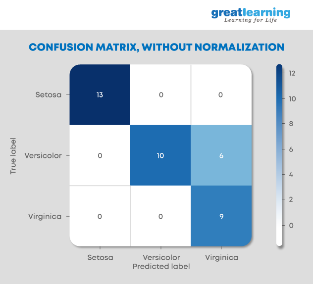
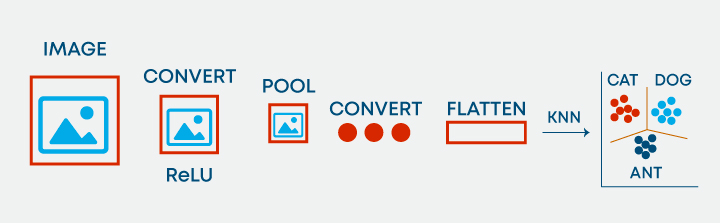
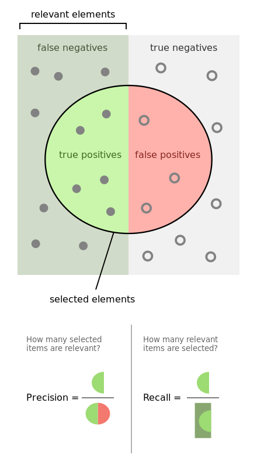
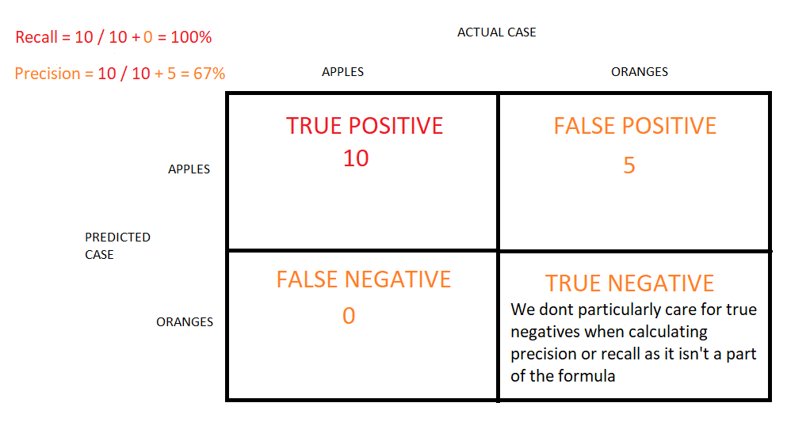

/ [Home](index.md)

# ML Interview Questions

1) What is Machine learning?

    - Machine learning is a branch of computer science which deals with system programming in order to automatically learn and improve with experience. For example: Robots are programed so that they can perform the task based on data they gather from sensors. It automatically learns programs from data.

2) Mention the difference between Data Mining and Machine learning?

   - Machine learning relates with the study, design and development of the algorithms that give computers the capability to learn without being explicitly programmed. While, data mining can be defined as the process in which the unstructured data tries to extract knowledge or unknown interesting patterns. During this process machine, learning algorithms are used.

3) What is ‘Overfitting’ in Machine learning?

     - In machine learning, when a statistical model describes random error or noise instead of underlying relationship ‘overfitting’ occurs. When a model is excessively complex, overfitting is normally observed, because of having too many parameters with respect to the number of training data types. The model exhibits poor performance which has been overfit.

4) Why overfitting happens?

     - The possibility of overfitting exists as the criteria used for training the model is not the same as the criteria used to judge the efficacy of a model.

5) What is inductive machine learning?

     - The inductive machine learning involves the process of learning by examples, where a system, from a set of observed instances tries to induce a general rule.

6) What are the five popular algorithms of Machine Learning?

      * Decision Trees
      * Neural Networks (back propagation)
      * Probabilistic networks
      * Nearest Neighbor
      * Support vector machines

7) What are the different Algorithm techniques in Machine Learning?

      * Supervised Learning
      * Unsupervised Learning
      * Semi-supervised Learning
      * Reinforcement Learning
      * Transduction
      * Learning to Learn

8) What are the three stages to build the hypotheses or model in machine learning?

    * Model building
    * Model testing
    * Applying the model

9) What is the standard approach to supervised learning?

    - The standard approach to supervised learning is to split the set of example into the training set and the test.

10) What is ‘Training set’ and ‘Test set’?

    - In various areas of information science like machine learning, a set of data is used to discover the potentially predictive relationship known as ‘Training Set’. Training set is an examples given to the learner, while Test set is used to test the accuracy of the hypotheses generated by the learner, and it is the set of example held back from the learner. Training set are distinct from Test set.

11) List down various approaches for machine learning?

    - The different approaches in Machine Learning are
        1. Concept Vs Classification Learning
        2. Symbolic Vs Statistical Learning
        3. Inductive Vs Analytical Learning

12) Explain what is the function of ‘Unsupervised Learning’?

    * Find clusters of the data
    * Find low-dimensional representations of the data
    * Find interesting directions in data
    * Interesting coordinates and correlations
    * Find novel observations/ database cleaning

13) Explain what is the function of ‘Supervised Learning’?

    * Classifications
    * Speech recognition
    * Regression
    * Predict time series
    * Annotate strings

14) What is algorithm independent machine learning?

    - Machine learning in where mathematical foundations is independent of any particular classifier or learning algorithm is referred as algorithm independent machine learning

15) What is classifier in machine learning?

    - A classifier in a Machine Learning is a system that inputs a vector of discrete or continuous feature values and outputs a single discrete value, the class.

16) What are the advantages of Naive Bayes?

    - In Naïve Bayes classifier will converge quicker than discriminative models like logistic regression, so you need less training data. The main advantage is that it can’t learn interactions between features.

17) In what areas Pattern Recognition is used?

     - Pattern Recognition can be used in

        * Computer Vision
        * Speech Recognition
        * ata Mining
        * Statistics
        * Informal Retrieval
        * Bio-Informatics

18) What is Genetic Programming?

     - Genetic programming is one of the two techniques used in machine learning. The model is based on the testing and selecting the best choice among a set of results.

19) What is Inductive Logic Programming in Machine Learning?

     - Inductive Logic Programming (ILP) is a subfield of machine learning which uses logical programming representing background knowledge and examples.

20) What is Model Selection in Machine Learning?

     - The process of selecting models among different mathematical models, which are used to describe the same data set is known as Model Selection. Model selection is applied to the fields of statistics, machine learning and data mining.

21) What are the two methods used for the calibration in Supervised Learning?

    - The two methods used for predicting good probabilities in Supervised Learning are

        * Platt Calibration
        * Isotonic Regression
These methods are designed for binary classification, and it is not trivial.

22) Which method is frequently used to prevent overfitting?

    - When there is sufficient data ‘Isotonic Regression’ is used to prevent an overfitting issue.

23) What is the difference between heuristic for rule learning and heuristics for decision trees?

    - The difference is that the heuristics for decision trees evaluate the average quality of a number of disjointed sets while rule learners only evaluate the quality of the set of instances that is covered with the candidate rule.

24) What is Perceptron in Machine Learning?

    - In Machine Learning, Perceptron is a supervised learning algorithm for binary classifiers where a binary classifier is a deciding function of whether an input represents a vector or a number.

25) What are Bayesian Networks (BN)?

    - Bayesian Network is used to represent the graphical model for probability relationship among a set of variables.

26) Why instance based learning algorithm sometimes referred as Lazy learning algorithm?

    - Instance based learning algorithm is also referred as Lazy learning algorithm as they delay the induction or generalization process until classification is performed.

27) What are the two classification methods that SVM ( Support Vector Machine) can handle?

    * Combining binary classifiers
    * Modifying binary to incorporate multiclass learning

28) What is ensemble learning?

     - To solve a particular computational program, multiple models such as classifiers or experts are strategically generated and combined. This process is known as ensemble learning.

29) Why ensemble learning is used?

    - Ensemble learning is used to improve the classification, prediction, function approximation etc of a model.

30) When to use ensemble learning?

     - Ensemble learning is used when you build component classifiers that are more accurate and independent from each other.

31) What are the two paradigms of ensemble methods?

    - The two paradigms of ensemble methods are

        * Sequential ensemble methods
        * Parallel ensemble methods

32) What is bias-variance decomposition of classification error in ensemble method?

    - The expected error of a learning algorithm can be decomposed into bias and variance. A bias term measures how closely the average classifier produced by the learning algorithm matches the target function. The variance term measures how much the learning algorithm’s prediction fluctuates for different training sets.

33) What is an Incremental Learning algorithm in ensemble?

    - Incremental learning method is the ability of an algorithm to learn from new data that may be available after classifier has already been generated from already available dataset.

34) What is PCA, KPCA and ICA used for?

    - PCA (Principal Components Analysis), KPCA ( Kernel based Principal Component Analysis) and ICA ( Independent Component Analysis) are important feature extraction techniques used for dimensionality reduction.

35) What is dimension reduction in Machine Learning?

    - In Machine Learning and statistics, dimension reduction is the process of reducing the number of random variables under considerations and can be divided into feature selection and feature extraction.

36) What are support vector machines?

    - Support vector machines are supervised learning algorithms used for classification and regression analysis.

37) What are the components of relational evaluation techniques?

    - The important components of relational evaluation techniques are

        * Data Acquisition
        * Ground Truth Acquisition
        * Cross Validation Technique
        * Query Type
        * Scoring Metric
        * Significance Test

38) What are the different methods for Sequential Supervised 
Learning?

    - The different methods to solve Sequential Supervised Learning problems are

        * Sliding-window methods
        * Recurrent sliding windows
        * Hidden Markow models
        * Maximum entropy Markow models
        * Conditional random fields
        * Graph transformer networks

39) What are the areas in robotics and information processing where sequential prediction problem arises?

    - The areas in robotics and information processing where sequential prediction problem arises are

        * Imitation Learning
        * Structured prediction
        * Model based reinforcement learning

40) What is batch statistical learning?

    - Statistical learning techniques allow learning a function or predictor from a set of observed data that can make predictions about unseen or future data. These techniques provide guarantees on the performance of the learned predictor on the future unseen data based on a statistical assumption on the data generating process.

41) What is PAC Learning?

    - PAC (Probably Approximately Correct) learning is a learning 
framework that has been introduced to analyze learning algorithms and their statistical efficiency.

42) What are the different categories you can categorized the sequence learning process?

     * Sequence prediction
     * Sequence generation
     * Sequence recognition
     * Sequential decision

43) What is sequence learning?

    - Sequence learning is a method of teaching and learning in a logical manner.

44) What are two techniques of Machine Learning?

    - The two techniques of Machine Learning are

        * Genetic Programming
        * Inductive Learning

45) What are the performance metrics that can be used to estimate the efficiency of a linear regression model?

    - The performance metric that is used in this case is:

        * Mean Squared Error
        * R2 score
        * Adjusted  R2 score
        * Mean Absolute score

46) What is the default method of splitting in decision 
trees?

     - The default method of splitting in decision trees is the Gini Index. Gini Index is the measure of impurity of a particular node.

     - This can be changed by making changes to classifier parameters. 

47) How is p-value useful?

    - The p-value gives the probability of the null hypothesis is true. It gives us the statistical significance of our results. In other words, p-value determines the confidence of a model in a particular output.

48) Can logistic regression be used for classes more than 2?

    - No, logistic regression cannot be used for classes more than 2 as it is a binary classifier. For multi-class classification algorithms like Decision Trees, Naïve Bayes’ Classifiers are better suited.

49) What are the hyperparameters of a logistic regression model?

     - Classifier penalty, classifier solver and classifier C are the trainable hyperparameters of a Logistic Regression Classifier. These can be specified exclusively with values in Grid Search to hyper tune a Logistic Classifier.

50) Name a few hyper-parameters of decision trees?

    - The most important features which one can tune in decision trees are:

        * Splitting criteria
        * Min_leaves
        * Min_samples
        * Max_depth

51) How to deal with multicollinearity?

    - Multi collinearity can be dealt with by the following steps:

    - Remove highly correlated predictors from the model.
Use Partial Least Squares Regression (PLS) or Principal Components Analysis

52) What is Heteroscedasticity?

     - It is a situation in which the variance of a variable is unequal across the range of values of the predictor variable.

     - It should be avoided in regression as it introduces unnecessary variance.  

53) How do you deal with the class imbalance in a classification problem?

    - Class imbalance can be dealt with in the following ways:

        * Using class weights
        * Using Sampling
        * Using SMOTE
        * Choosing loss functions like Focal Loss

54) What is the role of cross-validation?

     - Cross-validation is a technique which is used to increase the performance of a machine learning algorithm, where the machine is fed sampled data out of the same data for a few times. The sampling is done so that the dataset is broken into small parts of the equal number of rows, and a random part is chosen as the test set, while all other parts are chosen as train sets.

55) How would you handle missing or corrupted data in a dataset?

    - Dropping the rows or columns with the missing or corrupted dataset or replacing them entirely with a different value are two easy ways to handle such a situation. Methods like IsNull(), dropna(), and Fillna() help in accomplishing this task.

56)  State the applications of supervised machine learning in modern businesses?

     - Sentiment Analysis, Email Spam Detection, Fraud Detection, and Healthcare Diagnosis are some applications of Supervised Machine Learning. 

57) Explain the ensemble learning technique in machine learning?

    - Ensemble learning involves meta-algorithms combining various ML techniques into a single predictive model. The aim of doing that is stacking, bagging, or boosting. That is, to improve predictions, decrease variance, or decrease bias.

58) Differentiate between bagging and boosting?

    - Bagging is a way to merge the same type of predictions, whereas boosting refers to a method of merging different types of predictions. Bagging decreases variance, and boosting decreases bias, not vice versa.

59) How is KNN different from K-means clustering?

    - means is an unsupervised learning algorithm, whereas KNN is a supervised learning algorithm. K-means is mainly used for clustering problems, and the KNN algorithm is primarily used for classification and regression problems.

60) Which algorithms are most widely used in machine learning?

    - Linear regression, Decision tree, Logistic regression, KNN algorithm, K-means, SVM algorithm, Naive Bayes algorithm, and Random forest algorithm are some of the most widely used algorithms in Machine Learning.

61) How would you explain Machine Learning to a school-going kid?

    - Machine learning is an application of Artificial Intelligence where we give machines access to data and let them use that data to learn for themselves. Then, you can input new conditions and it will predict the outcome.It's basically getting a computer to perform a task without explicitly being programmed to do so.

62) How does Deep Learning differ from Machine Learning?

    - ML refers to an AI system that can self-learn based on the algorithm. Systems that get smarter and smarter over time without the human intervention is ML. Deep Learning is a machine learning applied to large data sets. Most AI work involves ML because intelligent behaviour requires considerable knowledge.

63) Explain Classification and Regression?

    - Classification is a process of categorizing a given set of data into classes, It can be performed on both structured or unstructured data. Regression in machine learning consists of mathematical methods that allow data scientists to predict a continuous outcome (y) based on the value of one or more predictor variables (x). Linear regression is probably the most popular form of regression analysis because of its ease-of-use in predicting and forecasting.

64) What do you understand by selection bias?

    - Selection bias is a kind of error that occurs when the researcher decides who is going to be studied. It is usually associated with the research where the selection of participants isn't random.

65) What do you understand by Precision and Recall?

    - Recall is the number of relevant documents retrieved by a search divided by the total number of the existing relevant documents, while precision is the number of relevant documents retrieved by a search divided by the total number of documents retrieved by that search.

66) What is a Confusion Matrix?

    - The confusion is a 26 by 26 matrix with the probability of each reaction to each stimulus. This explains the name and matches the use in machine learning today.

67) What is the difference between inductive and deductive learning?

    - The main difference between inductive and deductive reasoning is that inductive reasoning aims at developing a theory while deductive reasoning aims at testing an existing theory. Inductive reasoning moves from the specific observations to broad generalizations, and deductive reasoning the other way around.

68) How is KNN different from K-means clustering?

    - K-means is an unsupervised learning algorithm used for the clustering problem whereas KNN is a supervised learning algorithm used for classification and regression problem. This is the basic difference between K-means and KNN algorithm. It makes predictions by learning from the past available data.

69) What is ROC curve and what does it represent?

    - An ROC curve is a graph showing the performance of a classification model at all the classification thresholds. This curve plots two parameters: True Positive Rate. False Positive Rate.

70) What’s the difference between Type I and Type II error?

    - Type 1 error, in statistical hypothesis testing, is the error caused by rejecting a null hypothesis when it is true. Type II error is the error that occurs when the null hypothesis is accepted when it is not true. Type I error is equivalent to a false positive. Type II error is equivalent to a false negative.

71) s it better to have too many false positives or too many false negatives? Explain.

    - In medical testing, false negatives may provide a falsely reassuring message to patients and physicians that the disease is absent, when it is actually present. This sometimes leads to inappropriate or inadequate treatment of both the patient and their disease. So, it is desired to have too many false positive.

72) Which is more important to you – model accuracy or model performance?

    - The accuracy extremely critical, even if the models would take minutes or hours to make a prediction. Other applications require the real time performance, even if this comes at a cost of accuracy.

73)  What is the difference between Entropy and Information Gain?

     - The information gain is the amount of information gained about a random variable or signal from observing another random variable. Entropy is that the average rate at which information is produced by a stochastic source of data, Or, it is a measure of the uncertainty associated with a random variable.

74) Explain Ensemble learning technique in Machine Learning?

    - Ensemble methods are meta-algorithms that combine several machine learning techniques into the one predictive model in order to decrease variance (bagging), bias (boosting), or improve predictions (stacking).

75)  What are collinearity and multicollinearity?

     - Collinearity is a linear association between the two predictors. Multicollinearity is a situation where two or more predictors are highly linearly related. In general, an absolute correlation coefficient of >0.7 among two or more predictors indicates the presence of multicollinearity.

76) How will you explain the Fourier Transformation in Machine Learning?

    - A Fourier Transformation is the generic method that helps in decomposing functions into a series of symmetric functions. It helps you in finding the set of cycle speeds, phases, and amplitude to match the particular time signal. It has the capability to convert the signal into frequency domain like sensor data or more.

77) How will you differentiate the generic model from the discriminative model?

    - A generic model will explain the multiple categories of data while the discriminative model simply tells the difference between data categories. They are used in classification tasks and need to understand deeply before you actually implement them.

78) List different types of cloud services?

    - Various types of cloud services are:

        * Software as a Service (SaaS)
        * Data as a Service (DaaS)
        * Platform as a Service (PaaS)
        * Infrastructure as a Service (IaaS).

79) Explain the term Q-Learning?

    -  Q-learning is a popular reinforcement learning algorithm. In this, the agent tries to learn the optimal policies that can provide the best actions to maximize the environment’s rewards. The agent learns these optimal policies from past experiences.

80) What is Rectified Linear Unit (ReLU) in Machine learning?

    - An activation function with the following rules:

        If input is negative or zero, output is 0.

        If input is positive, output is equal to input.

81) What is AdaGrad algorithm?

    - A sophisticated gradient descent algorithm that rescales the gradients of each parameter, effectively giving each parameter an independent learning rate.

82)  What is backpropagation?

        - The primary algorithm for performing gradient descent on neural networks. First, the output values of each node are calculated (and cached) in a forward pass. Then, the partial derivative of the error with respect to each parameter is calculated in a backward pass through the graph.

            The Area Under the ROC curve is the probability that a classifier will be more confident that a randomly chosen positive example is actually positive than that a randomly chosen negative example is positive.

83) What do you understand about Variance Error in machine learning algorithms?

    - Variance error is common in machine learning when the algorithm is highly complex and difficult to understand as well. It may lead to a high degree of variation to your training data that can lead the model to overfit the data. Also, there could be so much noise for the training data that is not necessary in case of the test data.

84)  How will you differentiate the L1 and L2 regularization?

     -  L2 regularization tends to spread error among multiple terms while L! is more specific to binary variables where either 0 or 1 is assigned based on requirements. L1 tends to set a Laplacian prior on terms, but L2 tends to set a Gaussian prior on terms.

85) What is your favorite algorithm? Explain in less than a minute based on your past experiences.

    - The answer to this question will vary based on the projects you worked on earlier. Also, which algorithm assured better outcomes as compared to others.

86) What is cross-validation in Machine Learning?

    - The cross-validation method in Machine Learning allows a system to enhance the performance of the given Machine Learning algorithm to which you feed various sample data from the dataset. This sampling process is done to break the dataset into smaller parts that have the same number of rows, out of which a random part is selected as a test set, and the rest of the parts are kept as train sets. Cross-validation includes the following techniques:

        * Holdout method
        * K-fold cross-validation
        * Stratified k-fold cross-validation 
        * Leave p-out cross-validation

87)  What seems more important is either model accuracy or performance of a model?

     - Well, model accuracy is just a subset of the model performance parameter. For a model who is performing excellent, there are chances of more accuracy than others.

88) Differentiate Sigmoid and Softmax functions?

    - The sigmoid function is used for binary classification and the probabilities sum required to be 1. Whereas, Softmax function is used for multi-classification and its probability sum will be 1.

89) What is PCA? When do you use it?

    - Principal component analysis (PCA) is most commonly used for dimension reduction.

        In this case, PCA measures the variation in each variable (or column in the table). If there is little variation, it throws the variable out, as illustrated in the figure below:

        Principal component analysis (PCA)
        Thus making the dataset easier to visualize. PCA is used in finance, neuroscience, and pharmacology.

        It is very useful as a preprocessing step, especially when there are linear correlations between features.

90)  What are Different Kernels in SVM?

     - There are six types of kernels in SVM:

        * Linear kernel - used when data is linearly separable. 
        * Polynomial kernel - When you have discrete data that has no natural notion of smoothness.
        * Radial basis kernel - Create a decision boundary able to do a much better job of separating two classes than the linear kernel.
        * Sigmoid kernel - used as an activation function for neural networks.

91) What are Loss Function and Cost Functions? Explain the key Difference Between them?

    - When calculating loss we consider only a single data point, then we use the term loss function.

        Whereas, when calculating the sum of error for multiple data then we use the cost function. There is no major difference.

        In other words, the loss function is to capture the difference between the actual and predicted values for a single record whereas cost functions aggregate the difference for the entire training dataset.

        The Most commonly used loss functions are Mean-squared error and Hinge loss.

        Mean-Squared Error(MSE): In simple words, we can say how our model predicted values against the actual values.

        MSE = √(predicted value - actual value)2
        Hinge loss: It is used to train the machine learning classifier, which is

        L(y) = max(0,1- yy)

        Where y = -1 or 1 indicating two classes and y represents the output form of the classifier. The most common cost function represents the total cost as the sum of the fixed costs and the variable costs in the equation y = mx + b

92) What is Ensemble learning?

    - Ensemble learning is a method that combines multiple machine learning models to create more powerful models.

        There are many reasons for a model to be different. Few reasons are:

        Different Population
        Different Hypothesis
        Different modeling techniques
        When working with the model’s training and testing data, we will experience an error. This error might be bias, variance, and irreducible error.

        Now the model should always have a balance between bias and variance, which we call a bias-variance trade-off.

        This ensemble learning is a way to perform this trade-off.

        There are many ensemble techniques available but when aggregating multiple models there are two general methods:

        Bagging, a native method: take the training set and generate new training sets off of it.
        Boosting, a more elegant method: similar to bagging, boosting is used to optimize the best weighting scheme for a training set.

93) How do you make sure which Machine Learning Algorithm to use?

    - It completely depends on the dataset we have. If the data is discrete we use SVM. If the dataset is continuous we use linear regression.

        So there is no specific way that lets us know which ML algorithm to use, it all depends on the exploratory data analysis (EDA).

        EDA is like “interviewing” the dataset; As part of our interview we do the following:

        Classify our variables as continuous, categorical, and so forth. 
        Summarize our variables using descriptive statistics. 
        Visualize our variables using charts.
        Based on the above observations select one best-fit algorithm for a particular dataset.

94) How to Handle Outlier Values?

    - An Outlier is an observation in the dataset that is far away from other observations in the dataset. Tools used to discover outliers are

        Box plot
        Z-score
        Scatter plot, etc.
        Typically, we need to follow three simple strategies to handle outliers:

        We can drop them. 
        We can mark them as outliers and include them as a feature. 
        Likewise, we can transform the feature to reduce the effect of the outlier.

95) What is a Random Forest? How does it work?

    - Random forest is a versatile machine learning method capable of performing both regression and classification tasks.

        Like bagging and boosting, random forest works by combining a set of other tree models. Random forest builds a tree from a random sample of the columns in the test data.

        Here’s are the steps how a random forest creates the trees:

        Take a sample size from the training data.
        Begin with a single node.
        Run the following algorithm, from the start node:
        If the number of observations is less than node size then stop.
        Select random variables.
        Find the variable that does the “best” job of splitting the observations.
        Split the observations into two nodes.
        Call step `a` on each of these nodes.

96) What is Collaborative Filtering? And Content-Based Filtering?

    - Collaborative filtering is a proven technique for personalized content recommendations. Collaborative filtering is a type of recommendation system that predicts new content by matching the interests of the individual user with the preferences of many users.

        Content-based recommender systems are focused only on the preferences of the user. New recommendations are made to the user from similar content according to the user’s previous choices.

97) How do check the Normality of a dataset?

    - Visually, we can use plots. A few of the normality checks are as follows:

        * Shapiro-Wilk Test
        * Anderson-Darling Test
        * Martinez-Iglewicz Test
        * Kolmogorov-Smirnov Test
        * D’Agostino Skewness Test

98) Can logistic regression use for more than 2 classes?

    - No, by default logistic regression is a binary classifier, so it cannot be applied to more than 2 classes. However, it can be extended for solving multi-class classification problems (multinomial logistic regression)

99) What is P-value?

    - P-values are used to make a decision about a hypothesis test. P-value is the minimum significant level at which you can reject the null hypothesis. The lower the p-value, the more likely you reject the null hypothesis.

100) What are Parametric and Non-Parametric Models?

     - Parametric models will have limited parameters and to predict new data, you only need to know the parameter of the model.

        Non-Parametric models have no limits in taking a number of parameters, allowing for more flexibility and to predict new data. You need to know the state of the data and model parameters.

101) What is Reinforcement Learning? 

     - Reinforcement learning is different from the other types of learning like supervised and unsupervised. In reinforcement learning, we are given neither data nor labels. Our learning is based on the rewards given to the agent by the environment.

102) What Are the Applications of Supervised Machine Learning in Modern Businesses?

        - Applications of supervised machine learning include:

        Email Spam Detection
        Here we train the model using historical data that consists of emails categorized as spam or not spam. This labeled information is fed as input to the model.
        Healthcare Diagnosis
        By providing images regarding a disease, a model can be trained to detect if a person is suffering from the disease or not.
        Sentiment Analysis
        This refers to the process of using algorithms to mine documents and determine whether they’re positive, neutral, or negative in sentiment. 
        Fraud Detection
        By training the model to identify suspicious patterns, we can detect instances of possible fraud.

103) What is Semi-supervised Machine Learning?

        - Supervised learning uses data that is completely labeled, whereas unsupervised learning uses no training data.

             In the case of semi-supervised learning, the training data contains a small amount of labeled data and a large amount of unlabeled data.

104) What Are Unsupervised Machine Learning Techniques? 

        - There are two techniques used in unsupervised learning: clustering and association.

            * Clustering
            Clustering problems involve data to be divided into subsets. These subsets, also called clusters, contain data that are similar to each other. Different clusters reveal different details about the objects, unlike classification or regression.

            * Association
            In an association problem, we identify patterns of associations between different variables or items.

            For example, an e-commerce website can suggest other items for you to buy, based on the prior purchases that you have made, spending habits, items in your wishlist, other customers’ purchase habits, and so on.

105) What Is ‘naive’ in the Naive Bayes Classifier?

        - The classifier is called ‘naive’ because it makes assumptions that may or may not turn out to be correct. 

            The algorithm assumes that the presence of one feature of a class is not related to the presence of any other feature (absolute independence of features), given the class variable.

            For instance, a fruit may be considered to be a cherry if it is red in color and round in shape, regardless of other features. This assumption may or may not be right (as an apple also matches the description).

106) Explain How a System Can Play a Game of Chess Using Reinforcement Learning?

        - Reinforcement learning has an environment and an agent. The agent performs some actions to achieve a specific goal. Every time the agent performs a task that is taking it towards the goal, it is rewarded. And, every time it takes a step that goes against that goal or in the reverse direction, it is penalized. 

            Earlier, chess programs had to determine the best moves after much research on numerous factors. Building a machine designed to play such games would require many rules to be specified. 

            With reinforced learning, we don’t have to deal with this problem as the learning agent learns by playing the game. It will make a move (decision), check if it’s the right move (feedback), and keep the outcomes in memory for the next step it takes (learning). There is a reward for every correct decision the system takes and punishment for the wrong one. 

107) How Will You Know Which Machine Learning Algorithm to Choose for Your Classification Problem?

        - While there is no fixed rule to choose an algorithm for a classification problem, you can follow these guidelines:

            If accuracy is a concern, test different algorithms and cross-validate them
            If the training dataset is small, use models that have low variance and high bias
            If the training dataset is large, use models that have high variance and little bias

108) When Will You Use Classification over Regression?

        - Classification is used when your target is categorical, while regression is used when your target variable is continuous. Both classification and regression belong to the category of supervised machine learning algorithms. 

            Examples of classification problems include:

            Predicting yes or no
            Estimating gender
            Breed of an animal
            Type of color
            Examples of regression problems include:

            Estimating sales and price of a product
            Predicting the score of a team
            Predicting the amount of rainfall

109) How Do You Design an Email Spam Filter?

        - Building a spam filter involves the following process:

            The email spam filter will be fed with thousands of emails 
            Each of these emails already has a label: ‘spam’ or ‘not spam.
            The supervised machine learning algorithm will then determine which type of emails are being marked as spam based on spam words like the lottery, free offer, no money, full refund, etc.
            The next time an email is about to hit your inbox, the spam filter will use statistical analysis and algorithms like Decision Trees and SVM to determine how likely the email is spam
            If the likelihood is high, it will label it as spam, and the email won’t hit your inbox
            Based on the accuracy of each model, we will use the algorithm with the highest accuracy after testing all the models

110) What is Pruning in Decision Trees, and How Is It Done?

        - Pruning is a technique in machine learning that reduces the size of decision trees. It reduces the complexity of the final classifier, and hence improves predictive accuracy by the reduction of overfitting. 

        Pruning can occur in:

        Top-down fashion. It will traverse nodes and trim subtrees starting at the root
        Bottom-up fashion. It will begin at the leaf nodes
        There is a popular pruning algorithm called reduced error pruning, in which:

        Starting at the leaves, each node is replaced with its most popular class
        If the prediction accuracy is not affected, the change is kept
        There is an advantage of simplicity and speed

111) What is Kernel SVM?

     - Kernel SVM is the abbreviated version of the kernel support vector machine. Kernel methods are a class of algorithms for pattern analysis, and the most common one is the kernel SVM.

112)  What Are Some Methods of Reducing Dimensionality?

         - You can reduce dimensionality by combining features with feature engineering, removing collinear features, or using algorithmic dimensionality reduction.

       Now that you have gone through these machine learning interview questions, you must have got an idea of your strengths and weaknesses in this domain.

113)  What is ‘Training set’ and ‘Test set’?

         - In various areas of information science like machine learning, a set of data is used to discover the potentially predictive relationship known as ‘Training Set’. Training set is an examples given to the learner, while Test set is used to test the accuracy of the hypotheses generated by the learner, and it is the set of example held back from the learner. Training set are distinct from Test set.

114) What is the difference between heuristic for rule learning and heuristics for decision trees?

     - The difference is that the heuristics for decision trees evaluate the average quality of a number of disjointed sets while rule learners only evaluate the quality of the set of instances that is covered with the candidate rule.

115) What is Perceptron in Machine Learning?

     - In Machine Learning, Perceptron is a supervised learning algorithm for binary classifiers where a binary classifier is a deciding function of whether an input represents a vector or a number.

116) What are Bayesian Networks (BN)?

        - Bayesian Network is used to represent the graphical model for probability relationship among a set of variables.

117) What is a voting model?

     - A voting model is an ensemble model which combines several classifiers but to produce the final result, in case of a classification-based model, takes into account, the classification of a certain data point of all the models and picks the most vouched/voted/generated option from all the given classes in the target column.

118) How to deal with very few data samples? Is it possible to make a model out of it?

     - If very few data samples are there, we can make use of oversampling to produce new data points. In this way, we can have new data points.

119) What are the hyperparameters of an SVM?

     - The gamma value, c value and the type of kernel are the hyperparameters of an SVM model.

120) What is Pandas Profiling?

     - Pandas profiling is a step to find the effective number of usable data. It gives us the statistics of NULL values and the usable values and thus makes variable selection and data selection for building models in the preprocessing phase very effective.

121) What impact does correlation have on PCA?

     - If data is correlated PCA does not work well. Because of the correlation of variables the effective variance of variables decreases. Hence correlated data when used for PCA does not work well.

122) How is PCA different from LDA?

      - PCA is unsupervised. LDA is unsupervised.

     - PCA takes into consideration the variance. LDA takes into account the distribution of classes.

123) What distance metrics can be used in KNN?

     - Following distance metrics can be used in KNN.

        * Manhattan
        * Minkowski
        * Tanimoto
        * Jaccard
        * Mahalanobis

124) Which metrics can be used to measure correlation of categorical data?

     - Chi square test can be used for doing so. It gives the measure of correlation between categorical predictors.

125) Which algorithm can be used in value imputation in both categorical and continuous categories of data?

     - KNN is the only algorithm that can be used for imputation of both categorical and continuous variables.

126) When should ridge regression be preferred over lasso?

     - We should use ridge regression when we want to use all predictors and not remove any as it reduces the coefficient values but does not nullify them.

127) Which algorithms can be used for important variable selection?

     - Random Forest, Xgboost and plot variable importance charts can be used for variable selection.

128) What ensemble technique is used by Random forests?

     - Bagging is the technique used by Random Forests. Random forests are a collection of trees which work on sampled data from the original dataset with the final prediction being a voted average of all trees.

129) What ensemble technique is used by gradient boosting trees?

     - Boosting is the technique used by GBM.

130) What is a good metric for measuring the level of multicollinearity?

     - VIF or 1/tolerance is a good measure of measuring multicollinearity in models. VIF is the percentage of the variance of a predictor which remains unaffected by other predictors. So higher the VIF value, greater is the multicollinearity amongst the predictors.

     - A rule of thumb for interpreting the variance inflation factor:

        1 = not correlated.
        Between 1 and 5 = moderately correlated.
        Greater than 5 = highly correlated.

131) When can be a categorical value treated as a continuous variable and what effect does it have when done so?

     - A categorical predictor can be treated as a continuous one when the nature of data points it represents is ordinal. If the predictor variable is having ordinal data then it can be treated as continuous and its inclusion in the model increases the performance of the model.

132) What is the role of maximum likelihood in logistic regression?

     - Maximum likelihood equation helps in estimation of most probable values of the estimator’s predictor variable coefficients which produces results which are the most likely or most probable and are quite close to the truth values.
     
133) Which distance do we measure in the case of KNN?

     - The hamming distance is measured in case of KNN for the determination of nearest neighbours. Kmeans uses euclidean distance.

134) What is a pipeline?

     - A pipeline is a sophisticated way of writing software such that each intended action while building a model can be serialized and the process calls the individual functions for the individual tasks. The tasks are carried out in sequence for a given sequence of data points and the entire process can be run onto n threads by use of composite estimators in scikit learn.

135) Which sampling technique is most suitable when working with time-series data?

     - We can use a custom iterative sampling such that we continuously add samples to the train set. We only should keep in mind that the sample used for validation should be added to the next train sets and a new sample is used for validation.

136) What are the benefits of pruning?

   - Pruning helps in the following:

        * Reduces overfitting
        * Shortens the size of the tree
        * Reduces complexity of the model
        * Increases bias

137) What is normal distribution?

     - The distribution having the below properties is called normal distribution. 

        * The mean, mode and median are all equal.
        * The curve is symmetric at the center (i.e. around the mean, μ).
        * Exactly half of the values are to the left of center and exactly  half the values are to the right.
        * The total area under the curve is 1.

138) What is the 68 per cent rule in normal distribution?

     - The normal distribution is a bell-shaped curve. Most of the data points are around the median. Hence approximately 68 per cent of the data is around the median. Since there is no skewness and its bell-shaped. 

139) What is a chi-square test?

     - A chi-square determines if a sample data matches a population. 

     - A chi-square test for independence compares two variables in a contingency table to see if they are related.

     - A very small chi-square test statistics implies observed data fits the expected data extremely well. 

140) What is a random variable?

     - A Random Variable is a set of possible values from a random experiment. Example: Tossing a coin: we could get Heads or Tails. Rolling of a dice: we get 6 values

141) What is the degree of freedom?

     - It is the number of independent values or quantities which can be assigned to a statistical distribution. It is used in Hypothesis testing and chi-square test.

142) What is a false positive?

     - It is a test result which wrongly indicates that a particular condition or attribute is present.

     - Example – “Stress testing, a routine diagnostic tool used in detecting heart disease, results in a significant number of false positives in women”

143) What is a false negative?

     - A test result which wrongly indicates that a particular condition or attribute is absent.

     - Example – “it’s possible to have a false negative—the test says you aren’t pregnant when you are”

144) What is the error term composed of in regression?

     - Error is a sum of bias error+variance error+ irreducible error in regression. Bias and variance error can be reduced but not the irreducible error.

145) Which performance metric is better R2 or adjusted R2?

     - Adjusted R2 because the performance of predictors impacts it. R2 is independent of predictors and shows performance improvement through increase if the number of predictors is increased.

146) What’s the difference between Type I and Type II error?

     - Type I and Type II error in machine learning refers to false values. Type I is equivalent to a False positive while Type II is equivalent to a False negative. In Type I error, a hypothesis which ought to be accepted doesn’t get accepted. Similarly, for Type II error, the hypothesis gets rejected which should have been accepted in the first place.

147) What do you understand by L1 and L2 regularization?

     * L2 regularization: It tries to spread error among all the terms. L2 corresponds to a Gaussian prior.

     * L1 regularization: It is more binary/sparse, with many variables either being assigned a 1 or 0 in weighting. L1 corresponds to setting a Laplacean prior on the terms.

148) Which one is better, Naive Bayes Algorithm or Decision Trees?

     - Although it depends on the problem you are solving, but some general advantages are following:

        Naive Bayes:

        * Work well with small dataset compared to DT which need more data
        * Lesser overfitting
        * Smaller in size and faster in processing

        Decision Trees:

       * Decision Trees are very flexible, easy to understand, and easy to debug
       * No preprocessing or transformation of features required
       * Prone to overfitting but you can use pruning or Random forests to avoid that.

149) What do you mean by the ROC curve?

     - Receiver operating characteristics (ROC curve): ROC curve illustrates the diagnostic ability of a binary classifier. It is calculated/created by plotting True Positive against False Positive at various threshold settings. The performance metric of ROC curve is AUC (area under curve). Higher the area under the curve, better the prediction power of the model.

150) What do you mean by AUC curve?

     - AUC (area under curve). Higher the area under the curve, better the prediction power of the model.

151) What is the meaning of Overfitting?

     - Overfitting can be seen in machine learning when a statistical model describes random error or noise instead of the underlying relationship. Overfitting is usually observed when a model is excessively complex. It happens because of having too many parameters concerning the number of training data types. The model displays poor performance, which has been overfitted.

152)  What is the method to avoid overfitting?

      - Overfitting occurs when we have a small dataset, and a model is trying to learn from it. By using a large amount of data, overfitting can be avoided. But if we have a small database and are forced to build a model based on that, then we can use a technique known as cross-validation. In this method, a model is usually given a dataset of a known data on which training data set is run and dataset of unknown data against which the model is tested. The primary aim of cross-validation is to define a dataset to "test" the model in the training phase. If there is sufficient data, 'Isotonic Regression' is used to prevent overfitting.

153) How is KNN different from k-means?

     - KNN or K nearest neighbors is a supervised algorithm which is used for classification purpose. In KNN, a test sample is given as the class of the majority of its nearest neighbors. On the other side, K-means is an unsupervised algorithm which is mainly used for clustering. In k-means clustering, it needs a set of unlabeled points and a threshold only. The algorithm further takes unlabeled data and learns how to cluster it into groups by computing the mean of the distance between different unlabeled points.

154) What are the five popular algorithms we use in Machine Learning?

     - Five popular algorithms are:

       * Decision Trees
       * Probabilistic Networks
       * Neural Networks
       * Support Vector Machines
       * Nearest Neighbor

155) What is a model selection in Machine Learning?

     - The process of choosing models among diverse mathematical models, which are used to define the same data is known as Model Selection. Model learning is applied to the fields of statistics, data mining, and machine learning.

156) What do you understand by ILP?

     - ILP stands for Inductive Logic Programming. It is a part of machine learning which uses logic programming. It aims at searching patterns in data which can be used to build predictive models. In this process, the logic programs are assumed as a hypothesis.

157) What are the functions of Supervised Learning?

     - Classification
        * Speech Recognition
        * Regression
        * Predict Time Series
        * Annotate Strings

158) What are the functions of Unsupervised Learning?

        - Finding clusters of the data
            * Finding low-dimensional representations of the data
            * Finding interesting directions in data
            * Finding novel observations/ database cleaning
            * Finding interesting coordinates and correlations

159) What do you mean by Genetic Programming?

     - Genetic Programming (GP) is almost similar to an Evolutionary Algorithm, a subset of machine learning. Genetic programming software systems implement an algorithm that uses random mutation, a fitness function, crossover, and multiple generations of evolution to resolve a user-defined task. The genetic programming model is based on testing and choosing the best option among a set of results.

160) Explain True Positive, True Negative, False Positive, and False Negative in Confusion Matrix with an example?

     - True Positive
When a model correctly predicts the positive class, it is said to be a true positive.
For example, Umpire gives a Batsman NOT OUT when he is NOT OUT.
     - True Negative
When a model correctly predicts the negative class, it is said to be a true negative.
For example, Umpire gives a Batsman OUT when he is OUT.
      - False Positive
When a model incorrectly predicts the positive class, it is said to be a false positive. It is also known as 'Type I' error.
For example, Umpire gives a Batsman NOT OUT when he is OUT.
       - False Negative
When a model incorrectly predicts the negative class, it is said to be a false negative. It is also known as 'Type II' error.
For example, Umpire gives a Batsman OUT when he is NOT OUT.

161) Which are the two components of Bayesian logic program?

     - A Bayesian logic program consists of two components:

        Logical
        It contains a set of Bayesian Clauses, which capture the qualitative structure of the domain.
        Quantitative
        It is used to encode quantitative information about the domain.

162) Why instance-based learning algorithm sometimes referred to as Lazy learning algorithm?

     - In machine learning, lazy learning can be described as a method where induction and generalization processes are delayed until classification is performed. Because of the same property, an instance-based learning algorithm is sometimes called lazy learning algorithm.

163) What is Hypothesis in Machine Learning?

     - Machine Learning allows the use of available dataset to understand a specific function that maps input to output in the best possible way. This problem is known as function approximation. Here, approximation needs to be used for the unknown target function that maps all plausible observations based on the given problem in the best manner. Hypothesis in Machine learning is a model that helps in approximating the target function and performing the necessary input-to-output mappings. The choice and configuration of algorithms allow defining the space of plausible hypotheses that may be represented by a model.

164) What is Entropy?

     - Entropy in Machine Learning measures the randomness in the data that needs to be processed. The more entropy in the given data, the more difficult it becomes to draw any useful conclusion from the data. For example, let us take the flipping of a coin. The result of this act is random as it does not favor heads or tails. Here, the result for any number of tosses cannot be predicted easily as there is no definite relationship between the action of flipping and the possible outcomes.

165) What is Epoch?

     - Epoch in Machine Learning is used to indicate the count of passes in a given training dataset where the Machine Learning algorithm has done its job. Generally, when there is a large chunk of data, it is grouped into several batches. All these batches go through the given model, and this process is referred to as iteration. Now, if the batch size comprises the complete training dataset, then the count of iterations is the same as that of epochs.

166) How is the suitability of a Machine Learning Algorithm determined for a particular problem?

     - To identify a Machine Learning Algorithm for a particular problem, the following steps should be followed:

       * Step 1: Problem classification: Classification of the problem depends on the classification of input and output:
        Classifying the input: Classification of the input depends on whether there is data labeled (supervised learning) or unlabeled (unsupervised learning), or whether a model has to be created that interacts with the environment and improves itself (reinforcement learning.)
        Classifying the output: If the output of a model is required as a class, then some classification techniques need to be used.
        If the output is a number, then regression techniques must be used; if the output is a different cluster of inputs, then clustering techniques should be used.

       * Step 2: Checking the algorithms in hand: After classifying the problem, the available algorithms that can be deployed for solving the classified problem should be considered.

       * Step 3: Implementing the algorithms: If there are multiple algorithms available, then all of them are to be implemented. Finally, the algorithm that gives the best performance is selected.

167) What is the Variance Inflation Factor?

     - Variance inflation factor (VIF) is the estimate of the volume of multicollinearity in a collection of many regression variables.

        VIF = Variance of the model / Variance of the model with a single independent variable

        This ratio has to be calculated for every independent variable. If VIF is high, then it shows the high collinearity of the independent variables.

168) How to Standardize Data?

     - Standardization is the method that is used for rescaling data attributes. The attributes are likely to have a mean value of 0 and a value of the standard deviation of 1. The main objective of standardization is to prompt the mean and standard deviation for the attributes.

169) What's the "kernel trick" and how is it useful?

     - The Kernel trick involves kernel functions that can enable in higher-dimension spaces without explicitly calculating the coordinates of points within that dimension: instead, kernel functions compute the inner products between the images of all pairs of data in a feature space. This allows them the very useful attribute of calculating the coordinates of higher dimensions while being computationally cheaper than the explicit calculation of said coordinates. Many algorithms can be expressed in terms of inner products. Using the kernel trick enables us effectively run algorithms in a high-dimensional space with lower-dimensional data.

170) Describe a hash table.

     - A hash table is a data structure that produces an associative array. A key is mapped to certain values through the use of a hash function. They are often used for tasks such as database indexing.

171) What is the difference between Gini Impurity and Entropy in a Decision Tree?

     - Gini Impurity and Entropy are the metrics used for deciding how to split a Decision Tree.
    Gini measurement is the probability of a random sample being classified correctly if you randomly pick a label according to the distribution in the branch.
    Entropy is a measurement to calculate the lack of information. You calculate the Information Gain (difference in entropies) by making a split. This measure helps to reduce the uncertainty about the output label.

172) What is A/B Testing?

     - A/B is Statistical hypothesis testing for randomized experiment with two variables A and B. It is used to compare two models that use different predictor variables in order to check which variable fits best for a given sample of data.
Consider a scenario where you've created two models (using different predictor variables) that can be used to recommend products for an e-commerce platform.
A/B Testing can be used to compare these two models to check which one best recommends products to a customer.

173) How do we label the hidden layers of a neural network?

     - We label these intermediate or hidden layer nodes. The nodes are also called activation units.

174) What is feature extraction?

     - A method to transform or project the data onto a new feature space. In the context of dimensionality reduction, feature extraction can be understood as an approach to data compression with the goal of maintaining most of the relevant information.

175) What are Recurrent Neural Networks?

     - Recurrent Neural Networks (RNNs) can be thought of as feedforward neural networks with feedback loops or backpropagation through time. In RNNs, the neurons only fire for a limited amount of time before they are (temporarily) deactivated. In turn, these neurons activate other neurons that fire at a later point in time. Basically, we can think of recurrent neural networks as MLPs with an additional time variable. The time component and dynamic structure allows the network to use not only the current inputs but also the inputs that it encountered earlier.

176) What are the advantages of using a naive Bayes for classification?

        * Very simple, easy to implement and fast.
        * If the NB conditional independence assumption holds, then it will converge quicker than discriminative models like logistic regression.
        * Even if the NB assumption doesn’t hold, it works great in practice.
        Need less training data.
        * Highly scalable. It scales linearly with the number of predictors and data points.
        * Can be used for both binary and mult-iclass classification problems.
        * Can make probabilistic predictions.
        * Handles continuous and discrete data.
        * Not sensitive to irrelevant features.

177) In what real world applications is Naive Bayes classifier used?

     - Some of real world examples are as given below

        * To mark an email as spam, or not spam?
        * Classify a news article about technology, politics, or sports?
        * Check a piece of text expressing positive emotions, or negative emotions?
        * Also used for face recognition software

178) What do you understand by Precision and Recall?

     - In pattern recognition, The information retrieval and classification in machine learning are part of precision. It is also called as positive predictive value which is the fraction of relevant instances among the retrieved instances.

     - Recall is also known as sensitivity and the fraction of the total amount of relevant instances which  were actually retrieved. 

     - Both precision and recall are therefore based on an understanding and measure of relevance.

179) What Are the Three Stages of Building a Model in Machine Learning?

     - To build a model in machine learning, you need to follow few steps:

        * Understand the business model
        * Data acquisitions
        * Data cleaning
        * Exploratory data analysis
        * Use machine learning algorithms to make a model
        * Use unknown dataset to check the accuracy of the model

180) What is the difference between Entropy and Information Gain?

     - The information gain is based on the decrease in entropy after a dataset is split on an attribute. Constructing a decision tree is all about finding the attribute that returns the highest information gain (i.e., the most homogeneous branches). Step 1: Calculate entropy of the target.

181) What are collinearity and multicollinearity?

     - Collinearity is a linear association between two predictors. Multicollinearity is a situation where two or more predictors are highly linearly related.

182) What is Kernel SVM?

        - SVM algorithms have basically advantages in terms of complexity. First I would like to clear that both Logistic regression as well as SVM can form non linear decision surfaces and can be coupled with the kernel trick. If Logistic regression can be coupled with kernel then why use SVM?

        - SVM is found to have better performance practically in most cases.

        - SVM is computationally cheaper O(N^2*K) where K is no of support vectors (support vectors are those points that lie on the class margin) where as logistic regression is O(N^3)

        - Classifier in SVM depends only on a subset of points . Since we need to maximize distance between closest points of two classes (aka margin) we need to care about only a subset of points unlike logistic regression.

183) Why is “Naive” Bayes naive?

     - Despite its practical applications, especially in text mining, Naive Bayes is considered “Naive” because it makes an assumption that is virtually impossible to see in real-life data: the conditional probability is calculated as the pure product of the individual probabilities of components. This implies the absolute independence of features — a condition probably never met in real life.

     - As a Quora commenter put it whimsically, a Naive Bayes classifier that figured out that you liked pickles and ice cream would probably naively recommend you a pickle ice cream.

184) Explain how a ROC curve works.

     - The ROC curve is a graphical representation of the contrast between true positive rates and the false positive rate at various thresholds. It’s often used as a proxy for the trade-off between the sensitivity of the model (true positives) vs the fall-out or the probability it will trigger a false alarm (false positives).

185) What’s the difference between a generative and discriminative model?

     - A generative model will learn categories of data while a discriminative model will simply learn the distinction between different categories of data. Discriminative models will generally outperform generative models on classification tasks.

186) How is a decision tree pruned?

     - Pruning is what happens in decision trees when branches that have weak predictive power are removed in order to reduce the complexity of the model and increase the predictive accuracy of a decision tree model. Pruning can happen bottom-up and top-down, with approaches such as reduced error pruning and cost complexity pruning.

     - Reduced error pruning is perhaps the simplest version: replace each node. If it doesn’t decrease predictive accuracy, keep it pruned. While simple, this heuristic actually comes pretty close to an approach that would optimize for maximum accuracy.

187) What’s the F1 score? How would you use it?
     - The F1 score is a measure of a model’s performance. It is a weighted average of the precision and recall of a model, with results tending to 1 being the best, and those tending to 0 being the worst. You would use it in classification tests where true negatives don’t matter much.

188) How would you handle an imbalanced dataset?

     - An imbalanced dataset is when you have, for example, a classification test and 90% of the data is in one class. That leads to problems: an accuracy of 90% can be skewed if you have no predictive power on the other category of data! Here are a few tactics to get over the hump:

          * Collect more data to even the imbalances in the dataset.
          * Resample the dataset to correct for imbalances.
          * Try a different algorithm altogether on your dataset.

189) How do you ensure you’re not overfitting with a model?

     - This is a simple restatement of a fundamental problem in machine learning: the possibility of overfitting training data and carrying the noise of that data through to the test set, thereby providing inaccurate generalizations.

     - There are three main methods to avoid overfitting:

          * Keep the model simpler: reduce variance by taking into account fewer variables and parameters, thereby removing some of the noise in the training data.
          * Use cross-validation techniques such as k-folds cross-validation.
          * Use regularization techniques such as LASSO that penalize certain model parameters if they’re likely to cause overfitting.

190) What evaluation approaches would you work to gauge the effectiveness of a machine learning model?

     - You would first split the dataset into training and test sets, or perhaps use cross-validation techniques to further segment the dataset into composite sets of training and test sets within the data. You should then implement a choice selection of performance metrics: here is a fairly comprehensive list. You could use measures such as the F1 score, the accuracy, and the confusion matrix. What’s important here is to demonstrate that you understand the nuances of how a model is measured and how to choose the right performance measures for the right situations.

191) How do you handle missing or corrupted data in a dataset?

     - You could find missing/corrupted data in a dataset and either drop those rows or columns, or decide to replace them with another value.

     - In Pandas, there are two very useful methods: isnull() and dropna() that will help you find columns of data with missing or corrupted data and drop those values. If you want to fill the invalid values with a placeholder value (for example, 0), you could use the fillna() method.

192) Pick an algorithm. Write the pseudo-code for a parallel implementation.

     - This kind of question demonstrates your ability to think in parallelism and how you could handle concurrency in programming implementations dealing with big data. Take a look at pseudocode frameworks such as Peril-L and visualization tools such as Web Sequence Diagrams to help you demonstrate your ability to write code that reflects parallelism.

193) What are some differences between a linked list and an array?

     - An array is an ordered collection of objects. A linked list is a series of objects with pointers that direct how to process them sequentially. An array assumes that every element has the same size, unlike the linked list. A linked list can more easily grow organically: an array has to be pre-defined or re-defined for organic growth. Shuffling a linked list involves changing which points direct where—meanwhile, shuffling an array is more complex and takes more memory.

194) Which data visualization libraries do you use? What are your thoughts on the best data visualization tools?

     - What’s important here is to define your views on how to properly visualize data and your personal preferences when it comes to tools. Popular tools include R’s ggplot, Python’s seaborn and matplotlib, and tools such as Plot.ly and Tableau.

195) How are primary and foreign keys related in SQL?

     - Most machine learning engineers are going to have to be conversant with a lot of different data formats. SQL is still one of the key ones used. Your ability to understand how to manipulate SQL databases will be something you’ll most likely need to demonstrate. In this example, you can talk about how foreign keys allow you to match up and join tables together on the primary key of the corresponding table—but just as useful is to talk through how you would think about setting up SQL tables and querying them. 

196) How would you implement a recommendation system for our company’s users?

     - A lot of machine learning interview questions of this type will involve the implementation of machine learning models to a company’s problems. You’ll have to research the company and its industry in-depth, especially

197) What is a lambda expression in Python?

     - With the help of lambda expression, you can create an anonymous function. Unlike conventional functions, lambda functions occupy a single line of code. The basic syntax of a lambda function is –

     - lambda arguments: expression

       An example of lambda function in Python data science is –

               x = lambda a : a * 5
               print(x(5))

          We obtain the output of 25.

198) How will you measure the Euclidean distance between the two arrays in numpy?

     - In order to measure the Euclidean distance between the two arrays, we will first initialize our two arrays, then we will use the linalg.norm() function provided by the numpy library. Here, numpy is imported as np.

               a = np.array([1,2,3,4,5])
               b = np.array([6,7,8,9,10])
               # Solution
               e_dist = np.linalg.norm(a-b)
               e_dist
               11.180339887498949
     - With data integrity, we can define the accuracy as well as the consistency of the data. This integrity is to be ensured over the entire life-cycle.

199) How will you create an identity matrix using numpy?

     - In order to create the identity matrix with numpy, we will use the identity() function.
     - Numpy is imported as np

               np.identity(3)

          We will obtain the output as –

               array([[1., 0., 0.],
               [0., 1., 0.],
               [0., 0., 1.]])

200) You had mentioned Python as one of the tools for solving data science problems, can you tell me the various libraries of Python that are used in Data Science?

     - Some of the important libraries of Python that are used in Data Science are –

          * Numpy
          * SciPy
          * Pandas
          * Matplotlib
          * Keras 
          * TensorFlow
          * Scikit-learn

     
201) How do you create a 1-D array in numpy?

     - You can create a 1-D array in numpy as follows:

               x = np.array([1,2,3,4])

          Where numpy is imported as np

202) What function of numpy will you use to find maximum value from each row in a 2D numpy array?

     - In order to find the maximum value from each row in a 2D numpy array, we will use the amax() function as follows –

               np.amax(input, axis=1)

          Where numpy is imported as np and input is the input array.

203) Given two lists [1,2,3,4,5] and [6,7,8], you have to merge the list into a single dimension. How will you achieve this?

     - In order to merge the two lists into a single list, we will concatenate the two lists as follows –

               list1 + list2

          We will obtain the output as – [1, 2, 3, 4, 5, 6, 7, 8]

204) How will you create an identity matrix using numpy?

     - In order to create the identity matrix with numpy, we will use the identity() function. Numpy is imported as np

               np.identity(3)

          We will obtain the output as –

               array([[1., 0., 0.],
               [0., 1., 0.],
               [0., 0., 1.]])

     
205) How to add a border that is filled with 0s around an existing array?

      - In order to add a border to an array that is filled with 0s, we first make an array Z and initialize it with zeroes. We first import numpy as np.

               Z = np.ones((5,5))
               Then, we perform padding on it with the help of pad() function. 
               Z = np.pad(Z, pad_width=1, mode='constant', constant_values=0)
               print(Z)

206) How will you multiply a 4×3 matrix by a 3×2 matrix ?

     - There are two ways to do this. The first method is for the versions of Python that are older than 3.5 –

               Z = np.dot(np.ones((4,3)), np.ones((3,2)))
               print(Z)
               array([[3., 3.],
               [3., 3.],
               [3., 3.],
               [3., 3.]])

     - The second method is for Python version > 3.5,

               Z = np.ones((4,3)) @ np.ones((3,2))

          
207) Can you name the type of biases that occur in machine learning?

     - There are four main types of biases that occur while building machine learning algorithms –

          * Sample Bias
          * Prejudice Bias    
          * Measurement Bias
          * Algorithm Bias

208) How is skewness different from kurtosis?

     - In data science, the general meaning of skewness is basically to determine the imbalance. In statistics, skewness is a measure of asymmetry in the distribution of data. Ideally, data is normally distributed, meaning that both the left and right tails are equidistant from the center of the distribution. In this case, the skewness is 0. However, a distribution exhibits negative skewness if the left tail is longer than the right one. And, the distribution exhibits positive skewness if the right tail is longer than the left one.

     - In case of kurtosis, we measure the pointedness of the peak of distribution. The ideal kurtosis or the kurtosis of a normal distribution is 3. If the kurtosis of the tail data exceeds 3, then we say that the distributions possess heavy tails. And, if the kurtosis is less than 3, we say that the distributions have thin tails.

209) What is z-score?

     - Z-score, also known as the standard score is the number of standard deviations that the data-point is from the mean. It measures how many standard deviations below or above the population mean is. Z-score ranges from -3 and goes up till +3 standard deviations.

           

          
           

210) What is the formula of Logistic Regression?

      - The formula of Logistic Regression is:
      

          
            

211) For tuning hyperparameters of your machine learning model, what will be the ideal seed?

     - There is no fixed value for the seed and no ideal value. The seed is initialized randomly in order to tune the hyperparameters of the machine learning model.

212) Explain the difference between Eigenvalue and Eigenvectors.

     - While the eigenvalues are the values that are associated with the degree of linear transformation, eigenvectors of a non-singular matrix are associated with its linear transformations that are calculated with correlation or covariance matrix functions.

213)  Is it true that Pearson captures the monotonic behavior of the relation between the two variables whereas Spearman captures how linearly dependent the two variables are?

       - No. It is actually the opposite. Pearson evaluates the linear relationship between the two variables whereas Spearman evaluates the monotonic behavior that the two variables share in a relationship.

214) How is standard deviation affected by the outliers?

     - In the formula for standard deviation –

           

          
            

     - The variation in the input value of x, that is, a variation in its value between high and low would adversely affect the standard deviation and its value would be farther away from the mean. Therefore, we conclude that outliers will have an effect on the standard deviation.

215) How will you create a decision tree?

      

     
       

     - If both positive and negative examples are present, we select the attribute for splitting them.
     - If examples are positive, answer yes. Otherwise, answer no.
     - When there are no observed examples then we select a default based on majority classification at the parent.
     - If no attributes are remaining, then both the positive and negative examples are present. This means that there are no sufficient features for classification or an error is present in the examples.

216) What is regularization? How is it useful?

     - Regularizations are the techniques for reducing the error by fitting a function on a training set in an appropriate manner to avoid overfitting.

     - While training the model, there is a high chance of the model learning noise or the data-points that do not represent any property of your true data. This can lead to overfitting. Therefore, in order to minimize this form of error, we use regularization in our machine learning models.

217)  How is conditional random field different from hidden markov models?

      - Conditional Random Fields (CRMs) are discriminative in nature whereas Hidden Markov Models (HMMs) are generative models.
      

218) What does the cost parameter in SVM stand for?

     - Cost (C) Parameter in SVM decides how well the data should with the model. Cost Parameter is used for adjusting the hardness or softness of your large margin classification. With low cost, we make use of a smooth decision surface whereas to classify more points we make use of the higher cost.

219) Why is gradient descent stochastic in nature?

     - The term stochastic means random probability. Therefore, in the case of stochastic gradient descent, the samples are selected at random instead of taking the whole in a single iteration.

220) How will you subtract means of each row of matrix?

     - In order to subtract the means of each row of a matrix, we will use the mean() function as follows –

          - X = np.random.rand(5, 10)

        - Y = X – X.mean(axis=1, keepdims=True)

221) What do you mean by the law of large numbers?

     - According to the law of large numbers, the frequency 
     of occurrence of events that possess the same likelihood are evened out after they undergo a significant number of trials.

222) What do the Alpha and Beta Hyperparameter stand for in the Latent Dirichlet Allocation Model for text classification?

     - In the Latent Dirichlet Model for text classification, Alpha represents the number of topics within the document and Beta stands for the number of terms occurring within the topic.

223) Is it true that the LogLoss evaluation metric can possess negative values?

     - No. Log Loss evaluation metric cannot possess negative values.

224) Explain TF/IDF Vectorization.

     - TF/IDF stands for Term Frequency/Inverse Document Frequency. It is used for information retrieval and mining. It is used as a weighing factor to find the importance of word to a document. This importance is proportional to, and increases with the number of times a word occurs in the document but is offset by the frequency of the word in a corpus.

225) Is a high variance in data good or bad?

      - Higher variance directly means that the data spread is big and the feature has a variety of data. Usually, high variance in a feature is seen as not so good quality.

226) If your dataset is suffering from high variance, how would you handle it?

      - For datasets with high variance, we could use the bagging algorithm to handle it. Bagging algorithm splits the data into subgroups with sampling replicated from random data. After the data is split, random data is used to create rules using a training algorithm. Then we use polling technique to combine all the predicted outcomes of the model.

227) Explain the handling of missing or corrupted values in the given dataset.

     - An easy way to handle missing values or corrupted values is to drop the corresponding rows or columns. If there are too many rows or columns to drop then we consider replacing the missing or corrupted values with some new value.

     - Identifying missing values and dropping the rows or columns can be done by using IsNull() and dropna( ) functions in Pandas. Also, the Fillna() function in Pandas replaces the incorrect values with the placeholder value.

228) What is Time series?

     - A Time series is a sequence of numerical data points in successive order. It tracks the movement of the chosen data points, over a specified period of time and records the data points at regular intervals. Time series doesn’t require any minimum or maximum time input. Analysts often use Time series to examine data according to their specific requirement.

229) What is a Box-Cox transformation?

     - Box-Cox transformation is a power transform which transforms non-normal dependent variables into normal variables as normality is the most common assumption made while using many statistical techniques. It has a lambda parameter which when set to 0 implies that this transform is equivalent to log-transform. It is used for variance stabilization and also to normalize the distribution.

230) What is the difference between stochastic gradient descent (SGD) and gradient descent (GD)?

     - Gradient Descent and Stochastic Gradient Descent are the algorithms that find the set of parameters that will minimize a loss function.
     - The difference is that in Gradient Descend, all training samples are evaluated for each set of parameters. While in Stochastic Gradient Descent only one training sample is evaluated for the set of parameters identified.

231) What is the exploding gradient problem while using the back propagation technique?

     - When large error gradients accumulate and result in large changes in the neural network weights during training, it is called the exploding gradient problem. The values of weights can become so large as to overflow and result in NaN values. This makes the model unstable and the learning of the model to stall just like the vanishing gradient problem. This is one of the most commonly asked interview questions on machine learning.

232) Can you mention some advantages and disadvantages of decision trees?

     - The advantages of decision trees are that they are easier to interpret, are nonparametric and hence robust to outliers, and have relatively few parameters to tune.
     - On the other hand, the disadvantage is that they are prone to overfitting.

233) What is a confusion matrix and why do you need it?

      - Confusion matrix (also called the error matrix) is a table that is frequently used to illustrate the performance of a classification model i.e. classifier on a set of test data for which the true values are well-known.

      - It allows us to visualize the performance of an algorithm/model. It allows us to easily identify the confusion between different classes. It is used as a performance measure of a model/algorithm.

      - A confusion matrix is known as a summary of predictions on a classification model. The number of right and wrong predictions were summarized with count values and broken down by each class label. It gives us information about the errors made through the classifier and also the types of errors made by a classifier.

           

          
           

234) What’s a Fourier transform?

     - Fourier Transform is a mathematical technique that transforms any function of time to a function of frequency. Fourier transform is closely related to Fourier series. It takes any time-based pattern for input and calculates the overall cycle offset, rotation speed and strength for all possible cycles. Fourier transform is best applied to waveforms since it has functions of time and space. Once a Fourier transform applied on a waveform, it gets decomposed into a sinusoid.

235) What do you mean by Associative Rule Mining (ARM)?

     - Associative Rule Mining is one of the techniques to discover patterns in data like features (dimensions) which occur together and features (dimensions) which are correlated. It is mostly used in Market-based Analysis to find how frequently an itemset occurs in a transaction. Association rules have to satisfy minimum support and minimum confidence at the very same time. Association rule generation generally comprised of two different steps:

          - “A min support threshold is given to obtain all frequent item-sets in a database.”
          - “A min confidence constraint is given to these frequent item-sets in order to form the association rules.”
     - Support is a measure of how often the “item set” appears in the data set and Confidence is a measure of how often a particular rule has been found to be true.

236) What is Marginalisation? Explain the process.

     - Marginalisation is summing the probability of a random variable X given joint probability distribution of X with other variables. It is an application of the law of total probability.

          - P(X=x) = ∑YP(X=x,Y) 

     - Given the joint probability P(X=x,Y), we can use marginalization to find P(X=x). So, it is to find distribution of one random variable by exhausting cases on other random variables.

237) Explain the phrase “Curse of Dimensionality”.

     - The Curse of Dimensionality refers to the situation when your data has too many features.

     - The phrase is used to express the difficulty of using brute force or grid search to optimize a function with too many inputs.

     - It can also refer to several other issues like:

          - If we have more features than observations, we have a risk of overfitting the model.
          - When we have too many features, observations become harder to cluster. Too many dimensions cause every observation in the dataset to appear equidistant from all others and no meaningful clusters can be formed.
     - Dimensionality reduction techniques like PCA come to the rescue in such cases.

238) What is the Principle Component Analysis?

     - The idea here is to reduce the dimensionality of the data set by reducing the number of variables that are correlated with each other. Although the variation needs to be retained to the maximum extent.

     - The variables are transformed into a new set of variables that are known as Principal Components’. These PCs are the eigenvectors of a covariance matrix and therefore are orthogonal.

239) Why is rotation of components so important in Principle Component Analysis (PCA)?

     - Rotation in PCA is very important as it maximizes the separation within the variance obtained by all the components because of which interpretation of components would become easier. If the components are not rotated, then we need extended components to describe variance of the components.

240) What are outliers? Mention three methods to deal with outliers.

     - A data point that is considerably distant from the other similar data points is known as an outlier. They may occur due to experimental errors or variability in measurement. They are problematic and can mislead a training process, which eventually results in longer training time, inaccurate models, and poor results.

     - The three methods to deal with outliers are:
          - Univariate method – looks for data points having extreme values on a single variable
          - Multivariate method – looks for unusual combinations on all the variables
          - Minkowski error – reduces the contribution of potential outliers in the training process

241)  What is the difference between regularization and normalisation?

      - Normalisation
          - Normalisation adjusts the data; . If your data is on very different scales (especially low to high), you would want to normalise the data. Alter each column to have compatible basic statistics. This can be helpful to make sure there is no loss of accuracy. One of the goals of model training is to identify the signal and ignore the noise if the model is given free rein to minimize error, there is a possibility of suffering from overfitting. 
      - Regularisation
          - Regularisation adjusts the prediction function. Regularization imposes some control on this by providing simpler fitting functions over complex ones.

     
242) Explain the difference between Normalization and Standardization?

     - Normalisation	
          - Normalization refers to re-scaling the values to fit into a range of [0,1].
          - Normalization is useful when all parameters need to have an identical positive scale however the outliers from the data set are lost.
     - Standardization
          - Standardization refers to re-scaling data to have a mean of 0 and a standard deviation of 1 (Unit variance)

243) what is uniform distribution?

     - Uniform distribution is a probability distribution that has a constant probability. Rolling a single dice is one example because it has a fixed number of outcomes.

244) What is binomial distribution?
     
     - Binomial distribution is a probability with only two possible outcomes, the prefix ‘bi’ means two or twice. An example of this would be a coin toss. The outcome will either be heads or tails.

245) What is normal distribution? 

     - Normal distribution describes how the values of a variable are distributed. It is typically a symmetric distribution where most of the observations cluster around the central peak. The values further away from the mean taper off equally in both directions. An example would be the height of students in a classroom.

246) What is poisson distribution?

     - Poisson distribution helps predict the probability of certain events happening when you know how often that event has occurred. It can be used by businessmen to make forecasts about the number of customers on certain days and allows them to adjust supply according to the demand.

250) What is Exponential distribution?

     - Exponential distribution is concerned with the amount of time until a specific event occurs. For example, how long a car battery would last, in months.

251) What is the difference between a generative model and discriminative model?

     - A generative model will learn categories of data while a discriminative model will simply learn the distinction between different categories of data.Discriminative models will generally outperform generative models on classification tasks.

252)  What is Polybase?

      - Polybase optimises the data ingestion into PDW and supports T-SQL. It enables developers to query external data transparently from supported data stores, irrespective of the storage architecture of the external data store.

          Polybase can be used to:

          * Query data stored in Hadoop, Azure Blob Storage or Azure Data Lake Store from Azure SQL Database or Azure Synapse Analytics. It eliminates the need to import data from an external source.
          * Import data from Hadoop, Azure Blob Storage, or Azure Data Lake Store without a need to install a third-party ETL tool by only using a few simple T-SQL queries.
          * Export data to Hadoop, Azure Blob Storage, or Azure Data Lake Store. It supports the export and archiving of data to external data stores

253) Which service would you use to create Data Warehouse in Azure?

     - Azure Synapse is a limitless analytics service that brings together Big Data analytics and enterprise data warehousing. It gives users the freedom to query data on individual terms for using either serverless on-demand or provisioned resources at scale

254) What is Optimisation in Machine Learning?

     - Machine learning involves using an algorithm to learn and generalize from historical data to make predictions on new data.
     The problem can be described as approximating a function that maps examples of inputs to examples of outputs.
     Approximating a function can be solved by framing the problem as a function optimization. This is where a machine learning algorithm defines a parameterized mapping function and an optimization algorithm is used to find the values of the parameters that minimize the error of the function when used to map inputs to outputs.
     Function optimisation is a set of inputs that results in the minimum or maximum of an objective function.

255)  Explain One-Hot Encoding and Label Encoding. Does the dimensionality of the dataset increase or decrease after applying these techniques?

      - Both One-Hot Encoding and Label Encoding are used to encode the categorical variables to numerical variables so that we can feed that encoded data to our ML algorithms and be able to find insights about the data.

      * In Label Encoding, for each unique category value, we assigned an integer value. For example, in a "color" variable, "red" is 0, "green" is 1, and "blue" is 2, etc. These integer values have a natural ordered relationship between each other and machine learning algorithms may be able to understand and harness this relationship. So, for a "place" variable with the values "first", "second" and "third" a label encoding would be sufficient and this technique doesn't affect the dimensionality of the dataset.

      * In One-Hot Encoding a new binary variable is added for each unique integer value, therefore the dimensionality of the dataset increases. In the "color" variable example, there are 3 categories and therefore 3 binary variables are needed. A 1 value is placed in the binary variable for the color and a 0 value for the other colors. This is.

256) Give examples of using Clustering to solve real-life problems

     - Identifying cancerous data: Initially we take known samples of a cancerous and non-cancerous dataset, and label both the samples dataset. Then both the samples are mixed and different clustering algorithms are applied to the mixed samples dataset. It has been found through experiments that a cancerous dataset gives the best results with unsupervised non-linear clustering algorithms.
     * Search engines: Search engines try to group similar objects in one cluster and the dissimilar objects far from each other. It provides results for the searched data according to the nearest similar object which is clustered around the data to be searched.
     * Wireless sensor network's based application: Clustering algorithm can be used effectively in Wireless Sensor Network's based application. One application where it can be used is in Landmine detection. The clustering algorithm plays the role of finding the Cluster heads (or cluster center) which collects all the data in its respective cluster.

257) How do you choose the optimal k in k-NN?

     - There is not a rule of thumb to choose a standard optimal k. This value depends and varies from dataset to dataset, but as a general rule, the main goal is to keep it:

     * small enough to exclude the samples of the other classes but
     * large enough to minimize any noise in the data.
     A way to looking for this optimal parameter, commonly called the Elbow method, consist in creating a for loop that trains various KNN models with different k values, keeping track of the error for each of these models, and use the model with the k value that achieves the best accuracy.

258)  What are Loss Functions in Neural Networks?

      - Neural network requires a loss function to be chosen when designing and configuring the model.
While optimizing the model, an objective function is either a loss function or its negative. The objective function is sought to be maximized or minimized (output which has the highest or lowest score respectively). Typically, in a neural network the error should be minimized.
The loss function should reduce all the aspects of a complex model down to a single scalar value, which allows the candidate solutions to be ranked and compared.
The loss function chosen by the designer should capture the properties of the problem and be motivated by concerns that are important to the project.

259) What is Principal Component Analysis (PCA)?

     - The Principal Component Analysis (PCA) is the process of computing principal components and using them to perform a change of basis on the data.
The Principal Component of a collection of points in a real coordinate space are a sequence of p unit vectors, where the i-th vector is the direction of a line that best fits the data while being orthogonal to the i - 1 vectors. The best-fitting line is defined as the line that minimizes the average squared distance from the points to the line.
PCA is commonly used in dimensionality reduction by projecting each data point onto only the first few principal components to obtain lower-dimensional data while preserving as much of the data's variation as possible.

260) What is Statistical Significance?

     - Statistical significance is a term used by researchers to state that it is unlikely their observations could have occurred under the null hypothesis of a statistical test. Significance is usually denoted by a p-value, or probability value.

          Statistical significance is arbitrary – it depends on the threshold, or alpha value, chosen by the researcher. The most common threshold is p < 0.05, which means that the data is likely to occur less than 5% of the time under the null hypothesis.

          When the p-value falls below the chosen alpha value, then we say the result of the test is statistically significant.

261) What is the Bias-Variance tradeoff?

     - High Bias can cause an algorithm to miss the relevant relations between features and target outputs (underfitting).
High Variance may result from an algorithm modeling random noise in the training data (overfitting).

          The Bias-Variance tradeoff is a central problem in supervised learning. Ideally, a model should be able to accurately capture the regularities in its training data, but also generalize well to unseen data.
It is called a tradeoff because it is typically impossible to do both simultaneously:
Algorithms with high variance will be prone to overfitting the dataset, but
Algorithms with high bias will underfit the dataset.

262) What is the Jaccard Index?

     - The Jaccard index, also known as the Jaccard similarity coefficient, is a statistic used for gauging the similarity and diversity of sample sets. The Jaccard coefficient measures similarity between finite sample sets, and is defined as the size of the intersection divided by the size of the union of the sample sets.

263) What is the 68 - 95 - 99.7 rule for Normal Distribution?

     - The 68-95-99.7 rule, is also known as the Empirical Rule.
It is a shorthand used to remember the percentage of values that lie within an interval estimate in a Normal Distribution.

264) How do you think quantum computing will affect machine learning?

     - These types of Machine Learning interview questions test your interest in quantum computing. You must answer these questions concerning the present-day scenarios and how this new format and way of thinking will change the future. You must demonstrate your knowledge in this area to show your keen interest in machine learning at a higher level. 

265) hy CNN is preferred over ANN for Image Classification tasks even though it is possible to solve image classification using ANN?

     - One common problem with using ANN's for image classification is that ANN's react differently to input images and their shifted versions. Let's consider a simple example where you have the picture of a dog in the top left of an image and in another image, there is a picture of a dog at the bottom right. ANN will assume that a dog will always appear in this section of any image, however, that's not the case. ANN's require concrete data points meaning if you are building a deep learning model to distinguish between cats and dogs, the length of the ears, the width of the nose, and other features should be provided as data points while if using CNN for image classification spatial features are extracted from the input images. When there are thousands of features to be extracted, CNN is a better choice because it gathers features on its own, unlike ANN where each individual feature needs to be measured.

266) Why does the exploding gradient problem happen?

     - When the model weights grow exponentially and become unexpectedly large in the end when training the model, exploding gradient problem happens. In a neural network with n hidden layers, n derivatives are multiplied together.  If the weights that are multiplied are greater than 1 then the gradient increases exponentially greater than the usual one and eventually explodes as you propagate through the model. The situation wherein the value of weights is more than 1 makes the output exponentially larger hindering the model training and impacting the overall accuracy of the model is referred to as the exploding gradients problem. Exploding gradients is a serious problem because the model cannot learn from its training data resulting in a poor loss. One can deal with the exploding gradient problem either by gradient clipping, weight regularization, or with the use of LSTM's.

267) Can you train a neural network model by initializing all biases as 0?

     - Yes, there is a possibility that the neural network model will learn even if all the biases are initialized to 0.

268) What are the limitations of using a perceptron?

     - A major drawback to using a perceptron is that they can only linearly separable functions and cannot handle non-linear inputs.

269) Which is better LSTM or GRU?

     -  LSTM works well for problems where accuracy is critical and sequence is large whereas if you want less memory consumption and faster operations, opt for GRU

270)  Explain the Adam Optimizer in one minute.

      - Adaptive momentum or Adam optimizer is an optimization algorithm designed to deal with sparse gradients on noisy problems. Adam optimizer improves convergence through momentum that ensures that a model does not get stuck in saddle point and also provides per-parameter updates for faster convergence.

271) Which loss function is preferred for multi-category classification?

     - Cross-Entropy loss function

272) Can you name a few data structures that are commonly used in deep learning?

     - You can talk about computational graphs, tensors, matrices, data frames, and lists.

273) Which is the best algorithm for face detection ?

     - There are several machine learning algorithms available for face detection but the best ones are the ones which involve CNNs and deep learning. Some notable algorithms for face detection are listed below FaceNet Probablisit Face Embedding ArcFace Cosface Spherface

274) How will you explain machine learning in to a layperson? 

     - Machine learning is all about making decisions based on previous experience with a task with the intent of improving its performance. There are multiple examples that can be given to explain machine learning to a layperson – 
          * Imagine a curious kid who sticks his palm 
          * You have observed from your connections that obese people often tend to get heart diseases thus you make the decision that you will try to remain thin otherwise you might suffer from a heart disease. You have observed a ton of data and come up with a general rule of classification. 
          * You are playing blackjack and based on the sequence of cards you see, you decide whether to hit or to stay. In this case based on the previous information you have and by looking at what happens, you make a decision quickly

275) Name some feature extraction techniques used for dimensionality reduction.

     - Independent Component Analysis 
     * Principal Component Analysis 
     * Kernel Based Principal Component Analysis

276) What kind of problems does regularization solve?

     - Regularization is used to address overfitting problems as it penalizes the loss function by adding a multiple of an L1 (LASSO) or an L2 (Ridge) norm of your weights vector w. 

277) How much data will you allocate for your training, validation and test sets?

     - There is no to the point answer to this question but there needs to be a balance/equilibrium when allocating data for training, validation and test sets. If you make the training set too small, then the actual model parameters might have high variance. Also, if the test set is too small, there are chances of unreliable estimation of model performance. A general thumb rule to follow is to use 80: 20 train/test spilt.  After this the training set can be further split into validation sets.

278) What is the most frequent metric to assess model accuracy for classification problems?

     - Percent Correct Classification (PCC) measures the overall accuracy irrespective of the kind of errors that are made, all errors are considered to have same weight. 

279) Why is Manhattan distance not used in kNN machine learning algorithm to calculate the distance between nearest neighbours?

     - Manhattan distance has restrictions on dimensions and calculates the distance either vertically or horizontally. Euclidean distance is better option in kNN to calculate the distance between nearest neighbours because the data points can be represented in any space without any dimension restriction.

280) What is the major difference between Quadratic Discriminant Analysis (QDA) and Linear Discriminant Analysis (LDA)?

     - LDA presumes that features within each class form a part of a multivariate Gaussian distribution with a class-specific mean vector and a covariance matrix that is shared by all N classes. However, QDA assumes that each class has its own covariance matrix. 

281) Write code to print the InOrder traversal of a tree.

     - The following function will print the InOrder traversal of a tree in C++:
      void printInorder(struct Node* node) 

       {   
          if (node == NULL)        
                 return;    
          printInorder(node->left);    
          cout << node->data << " ";    
          printInorder(node->right); 

       }

282) How will you design a spam filter? 

     - A spam filter can be designed by training a neural network with emails that are spam and emails that are not spam. Of course, before feeding the network with emails, one must convert the textual data into numbers through text processing techniques.

283) Given an objective function, calculate the range of its learning rate.

     - A good way of calculating the range of an objective function9s learning rate is by training a network beginning with a low learning rate and increasing the learning rate exponentially for every batch. One should then store the values for loss corresponding to each learning rate value and then plot it to visualize which range of learning rate corresponds to a fast decrease in the loss function. 

284) What is the role of the Discount Factor in Reinforcement Learning?

     - The discount factor, 𝛾, is a real value ∈ [0, 1], cares for the rewards agent achieved in the past, present, and future. In different words, it relates the rewards to the time-domain. Let's explore the two following cases:

     * When we set the discount factor 𝛾 = 1, it implies that we consider all the future rewards. Then the agent will learn forever, looking for all the future rewards, which may lead to infinity.
     * When we set the discount factor 𝛾 = 0, it implies that we consider only the immediate reward and not the reward obtained from the future time steps. Then the agent will never learn as it will consider only the immediate reward.
     Therefore the optimal value of the discount factor lies between 0.2 and 0.8 it set the importance to immediate and future rewards depending on the tasks. In some tasks, future rewards are more desirable than immediate rewards, and vice versa.

285) Can the Monte Carlo Method be applicable to all tasks?

     - Monte Carlo is a model-free method, and so it doesn't require the model dynamics of the environment to compute the value and Q function in order to find the optimal policy. Instead, the Monte Carlo method computes the value function and Q function by just taking the average return of the state and the average return of the state-action pair, respectively.

        But one issue with the Monte Carlo method is that it is applicable only to episodic tasks: In the Monte Carlo method, we compute the value of the state by taking the average return of the state and the return is the sum of rewards of the episode. But when there is no episode, that is, if our task is a continuous task (non-episodic task), then we cannot apply the Monte Carlo method.

286) What is the trade-off between bias and variance?

     - Bias (how well a model fits data) refers to errors due to inaccurate or simplistic assumptions in your ML algorithm, which leads to overfitting.

          Variance (how much a model changes based on inputs) refers to errors due to complexity in your ML algorithm, which generates sensitivity to high levels of variation in training data and overfitting.

          In other words, simple models are stable (low variance) but highly biased. Complex models are prone to overfitting but express the truth of the model (low bias). The optimal reduction of error requires a tradeoff of bias and variance to avoid both high variance and high bias.

286) Explain the difference between KNN and k-means clustering.

     - The main difference is that KNN requires labeled points (classification algorithm, supervised learning), but k-means does not (clustering algorithm, unsupervised learning).

          To use K-Nearest Neighbors, you use labeled data that you want to classify into an unlabeled point. K-means clustering takes unlabeled points and learns how to group them using the mean of the distance between points.

287) Explain the difference between an array and a linked list.

     - An array is an ordered collection of objects. It assumes that every element has the same size, since the entire array is stored in a contiguous block of memory. The size of an array is specified at the time of declaration and cannot be changed afterward​.

          Search options for an array are Linear search and Binary search (if it's sorted).

          A linked list is a series of objects with pointers. Different elements are stored at different memory locations, and data items can be added or removed when desired.

          The only search option for a linked list is Linear.

288) Which cross-validation technique would you choose for a time series dataset?

     - A time series is not randomly distributed but has a chronological ordering. You want to use something like forward chaining so you can model based on past data before looking at future data. For example:

     * Fold 1 : training [1], test [2]
     * Fold 2 : training [1 2], test [3]
     * Fold 3 : training [1 2 3], test [4]
     * Fold 4 : training [1 2 3 4], test [5]
     * Fold 5 : training [1 2 3 4 5], test [6]

289) What evaluation approaches would you use to gauge the effectiveness of an ML model?

     - First, you would split the dataset into training and test sets. You could also use a cross-validation technique to segment the dataset. Then, you would select and implement performance metrics. For example, you could use the confusion matrix, the F1 score and accuracy.

290) Explain how you would develop a data pipeline.

     - Data pipelines enable us to take a data science model and automate or scale it. A common data pipeline tool is Apache Airflow, and Google Cloud, Azure, and AWS are used to host them.

          For a question like this, you want to explain the required steps and discuss real experience you have building data pipelines.

291) Why does XGBoost perform better than SVM?

     - XGBoos is an ensemble method that uses many trees. This means it improves as it repeats itself.

          SVM is a linear separator. So, if our data is not linearly separable, SVM requires a Kernel to get the data to a state where it can be separated. This can limit us, as there is not a perfect Kernel for every given dataset.

292) You build a random forest model with 10,000 trees. Training error as at 0.00, but validation error is 34.23. Explain what went wrong.

     - Your model is likely overfitted. A training error of 0.00 means that the classifier has mimicked training data patterns. This means that they aren't available for our unseen data, returning a higher error.

          When using random forest, this will occur if we use a large amount of trees.

293) What is the recall, specificity and precision of the confusion matrix below?

     - TP / True Positive: the case was positive, and it was predicted as positive
TN / True Negative: the case was negative, and it was predicted as negative
FN / False Negative: the case was positive, but it was predicted as negative
FP / False Positive: the case was negative, but it was predicted as positive

294)  How would you structure the ad selection process for an ad prediction system?

      - The main goal of an ads selection component is to narrow down the set of ads that are relevant for a given query. In a search-based system, the ads selection component is responsible for retrieving the top relevant ads from the ads database according to the user and query context.

          In a feed-based system, the ads selection component will select the top k relevant ads based more on user interests than search terms.

          Here is a general solution to this question. Say we use a funnel-based approach for modeling. It would make sense to structure the ad selection process in these three phases.

295) What are the architectural components for a feed based system?
     - Again, this question largely depends on the organization in question. You'll first want to ask clarifying questions about the system to make sure you meet all its needs. You can speak in hypotheticals to leave room for inaccuracy.

          I will explain it using Twitter's feed system to give you a sense of how to approach a problem like this.

296) What do you think about GPT-3? How do you think we can use it?

     - This question gauges your investment in the industry and you vision for how to apply new technologies. GPT-3 is a new language generation model that can generate human-like text.

          There are many perspectives on GPT-3, so do some reading on how it's being used to demonstrate next-generation critical thinking.

297) Write a function to return a new list where all None values are replaced with the most recent non-None value in the list.

     - def fill_none(input_list):

          prev_value = 0

          result = []
          for value in values:

               if value is None:
                    result.append(prev_value)
        else:

            result.append(value)
            prev_value = value

          return result

298) Write a function named grades_colors to select only the rows where the student's favorite color is green or red and their grade is above 90.

     - df_students = df_students[df_students["grade"] > 90]

299) What is Data augmentation? Can you give an example?

     -  Data augmentation is a machine learning strategy that enables the users to increase the data diversity for training models remarkably from internal and external sources within an enterprise. This does not require any new data collection.

          Modification in images is one of the most helpful examples of data augmentation. We can easily perform the following activities on an image and modify it –

     * Resizing the image
     * Flipping it horizontally or vertically
     * Adding noise
     * Deforming
     * Modifying colors

300) What are tensioners?

     - Tensors are similar to matrices in programming languages, but here they are larger. Tensors can be considered as a generalization of matrices that form a matrix of n dimensions. TensorFlow provides methods that can be used to easily create tensor functions and calculate their derivatives. This is what distinguishes tensors from NumPy matrices.

301) How do we check the normality of a data set or a feature?

     - Visually, we can check it using plots. There is a list of Normality checks, they are as follow:

          - Shapiro-Wilk W Test
          - Anderson-Darling Test
          - Martinez-Iglewicz Test
          - Kolmogorov-Smirnov Test
          - D’Agostino Skewness Test

302) What is Linear Regression?

     - Linear Function can be defined as a Mathematical function on a 2D plane as,  Y =Mx +C, where Y is a dependent variable and X is Independent Variable, C is Intercept and M is slope and same can be expressed as Y is a Function of X or Y = F(x).

     - At any given value of X, one can compute the value of Y, using the equation of Line. This relation between Y and X, with a degree of the polynomial as 1 is called Linear Regression.

     - In Predictive Modeling, LR is represented as Y = Bo + B1x1 + B2x2
     - The value of B1 and B2 determines the strength of the correlation between features and the dependent variable.

     - Example: Stock Value in $ = Intercept + (+/-B1)*(Opening value of Stock) + (+/-B2)*(Previous Day Highest value of Stock)
     

303) Differentiate between regression and classification.

     - Regression and classification are categorized under the same umbrella of supervised machine learning. The main difference between them is that the output variable in the regression is numerical (or continuous) while that for classification is categorical (or discrete).

     - Example: To predict the definite Temperature of a place is Regression problem whereas predicting whether the day will be Sunny cloudy or there will be rain is a case of classification. 

304) List all assumptions for data to be met before starting with linear regression.

     - Before starting linear regression, the assumptions to be met are as follow:

          - Linear relationship
          - Multivariate normality
          - No or little multicollinearity
          - No auto-correlation
          - Homoscedasticity

305) When does the linear regression line stop rotating or finds an optimal spot where it is fitted on data?

     - A place where the highest RSquared value is found, is the place where the line comes to rest. RSquared represents the amount of variance captured by the virtual linear regression line with respect to the total variance captured by the dataset. 

306) Why is logistic regression a type of classification technique and not a regression? Name the function it is derived from?

     - Since the target column is categorical, it uses linear regression to create an odd function that is wrapped with a log function to use regression as a classifier. Hence, it is a type of classification technique and not a regression. It is derived from cost function. 

307) What could be the issue when the beta value for a certain variable varies way too much in each subset when regression is run on different subsets of the given dataset?

     - Variations in the beta values in every subset implies that the dataset is heterogeneous. To overcome this problem, we can use a different model for each of the clustered subsets of the dataset or use a non-parametric model such as decision trees.

308) What does the term Variance Inflation Factor mean?

     - Variation Inflation Factor (VIF) is the ratio of the variance of the model to the variance of the model with only one independent variable. VIF gives the estimate of the volume of multicollinearity in a set of many regression variables.

     - VIF = Variance of model with one independent variable

309) Which machine learning algorithm is known as the lazy learner and why is it called so?

     - KNN is a Machine Learning algorithm known as a lazy learner. K-NN is a lazy learner because it doesn’t learn any machine learnt values or variables from the training data but dynamically calculates distance every time it wants to classify, hence memorising the training dataset instead. 

310)  Is it possible to use KNN for image processing?

 

 

- Yes, it is possible to use KNN for image processing. It can be done by converting the 3-dimensional image into a single-dimensional vector and using the same as input to KNN. 

312) Differentiate between K-Means and KNN algorithms?

     - KNN algorithms
          - KNN algorithms is Supervised Learning where-as K-Means is Unsupervised Learning. With KNN, we predict the label of the unidentified element based on its nearest neighbour and further extend this approach for solving classification/regression-based problems.
     - K-Means
          - K-Means is Unsupervised Learning, where we don’t have any Labels present, in other words, no Target Variables and thus we try to cluster the data based upon their coord

313) How does the SVM algorithm deal with self-learning?

     - SVM has a learning rate and expansion rate which takes care of this. The learning rate compensates or penalises the hyperplanes for making all the wrong moves and expansion rate deals with finding the maximum separation area between classes.

314) What are Kernels in SVM? List popular kernels used in SVM along with a scenario of their applications.

     - The function of the kernel is to take data as input and transform it into the required form. A few popular Kernels used in SVM are as follows: RBF, Linear, Sigmoid, Polynomial, Hyperbolic, Laplace, etc. 

315) What is Kernel Trick in an SVM Algorithm?

     - Kernel Trick is a mathematical function which when applied on data points, can find the region of classification between two different classes. Based on the choice of function, be it linear or radial, which purely depends upon the distribution of data, one can build a classifier. 

316) What are ensemble models? Explain how ensemble techniques yield better learning as compared to traditional classification ML algorithms. 

     - An ensemble is a group of models that are used together for prediction both in classification and regression classes. Ensemble learning helps improve ML results because it combines several models. By doing so, it allows for a better predictive performance compared to a single model. 
They are superior to individual models as they reduce variance, average out biases, and have lesser chances of overfitting.

317) What are overfitting and underfitting? Why does the decision tree algorithm suffer often with overfitting problems?

     - Overfitting is a statistical model or machine learning algorithm which captures the noise of the data. Underfitting is a model or machine learning algorithm which does not fit the data well enough and occurs if the model or algorithm shows low variance but high bias.

     - In decision trees, overfitting occurs when the tree is designed to perfectly fit all samples in the training data set. This results in branches with strict rules or sparse data and affects the accuracy when predicting samples that aren’t part of the training set.

318) What is OOB error and how does it occur?

     - For each bootstrap sample, there is one-third of data that was not used in the creation of the tree, i.e., it was out of the sample. This data is referred to as out of bag data. In order to get an unbiased measure of the accuracy of the model over test data, out of bag error is used. The out of bag data is passed for each tree is passed through that tree and the outputs are aggregated to give out of bag error. This percentage error is quite effective in estimating the error in the testing set and does not require further cross-validation. 

319) Why boosting is a more stable algorithm as compared to other ensemble algorithms? 

     - Boosting focuses on errors found in previous iterations until they become obsolete. Whereas in bagging there is no corrective loop. This is why boosting is a more stable algorithm compared to other ensemble algorithms. 

320) How do you handle outliers in the data?

     - Outlier is an observation in the data set that is far away from other observations in the data set. We can discover outliers using tools and functions like box plot, scatter plot, Z-Score, IQR score etc. and then handle them based on the visualization we have got. To handle outliers, we can cap at some threshold, use transformations to reduce skewness of the data and remove outliers if they are anomalies or errors.

321) List popular cross validation techniques.

     - There are mainly six types of cross validation techniques. They are as follow:

          - K fold
          - Stratified k fold
          - Leave one out
          - Bootstrapping
          - Random search cv
          - Grid search cv

322)  Is it possible to test for the probability of improving model accuracy without cross-validation techniques? If yes, please explain.

      - Yes, it is possible to test for the probability of improving model accuracy without cross-validation techniques. 
      - We can do so by running the ML model for say n number of iterations, recording the accuracy. Plot all the accuracies and remove the 5% of low probability values. Measure the left [low] cut off and right [high] cut off. With the remaining 95% confidence, we can say that the model can go as low or as high [as mentioned within cut off points]. 

323) Name a popular dimensionality reduction algorithm.

     - Popular dimensionality reduction algorithms are Principal Component Analysis and Factor Analysis.
     - Principal Component Analysis creates one or more index variables from a larger set of measured variables. Factor Analysis is a model of the measurement of a latent variable. This latent variable cannot be measured with a single variable and is seen through a relationship it causes in a set of y variables.

324) How can we use a dataset without the target variable into supervised learning algorithms? 

     - Input the data set into a clustering algorithm, generate optimal clusters, label the cluster numbers as the new target variable. Now, the dataset has independent and target variables present. This ensures that the dataset is ready to be used in supervised learning algorithms. 

325) List all types of popular recommendation systems? Name and explain two personalized recommendation systems along with their ease of implementation. 

     - Popularity based recommendation, content-based recommendation, user-based collaborative filter, and item-based recommendation are the popular types of recommendation systems.
     - Personalised Recommendation systems are- Content-based recommendation, user-based collaborative filter, and item-based recommendation. User-based collaborative filter and item-based recommendations are more personalised. Ease to maintain: Similarity matrix can be maintained easily with Item-based recommendation.

326) How do we deal with sparsity issues in recommendation systems? How do we measure its effectiveness? Explain. 

     - Singular value decomposition can be used to generate the prediction matrix. RMSE is the measure that helps us understand how close the prediction matrix is to the original matrix.  

327) Name and define techniques used to find similarities in the recommendation system. 

     - Pearson correlation and Cosine correlation are techniques used to find similarities in recommendation systems. 

328) State the limitations of Fixed Basis Function.

     - Linear separability in feature space doesn’t imply linear separability in input space. So, Inputs are non-linearly transformed using vectors of basic functions with increased dimensionality. Limitations of Fixed basis functions are:

          - Non-Linear transformations cannot remove overlap between two classes but they can increase overlap.
          - Often it is not clear which basis functions are the best fit for a given task. So, learning the basic functions can be useful over using fixed basis functions.
          - If we want to use only fixed ones, we can use a lot of them and let the model figure out the best fit but that would lead to overfitting the model thereby making it unstable. 

329) Define and explain the concept of Inductive Bias with some examples.

     - Inductive Bias is a set of assumptions that humans use to predict outputs given inputs that the learning algorithm has not encountered yet. When we are trying to learn Y from X and the hypothesis space for Y is infinite, we need to reduce the scope by our beliefs/assumptions about the hypothesis space which is also called inductive bias. Through these assumptions, we constrain our hypothesis space and also get the capability to incrementally test and improve on the data using hyper-parameters. Examples:

          - We assume that Y varies linearly with X while applying Linear regression.
          - We assume that there exists a hyperplane separating negative and positive examples.

330) Explain the term instance-based learning.

     - Instance Based Learning is a set of procedures for regression and classification which produce a class label prediction based on resemblance to its nearest neighbors in the training data set. These algorithms just collects all the data and get an answer when required or queried. In simple words they are a set of procedures for solving new problems based on the solutions of already solved problems in the past which are similar to the current problem.

331) Keeping train and test split criteria in mind, is it good to perform scaling before the split or after the split? 

     - Scaling should be done post-train and test split ideally. If the data is closely packed, then scaling post or pre-split should not make much difference.

332) Define precision, recall and F1 Score?

      

     
      

     - The metric used to access the performance of the classification model is Confusion Metric. Confusion Metric can be further interpreted with the following terms:-

     - True Positives (TP) – These are the correctly predicted positive values. It implies that the value of the actual class is yes and the value of the predicted class is also yes.

     - True Negatives (TN) – These are the correctly predicted negative values. It implies that the value of the actual class is no and the value of the predicted class is also no.

     - False positives and false negatives, these values occur when your actual class contradicts with the predicted class.

     - Now,
Recall, also known as Sensitivity is the ratio of true positive rate (TP), to all observations in actual class – yes
          - Recall = TP/(TP+FN)

     - Precision is the ratio of positive predictive value, which measures the amount of accurate positives model predicted viz a viz number of positives it claims.
          - Precision = TP/(TP+FP)

     - Accuracy is the most intuitive performance measure and it is simply a ratio of correctly predicted observation to the total observations.
          - Accuracy = (TP+TN)/(TP+FP+FN+TN)

     - F1 Score :
          - It is the weighted average of Precision and Recall. Therefore, this score takes both false positives and false negatives into account. Intuitively it is not as easy to understand as accuracy, but F1 is usually more useful than accuracy, especially if you have an uneven class distribution. Accuracy works best if false positives and false negatives have a similar cost. If the cost of false positives and false negatives are very different, it’s better to look at both Precision and Recall.

333) What is Bayes’ Theorem? State at least 1 use case with respect to the machine learning context?

     - Bayes’ Theorem describes the probability of an event, based on prior knowledge of conditions that might be related to the event. For example, if cancer is related to age, then, using Bayes’ theorem, a person’s age can be used to more accurately assess the probability that they have cancer than can be done without the knowledge of the person’s age.
     - Chain rule for Bayesian probability can be used to predict the likelihood of the next word in the sentence.

334) What is Naive Bayes? Why is it Naive?

     - Naive Bayes classifiers are a series of classification algorithms that are based on the Bayes theorem. This family of algorithm shares a common principle which treats every pair of features independently while being classified. 

     - Naive Bayes is considered Naive because the attributes in it (for the class) is independent of others in the same class.  This lack of dependence between two attributes of the same class creates the quality of naiveness.

335) Explain how a Naive Bayes Classifier works.

     - Naive Bayes classifiers are a family of algorithms which are derived from the Bayes theorem of probability. It works on the fundamental assumption that every set of two features that is being classified is independent of each other and every feature makes an equal and independent contribution to the outcome.

336) What do the terms prior probability and marginal likelihood in context of Naive Bayes theorem mean?

     - Prior probability is the percentage of dependent binary variables in the data set. If you are given a dataset and dependent variable is either 1 or 0 and percentage of 1 is 65% and percentage of 0 is 35%. Then, the probability that any new input for that variable of being 1 would be 65%.

     - Marginal likelihood is the denominator of the Bayes equation and it makes sure that the posterior probability is valid by making its area 1.

337) Explain the difference between Lasso and Ridge?

     - Lasso(L1) and Ridge(L2) are the regularization techniques where we penalize the coefficients to find the optimum solution. In ridge, the penalty function is defined by the sum of the squares of the coefficients and for the Lasso, we penalize the sum of the absolute values of the coefficients. Another type of regularization method is ElasticNet, it is a hybrid penalizing function of both lasso and ridge. 

338) What’s the difference between probability and likelihood?

     - Probability is the measure of the likelihood that an event will occur that is, what is the certainty that a specific event will occur? Where-as a likelihood function is a function of parameters within the parameter space that describes the probability of obtaining the observed data.
     - So the fundamental difference is, Probability attaches to possible results; likelihood attaches to hypotheses. 

339) Why would you Prune your tree?

     - In the context of data science or AIML, pruning refers to the process of reducing redundant branches of a decision tree. Decision Trees are prone to overfitting, pruning the tree helps to reduce the size and minimizes the chances of overfitting. Pruning involves turning branches of a decision tree into leaf nodes and removing the leaf nodes from the original branch. It serves as a tool to perform the tradeoff.

340) Model accuracy or Model performance? Which one will you prefer and why?

     - This is a trick question, one should first get a clear idea, what is Model Performance? If Performance means speed, then it depends upon the nature of the application, any application related to the real-time scenario will need high speed as an important feature. Example: The best of Search Results will lose its virtue if the Query results do not appear fast.

     - If Performance is hinted at Why Accuracy is not the most important virtue – For any imbalanced data set, more than Accuracy, it will be an F1 score than will explain the business case and in case data is imbalanced, then Precision and Recall will be more important than rest.

341) List the advantages and limitations of the Temporal Difference Learning Method.

     - Temporal Difference Learning Method is a mix of Monte Carlo method and Dynamic programming method. Some of the advantages of this method include:

          - It can learn in every step online or offline.
          - It can learn from a sequence which is not - complete as well.
          - It can work in continuous environments.
          - It has lower variance compared to MC method and is more efficient than MC method.

     - Limitations of TD method are:

          - It is a biased estimation.
          - It is more sensitive to initialization.

342) Mention some of the EDA Techniques?

     - Exploratory Data Analysis (EDA) helps analysts to understand the data better and forms the foundation of better models. 

     - Visualization

          - Univariate visualization
          - Bivariate visualization
          - Multivariate visualization

     - Missing Value Treatment – Replace missing values with Either Mean/Median

     - Outlier Detection – Use Boxplot to identify the distribution of Outliers, then Apply IQR to set the boundary for IQR

     - Transformation – Based on the distribution, apply a transformation on the features

     - Scaling the Dataset – Apply MinMax, Standard Scaler or Z Score Scaling mechanism to scale the data.

     - Feature Engineering – Need of the domain, and SME knowledge helps Analyst find derivative fields which can fetch more information about the nature of the data

     - Dimensionality reduction — Helps in reducing the volume of data without losing much information

343) Mention why feature engineering is important in model building and list out some of the techniques used for feature engineering.

     - Algorithms necessitate features with some specific characteristics to work appropriately. The data is initially in a raw form. You need to extract features from this data before supplying it to the algorithm. This process is called feature engineering. When you have relevant features, the complexity of the algorithms reduces. Then, even if a non-ideal algorithm is used, results come out to be accurate.

     - Feature engineering primarily has two goals:

          - Prepare the suitable input data set to be compatible with the machine learning algorithm constraints.
          - Enhance the performance of machine learning models.

     - Some of the techniques used for feature engineering include Imputation, Binning, Outliers Handling, Log transform, grouping operations, One-Hot encoding, Feature split, Scaling, Extracting date.

344) Differentiate between Statistical Modeling and Machine Learning?

     - Machine learning models are about making accurate predictions about the situations, like Foot Fall in restaurants, Stock-Price, etc. where-as, Statistical models are designed for inference about the relationships between variables, as What drives the sales in a restaurant, is it food or Ambience.

345) Differentiate between Boosting and Bagging?

     - Bagging and Boosting are variants of Ensemble Techniques.

     - Bootstrap Aggregation or bagging is a method that is used to reduce the variance for algorithms having very high variance. Decision trees are a particular family of classifiers which are susceptible to having high bias.

     - Decision trees have a lot of sensitiveness to the type of data they are trained on. Hence generalization of results is often much more complex to achieve in them despite very high fine-tuning. The results vary greatly if the training data is changed in decision trees.

     - Hence bagging is utilised where multiple decision trees are made which are trained on samples of the original data and the final result is the average of all these individual models.

     - Boosting is the process of using an n-weak classifier system for prediction such that every weak classifier compensates for the weaknesses of its classifiers. By weak classifier, we imply a classifier which performs poorly on a given data set. 

     - It’s evident that boosting is not an algorithm rather it’s a process. Weak classifiers used are generally logistic regression, shallow decision trees etc.

     - There are many algorithms which make use of boosting processes but two of them are mainly used: Adaboost and Gradient Boosting and XGBoost.

346) What is the significance of Gamma and Regularization in SVM?

     - The gamma defines influence. Low values meaning ‘far’ and high values meaning ‘close’.  If gamma is too large, the radius of the area of influence of the support vectors only includes the support vector itself and no amount of regularization with C will be able to prevent overfitting.  If gamma is very small, the model is too constrained and cannot capture the complexity of the data.

     - The regularization parameter (lambda) serves as a degree of importance that is given to miss-classifications. This can be used to draw the tradeoff with OverFitting.

347) Define ROC curve work?

     - The graphical representation of the contrast between true positive rates and the false positive rate at various thresholds is known as the ROC curve. It is used as a proxy for the trade-off between true positives vs the false positives.
           

          
           

348) What is the difference between a generative and discriminative model?

     - A generative model learns the different categories of data. On the other hand, a discriminative model will only learn the distinctions between different categories of data. Discriminative models perform much better than the generative models when it comes to classification tasks.

349) What are hyperparameters and how are they different from parameters?

     - A parameter is a variable that is internal to the model and whose value is estimated from the training data. They are often saved as part of the learned model. Examples include weights, biases etc.

     - A hyperparameter is a variable that is external to the model whose value cannot be estimated from the data. They are often used to estimate model parameters. The choice of parameters is sensitive to implementation. Examples include learning rate, hidden layers etc.

350) What is shattering a set of points? Explain VC dimension.

     - In order to shatter a given configuration of points, a classifier must be able to, for all possible assignments of positive and negative for the points, perfectly partition the plane such that positive points are separated from negative points. For a configuration of n points, there are 2n possible assignments of positive or negative. 

     - When choosing a classifier, we need to consider the type of data to be classified and this can be known by VC dimension of a classifier. It is defined as cardinality of the largest set of points that the classification algorithm i.e. the classifier can shatter. In order to have a VC dimension of at least n, a classifier must be able to shatter a single given configuration of n points.

351) What is the meshgrid () method and the contourf () method? State some usesof both.

     - The meshgrid( ) function in numpy takes two arguments as input : range of x-values in the grid, range of y-values in the grid whereas meshgrid needs to be built before the contourf( ) function in matplotlib is used which takes in many inputs : x-values, y-values, fitting curve (contour line) to be plotted in grid, colours etc.

     - Meshgrid () function is used to create a grid using 1-D arrays of x-axis inputs and y-axis inputs to represent the matrix indexing. Contourf () is used to draw filled contours using the given x-axis inputs, y-axis inputs, contour line, colours etc.

352) List the advantages and disadvantages of using Neural Networks.

     - Advantages:

          - We can store information on the entire network instead of storing it in a database. It has the ability to work and give a good accuracy even with inadequate information. A neural network has parallel processing ability and distributed memory.

     - Disadvantages:

          - Neural Networks requires processors which are capable of parallel processing. It’s unexplained functioning of the network is also quite an issue as it reduces the trust in the network in some situations like when we have to show the problem we noticed to the network. Duration of the network is mostly unknown. We can only know that the training is finished by looking at the error value but it doesn’t give us optimal results.

353) You have to train a 12GB dataset using a neural network with a machine which has only 3GB RAM. How would you go about it?

     - We can use NumPy arrays to solve this issue. Load all the data into an array. In NumPy, arrays have a property to map the complete dataset without loading it completely in memory. We can pass the index of the array, dividing data into batches, to get the data required and then pass the data into the neural networks. But be careful about keeping the batch size normal.

354) Write a simple code to binarize data.

     - Conversion of data into binary values on the basis of certain threshold is known as binarizing of data. Values below the threshold are set to 0 and those above the threshold are set to 1 which is useful for feature engineering.

     - Code:

     
     
               from sklearn.preprocessing import Binarizer
               import pandas
               import numpy
               names_list = ['Alaska', 'Pratyush', 'Pierce', 'Sandra', 'Soundarya', 'Meredith', 'Richard', 'Jackson', 'Tom',’Joe’]
               data_frame = pandas.read_csv(url, names=names_list)
               array = dataframe.values
               # Splitting the array into input and output 
               A = array [: 0:7]
               B = array [:7]
               binarizer = Binarizer(threshold=0.0). fit(X)
               binaryA = binarizer.transform(A)
               numpy.set_printoptions(precision=5)
               print (binaryA [0:7:])

355) How would you define the number of clusters in a clustering algorithm?

     - The number of clusters can be determined by finding the silhouette score. Often we aim to get some inferences from data using clustering techniques so that we can have a broader picture of a number of classes being represented by the data. In this case, the silhouette score helps us determine the number of cluster centres to cluster our data along.

     - Another technique that can be used is the elbow method.

356) What is the default method of splitting in decision trees?

     - The default method of splitting in decision trees is the Gini Index. Gini Index is the measure of impurity of a particular node.

     - This can be changed by making changes to classifier parameters. 

357) Is ARIMA model a good fit for every time series problem?

     - No, ARIMA model is not suitable for every type of time series problem. There are situations where ARMA model and others also come in handy.

     - ARIMA is best when different standard temporal structures require to be captured for time series data.

358) What is log likelihood in logistic regression?

     - It is the sum of the likelihood residuals. At record level, the natural log of the error (residual) is calculated for each record, multiplied by minus one, and those values are totaled. That total is then used as the basis for deviance (2 x ll) and likelihood (exp(ll)).

     - The same calculation can be applied to a naive model that assumes absolutely no predictive power, and a saturated model assuming perfect predictions.

     - The likelihood values are used to compare different models, while the deviances (test, naive, and saturated) can be used to determine the predictive power and accuracy. Logistic regression accuracy of the model will always be 100 percent for the development data set, but that is not the case once a model is applied to another data set.

359) How well does the model fit the data?, Which predictors are most important?, Are the predictions accurate?

     - The following are the criterion to access the model performance,

     - Akaike Information Criteria (AIC): In simple terms, AIC estimates the relative amount of information lost by a given model. So the less information lost the higher the quality of the model. Therefore, we always prefer models with minimum AIC.
     - Receiver operating characteristics (ROC curve): ROC curve illustrates the diagnostic ability of a binary classifier. It is calculated/ created by plotting True Positive against False Positive at various threshold settings. The performance metric of ROC curve is AUC (area under curve). Higher the area under the curve, better the prediction power of the model.
     - Confusion Matrix: In order to find out how well the model does in predicting the target variable, we use a confusion matrix/ classification rate. It is nothing but a tabular representation of actual Vs predicted values which helps us to find the accuracy of the model.

360) What are the advantages of SVM algorithms?

     - SVM algorithms have basically advantages in terms of complexity. First I would like to clear that both Logistic regression as well as SVM can form non linear decision surfaces and can be coupled with the kernel trick. If Logistic regression can be coupled with kernel then why use SVM?

          ● SVM is found to have better performance practically in most cases.

          ● SVM is computationally cheaper O(N^2*K) where K is no of support vectors (support vectors are those points that lie on the class margin) where as logistic regression is O(N^3)

          ● Classifier in SVM depends only on a subset of points . Since we need to maximize distance between closest points of two classes (aka margin) we need to care about only a subset of points unlike logistic regression.

361) What is the difference between SVM Rank and SVR (Support Vector Regression)?

     - One is used for ranking and the other is used for regression.

     - There is a crucial difference between regression and ranking. In regression, the absolute value is crucial. A real number is predicted.

     - In ranking, the only thing of concern is the ordering of a set of examples. We only want to know which example has the highest rank, which one has the second-highest, and so on. From the data, we only know that example 1 should be ranked higher than example 2, which in turn should be ranked higher than example 3, and so on. We do not know by how much example 1 is ranked higher than example 2, or whether this difference is bigger than the difference between examples 2 and 3.

362) What is the difference between the normal soft margin SVM and SVM with a linear kernel?

     - Hard-margin

          - You have the basic SVM – hard margin. This assumes that data is very well behaved, and you can find a perfect classifier – which will have 0 error on train data.

     - Soft-margin

          - Data is usually not well behaved, so SVM hard margins may not have a solution at all. So we allow for a little bit of error on some points. So the training error will not be 0, but average error over all points is minimized.

     - Kernels

          - The above assume that the best classifier is a straight line. But what is it is not a straight line. (e.g. it is a circle, inside a circle is one class, outside is another class). If we are able to map the data into higher dimensions – the higher dimension may give us a straight line.

363) How is linear classifier relevant to SVM?

     - An svm is a type of linear classifier. If you don’t mess with kernels, it’s arguably the most simple type of linear classifier.

     - Linear classifiers (all?) learn linear fictions from your data that map your input to scores like so: scores = Wx + b. Where W is a matrix of learned weights, b is a learned bias vector that shifts your scores, and x is your input data. This type of function may look familiar to you if you remember y = mx + b from high school.

     - A typical svm loss function ( the function that tells you how good your calculated scores are in relation to the correct labels ) would be hinge loss. It takes the form: Loss = sum over all scores except the correct score of max(0, scores – scores(correct class) + 1).

364) Are Gaussian Naive Bayes the same as binomial Naive Bayes?

     - Binomial Naive Bayes: It assumes that all our features are binary such that they take only two values. Means 0s can represent “word does not occur in the document” and 1s as “word occurs in the document”.

     - Gaussian Naive Bayes: Because of the assumption of the normal distribution, Gaussian Naive Bayes is used in cases when all our features are continuous. For example in Iris dataset features are sepal width, petal width, sepal length, petal length. So its features can have different values in the data set as width and length can vary. We can’t represent features in terms of their occurrences. This means data is continuous. Hence we use Gaussian Naive Bayes here.

365) What is the difference between the Naive Bayes Classifier and the Bayes classifier?

     - Naive Bayes assumes conditional independence, P(X|Y, Z)=P(X|Z)

          - P(X|Y,Z)=P(X|Z)

     - P(X|Y,Z)=P(X|Z), Whereas more general Bayes Nets (sometimes called Bayesian Belief Networks), will allow the user to specify which attributes are, in fact, conditionally independent.

     - For the Bayesian network as a classifier, the features are selected based on some scoring functions like Bayesian scoring function and minimal description length(the two are equivalent in theory to each other given that there is enough training data). The scoring functions mainly restrict the structure (connections and directions) and the parameters(likelihood) using the data. After the structure has been learned the class is only determined by the nodes in the Markov blanket(its parents, its children, and the parents of its children), and all variables given the Markov blanket are discarded.

366) Is naive Bayes supervised or unsupervised?

     - First, Naive Bayes is not one algorithm but a family of Algorithms that inherits the following attributes:

          - Discriminant Functions
          - Probabilistic Generative Models
          - Bayesian Theorem
          - Naive Assumptions of Independence and Equal Importance of feature vectors.

     - Moreover, it is a special type of Supervised Learning algorithm that could do simultaneous multi-class predictions (as depicted by standing topics in many news apps).

     - Since these are generative models, so based upon the assumptions of the random variable mapping of each feature vector these may even be classified as Gaussian Naive Bayes, Multinomial Naive Bayes, Bernoulli Naive Bayes, etc.

367) What do you understand by selection bias in Machine Learning?

     - Selection bias stands for the bias which was introduced by the selection of individuals, groups or data for doing analysis in a way that the proper randomization is not achieved. It ensures that the sample obtained is not representative of the population intended to be analyzed and sometimes it is referred to as the selection effect. This is the part of distortion of a statistical analysis which results from the method of collecting samples. If you don’t take the  selection bias into the account then some conclusions of the study may not be accurate.

     - The types of selection bias includes:

          - Sampling bias: It is a systematic error due to a non-random sample of a population causing some members of the population to be less likely to be included than others resulting in a biased sample.
          - Time interval: A trial may be terminated early at an extreme value (often for ethical reasons), but the extreme value is likely to be reached by the variable with the largest variance, even if all variables have a similar mean.
          - Data: When specific subsets of data are chosen to support a conclusion or rejection of bad data on arbitrary grounds, instead of according to previously stated or generally agreed criteria.
          - Attrition: Attrition bias is a kind of selection bias caused by attrition (loss of participants) discounting trial subjects/tests that did not run to completion.

368) How Do You Design an Email Spam Filter in Machine Learning?

     - Understand the business model: Try to understand the related attributes for the spam mail
     - Data acquisitions: Collect the spam mail to read the hidden pattern from them
     - Data cleaning: Clean the unstructured or semi structured data
     - Exploratory data analysis: Use statistical concepts to understand the data like spread, outlier, etc.
     - Use machine learning algorithms to make a model: can use naive bayes or some other algorithms as well
     - Use unknown dataset to check the accuracy of the model

369) What is the process of carrying out a linear regression?

     - Linear Regression Analysis consists of more than just fitting a linear line through a cloud of data points. It consists of 3 stages–

          - analyzing the correlation and directionality of the data,
          - estimating the model, i.e., fitting the line, 
          - evaluating the validity and usefulness of the model.

370) What’s the trade-off between bias and variance?

     - Bias is error due to erroneous or overly simplistic assumptions in the learning algorithm you’re using. This can lead to the model underfitting your data, making it hard for it to have high predictive accuracy and for you to generalize your knowledge from the training set to the test set.

     - Variance is error due to too much complexity in the learning algorithm you’re using. This leads to the algorithm being highly sensitive to high degrees of variation in your training data, which can lead your model to overfit the data. You’ll be carrying too much noise from your training data for your model to be very useful for your test data.

     - The bias-variance decomposition essentially decomposes the learning error from any algorithm by adding the bias, the variance and a bit of irreducible error due to noise in the underlying dataset. Essentially, if you make the model more complex and add more variables, you’ll lose bias but gain some variance — in order to get the optimally reduced amount of error, you’ll have to tradeoff bias and variance. You don’t want either high bias or high variance in your model.

371) Are there any limitations to using TensorFlow?

     - Although TensorFlow offers numerous benefits, it has a caveat or two in current versions:

     * No support for OpenCL (Open Computing Language) yet
     * GPU memory conflicts when used with Theano
     * It can be overwhelming for beginners to start

372) Can we capture the correlation between continuous and categorical variables?

     - Yes, we can establish the correlation between continuous and categorical variables by using the Analysis of Covariance or ANCOVA technique. ANCOVA controls the effects of selected other continuous variables, which co-vary with the dependent.

373) What is an OOB error?

     - OOB or Out Of Bag (OOB) error is the average error for each calculated sample using predictions from the trees that do not contain in their respective bootstrap sample. OOB error is calculated to get an unbiased measure of the accuracy of the model over test data.

374) The model you have trained has a low bias and high variance. How would you deal with it?

     - Low bias occurs when the model is predicting values close to the actual value. It is mimicking the training dataset. The model has no generalization which means if the model is tested on unseen data, it will give poor results. 
     To fix these issues, we will use bagging algorithms as it divides a data set into subsets using randomized sampling. Then, we generate sets of models using these samples with a single algorithm. After that, we combine the model prediction using voting classification or averaging.
     For high variance, we can use regularization techniques. It penalized higher model coefficients to lower model complexity. Furthermore, we can select the top features from the feature importance graph and train the model.

375) Which cross-validation technique would you suggest for a time-series dataset and why?

     - Cross-validation is used to evaluate model performance robustly and prevent overfitting. Generally, cross-validation techniques randomly pick samples from the data and split them into train and test data sets. The number of splits is based on the K value. 
For example, if the K = 5, there will be four folds for the train and one for the test. It will repeat five times to measure the model performed on separate folds.  
We cannot do it with a time series dataset because it doesn't make sense to use the value from the future to forecast the value of the past. There is a temporal dependency between observations, and we can only split the data in one direction so that the values of the test dataset are after the training set. 
The diagram shows that time series data k fold split is unidirectional. The blue points are the training set, the red point is the test set, and the white is unused data. As we can observe with every iteration, we are moving forward with the training set while the test set remains in front of the training set, not randomly selected. 

376) NLP Engineering Interview Questions What is Syntactic Analysis?

     - Syntactic Analysis, also known as Syntax analysis or Parsing, is a text analysis that tells us the logical meaning behind the sentence or part of the sentence. It focuses on the relationship between words and the grammatical structure of sentences. You can also say that it is the processing of analyzing the natural language by using grammatical rules. 

377) What are Stemming and Lemmatization?

     - Stemming and lemmatization is a normalizing technique used to minimize the structural variation of words in a sentence. 
Stemming removes the affixes added to the word and leaves it in base form. For example, Changing to Chang. 
It is widely used by search engines for storage optimization. Instead of storing all the forms of the words, it only stores the stems. 
Lemmatization converts the word into its lemma form. The output is the root word instead of the stem word. After lemmatization, we get the valid word that means something. For example, Changing to Change.

378) What is the Box-Cox transformation used for?

     - The Box-Cox transformation is a generalized "power transformation" that transforms data to make the distribution more normal.

          For example, when its lambda parameter is 0, it's equivalent to the log-transformation.

          It's used to stabilize the variance (eliminate heteroskedasticity) and normalize the distribution.

379) How can you help our marketing team be more efficient?

     - The answer will depend on the type of company. Here are some examples.

     * Clustering algorithms to build custom customer segments for each type of marketing campaign.
     * Natural language processing for headlines to predict performance before running ad spend.
     * Predict conversion probability based on a user's website behavior in order to create better re-targeting campaigns.

380) What is the difference between regplot(), lmplot() and residplot()?

     - regplot() plots the data and a linear regression model fit. It will show the best fit line that can be drawn across, given the set of all observations.

     
     * lmplot() plots the data, and the regression model fits across a FacetGrid. It is more computationally intensive and is intended as a convenient interface to fit regression models across conditional subsets of a dataset. lmplot() combines regplot() and FacetGrid.

     * residplot() plots the errors or the residuals between X and Y, creating a linear regression equation for the same.

381) What is the purpose of density plot or kde plot? Where are these used?

     - A density plot visualizes the distribution of data over a continuous interval or time period. A variation of the histogram density plot uses a kernel for smoothing the plot values. This allows smooth noise. The peaks of a density plot illustrate where the values are concentrated over the interval.

382) What is data augmentation? Can you give some examples?

     - Data augmentation is a technique for synthesizing new data by modifying existing data in such a way that the target is not changed, or it is changed in a known way.

          Computer vision is one of fields where data augmentation is very useful. There are many modifications that we can do to images:

     * Resize
     * Horizontal or vertical flip
     * Rotate
     * Add noise
     * Deform
     * Modify colors
     * Each problem needs a customized data augmentation pipeline. For example, on OCR, doing flips will change the text and won't be beneficial; however, resizes and small rotations may help.

383) Define precision and recall.
     
     - Recall is also known as the true positive rate: the amount of positives your model claims compared to the actual number of positives there are throughout the data. Precision is also known as the positive predictive value, and it is a measure of the amount of accurate positives your model claims compared to the number of positives it actually claims. It can be easier to think of recall and precision in the context of a case where you’ve predicted that there were 10 apples and 5 oranges in a case of 10 apples. You’d have perfect recall (there are actually 10 apples, and you predicted there would be 10) but 66.7% precision because out of the 15 events you predicted, only 10 (the apples) are correct.

     - Explanation: Out of a sample size of 15 (10 apples + 5 oranges), you have identified 10 apples as apples BUT you have also incorrectly predicted 5 oranges as apples. This implies that the true positive figure is 10 (10 correctly identified apples), whereas the false positive figure is 5 (5 oranges incorrectly tagged as apples). 

     - As per the formula of Precision = True Positive / (True Positive + False Positive), therefore the precision rate is 67%. 

     - As per the Recall formula = True Positive / (True Positive + False Negative), hence the recall rate is 100%. This is because not a single apple was incorrectly predicted as an orange. 

           

          
           

     
384) What is Bayes’ Theorem? How is it useful in a machine learning context?

     - Bayes’ Theorem gives you the posterior probability of an event given what is known as prior knowledge.

     - Mathematically, it’s expressed as the true positive rate of a condition sample divided by the sum of the false positive rate of the population and the true positive rate of a condition. Say you had a 60% chance of actually having the flu after a flu test, but out of people who had the flu, the test will be false 50% of the time, and the overall population only has a 5% chance of having the flu. Would you actually have a 60% chance of having the flu after having a positive test?

     - Bayes’ Theorem says no. It says that you have a (.6 * 0.05) (True Positive Rate of a Condition Sample) / (.6*0.05)(True Positive Rate of a Condition Sample) + (.5*0.95) (False Positive Rate of a Population)  = 0.0594 or 5.94% chance of getting a flu.

     - Bayes’ Theorem is the basis behind a branch of machine learning that most notably includes the Naive Bayes classifier. That’s something important to consider when you’re faced with machine learning interview questions.

385) Which is more important to you: model accuracy or model performance?

     - Such machine learning interview questions tests your grasp of the nuances of machine learning model performance! Machine learning interview questions often look towards the details. There are models with higher accuracy that can perform worse in predictive power—how does that make sense?

     - Well, it has everything to do with how model accuracy is only a subset of model performance, and at that, a sometimes misleading one. For example, if you wanted to detect fraud in a massive dataset with a sample of millions, a more accurate model would most likely predict no fraud at all if only a vast minority of cases were fraud. However, this would be useless for a predictive model—a model designed to find fraud that asserted there was no fraud at all! Questions like this help you demonstrate that you understand model accuracy isn’t the be-all and end-all of model performance.

386) When should you use classification over regression?

     - Classification produces discrete values and dataset to strict categories, while regression gives you continuous results that allow you to better distinguish differences between individual points. You would use classification over regression if you wanted your results to reflect the belongingness of data points in your dataset to certain explicit categories (ex: If you wanted to know whether a name was male or female rather than just how correlated they were with male and female names.)

387) Name an example where ensemble techniques might be useful.

     - Ensemble techniques use a combination of learning algorithms to optimize better predictive performance. They typically reduce overfitting in models and make the model more robust (unlikely to be influenced by small changes in the training data). 

     - You could list some examples of ensemble methods (bagging, boosting, the “bucket of models” method) and demonstrate how they could increase predictive power.

388) How would you evaluate a logistic regression model?

     - A subsection of the question above. You have to demonstrate an understanding of what the typical goals of a logistic regression are (classification, prediction, etc.) and bring up a few examples and use cases.

389) What’s the “kernel trick” and how is it useful?

     - The Kernel trick involves kernel functions that can enable in higher-dimension spaces without explicitly calculating the coordinates of points within that dimension: instead, kernel functions compute the inner products between the images of all pairs of data in a feature space. This allows them the very useful attribute of calculating the coordinates of higher dimensions while being computationally cheaper than the explicit calculation of said coordinates. Many algorithms can be expressed in terms of inner products. Using the kernel trick enables us effectively run algorithms in a high-dimensional space with lower-dimensional data.

390) Do you have experience with Spark or big data tools for machine learning?

     - You’ll want to get familiar with the meaning of big data for different companies and the different tools they’ll want. Spark is the big data tool most in demand now, able to handle immense datasets with speed. Be honest if you don’t have experience with the tools demanded, but also take a look at job descriptions and see what tools pop up: you’ll want to invest in familiarizing yourself with them.

391) Given two strings, A and B, of the same length n, find whether it is possible to cut both strings at a common point such that the first part of A and the second part of B form a palindrome.

     - You’ll often get standard algorithms and data structures questions as part of your interview process as a machine learning engineer that might feel akin to a software engineering interview. In this case, this comes from Google’s interview process. There are multiple ways to check for palindromes—one way of doing so if you’re using a programming language such as Python is to reverse the string and check to see if it still equals the original string, for example. The thing to look out for here is the category of questions you can expect, which will be akin to software engineering questions that drill down to your knowledge of algorithms and data structures. Make sure that you’re totally comfortable with the language of your choice to express that logic.

392) How does XML and CSVs compare in terms of size?

     - In practice, XML is much more verbose than CSVs are and takes up a lot more space. CSVs use some separators to categorize and organize data into neat columns. XML uses tags to delineate a tree-like structure for key-value pairs. You’ll often get XML back as a way to semi-structure data from APIs or HTTP responses. In practice, you’ll want to ingest XML data and try to process it into a usable CSV. This sort of question tests your familiarity with data wrangling sometimes messy data formats.  

393) What are the data types supported by JSON? 

     - This tests your knowledge of JSON, another popular file format that wraps with JavaScript. There are six basic JSON datatypes you can manipulate: strings, numbers, objects, arrays, booleans, and null values. 

394) How would you build a data pipeline?

     - Data pipelines are the bread and butter of machine learning engineers, who take data science models and find ways to automate and scale them. Make sure you’re familiar with the tools to build data pipelines (such as Apache Airflow) and the platforms where you can host models and pipelines (such as Google Cloud or AWS or Azure). Explain the steps required in a functioning data pipeline and talk through your actual experience building and scaling them in production. 

395) What are your thoughts on GPT-3 and OpenAI’s model?

     - GPT-3 is a new language generation model developed by OpenAI. It was marked as exciting because with very little change in architecture, and a ton more data, GPT-3 could generate what seemed to be human-like conversational pieces, up to and including novel-size works and the ability to create code from natural language. There are many perspectives on GPT-3 throughout the Internet — if it comes up in an interview setting, be prepared to address this topic (and trending topics like it) intelligently to demonstrate that you follow the latest advances in machine learning. 

396) What models do you train for fun, and what GPU/hardware do you use?

     - Such machine learning interview questions tests whether you’ve worked on machine learning projects outside of a corporate role and whether you understand the basics of how to resource projects and allocate GPU-time efficiently. Expect questions like this to come from hiring managers that are interested in getting a greater sense behind your portfolio, and what you’ve done independently.

397) What are some of your favorite APIs to explore? 

     - If you’ve worked with external data sources, it’s likely you’ll have a few favorite APIs that you’ve gone through. You can be thoughtful here about the kinds of experiments and pipelines you’ve run in the past, along with how you think about the APIs you’ve used before. 

398) How can you avoid overfitting?

     - By using a lot of data overfitting can be avoided, overfitting happens relatively as you have a small dataset, and you try to learn from it. But if you have a small database and you are forced to come with a model based on that. In such situation, you can use a technique known as cross validation. In this method the dataset splits into two section, testing and training datasets, the testing dataset will only test the model while, in training dataset, the datapoints will come up with the model.

     - In this technique, a model is usually given a dataset of a known data on which training (training data set) is run and a dataset of unknown data against which the model is tested. The idea of cross validation is to define a dataset to “test” the model in the training phase.

399) What is the general principle of an ensemble method and what is bagging and boosting in ensemble method?

     - The general principle of an ensemble method is to combine the predictions of several models built with a given learning algorithm in order to improve robustness over a single model. Bagging is a method in ensemble for improving unstable estimation or classification schemes. While boosting method are used sequentially to reduce the bias of the combined model. Boosting and Bagging both can reduce errors by reducing the variance term.

400) 37) What is bias-variance decomposition of classification error in ensemble method?

     - The expected error of a learning algorithm can be decomposed into bias and variance. A bias term measures how closely the average classifier produced by the learning algorithm matches the target function. The variance term measures how much the learning algorithm’s prediction fluctuates for different training sets.

