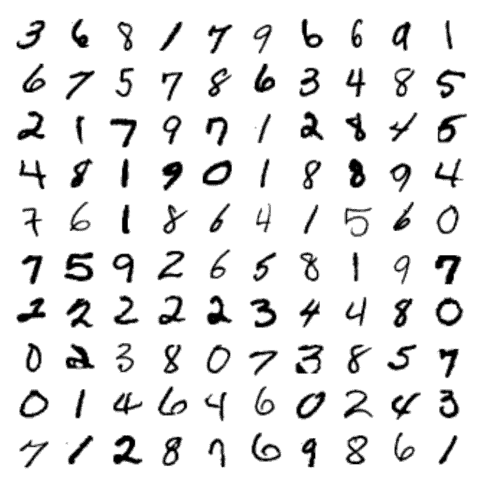

/ [Home](index.md)

# MNIST dataset

The MNIST(Modified National Institute of Standards and Technology database) dataset is a huge dataset of handwritten digits. It is commonly used to train image processing systems and machine learning models.

It was created using the original NIST datasets by normalizing the black and white images to fit in 28x28 pixel bounding box and anti-aliased it, thus creating gray-scale levels. MNIST has 60,000 training images and 10,000 training images.

 

**Created by Santhosh Kannan**

---

 
