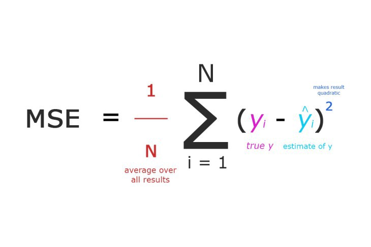

/ [Home](index.md)

# MSE 

“Mean squared error” is used for regression problems. It essentially finds the average squared error between the predicted and actual values. 

Eg:
We have a regression model which predicts the price of houses in Seattle area (show them with ŷᵢ), and let’s say for each house we also have the actual price the house was sold for (denoted with yᵢ). Then the MSE can be calculated as:

 

 

