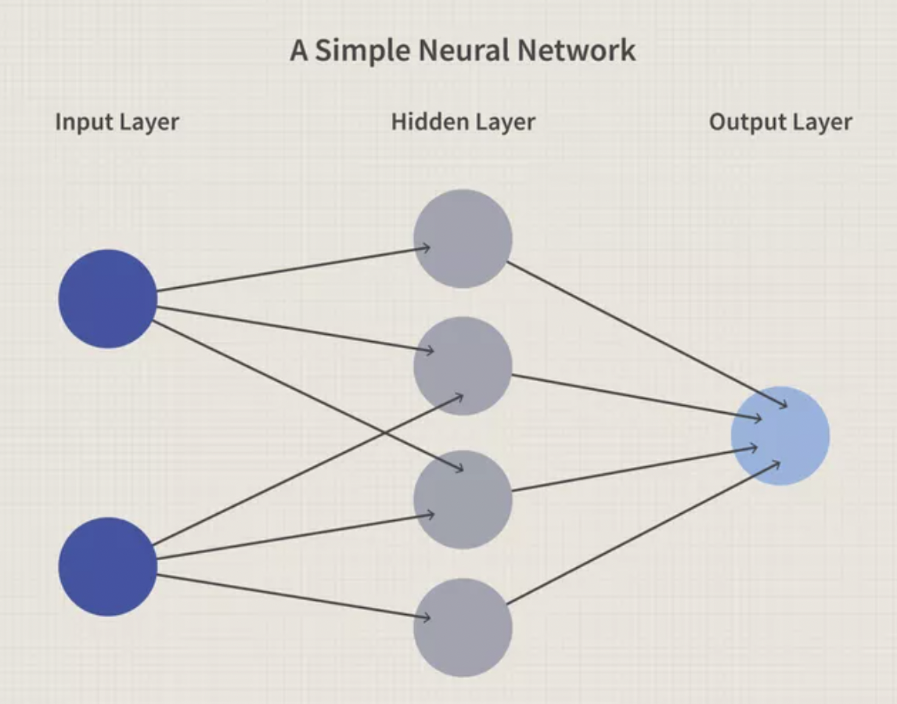

/ [Home](index.md)

# Neural Networks

Neural networks, also known as artificial neural networks (ANNs) or simulated neural networks (SNNs), are a subset of machine learning and are at the heart of deep learning algorithms. Their name and structure are inspired by the human brain, mimicking the way that biological neurons signal to one another. Neural networks can adapt to changing input; so the network generates the best possible result without needing to redesign the output criteria.

 

 
