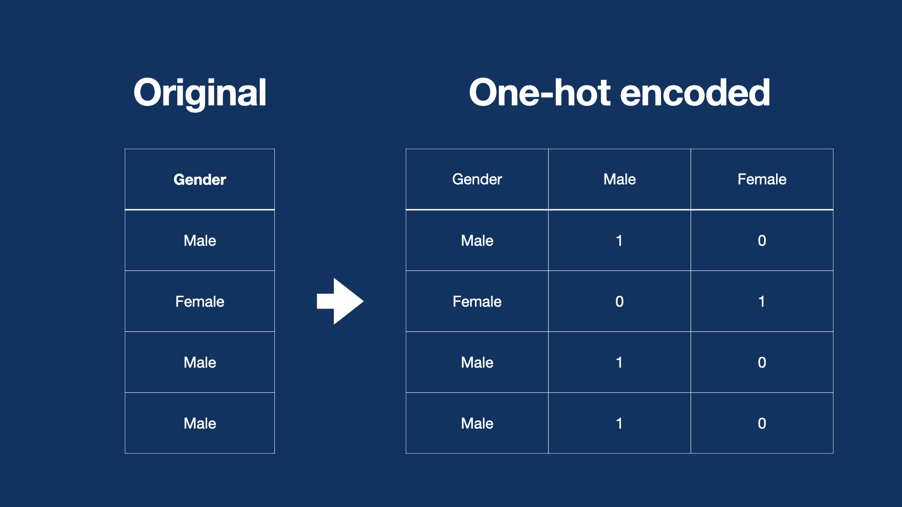

/ [Home](index.md)

# One-hot encoding

One-hot encoding is a method used to represent categorical data in form of binary vectors. A binary vector is a vector in which all values in the vector are zero except for the category of the vector, which would be one.

 

Advantages:

- Better deal with categorical data
- Possibly increase the number of features

Disadvantages:

- In NLP, it disregards the sequence of words
- assumes that features are independent which is not always true
- data can be extremely sparse after conversion

**Created by Santhosh Kannan**

---

 
