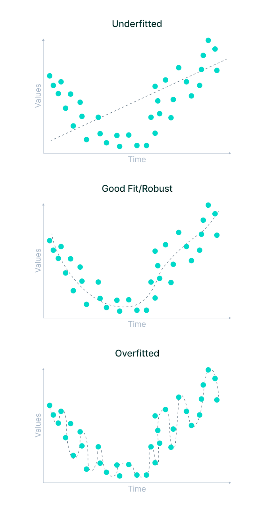

/ [Home](index.md)

# Overfitting 

Overfitting is in which a model tries to fit the training data entirely and ends up memorizing the data patterns and the noise/random fluctuations. These models fail to generalize and perform well in the case of unseen data scenarios, defeating the model's purpose.

For overfitting, Training error will be small and Model’s accuracy will be high. Test error will be high.

 

 