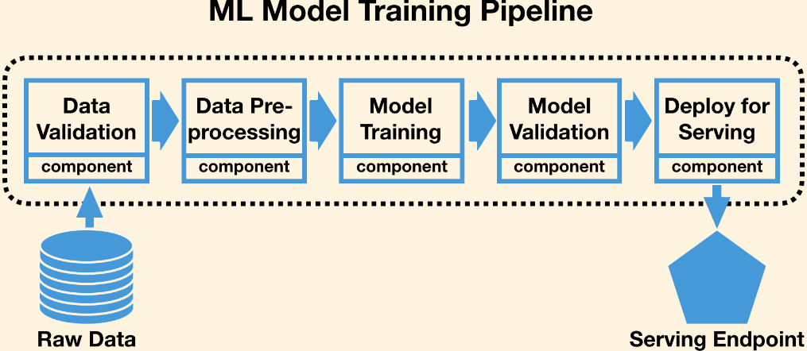

/ [Home](index.md)

# Pipelines

ML pipelines are used to build a workflow that connects various ML phases.

By tracking ML pipelines we can check how our model is performing and to data drift can be detected.

It automates the phases of ML by automating the workflow itself.

 

 

These pipelines are iterative as every single step is repeated to improve the accuracy of the model. 

The main objective of having a pipeline for any ML model is to gain  control over the model. 

A well-organised pipeline makes the model implementation more flexible.

They are not unidirectional. They are cyclic and the pattern of steps keep iterating throughout the implementation.

 

**Created by Snekha**

---

 
