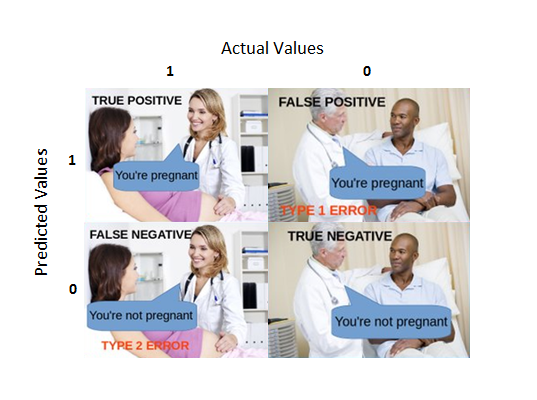

/ [Home](index.md)

# Posible outcomes in Classification Problem

## True Positive
True Positive (TP) tells us how many times a model correctly classifies a positive sample as Positive.

## False Positive
False Positive (FP) tells us how many times a model incorrectly classifies a negative sample as Positive.

## False Negative
False Negative (FN) tells us how many times a model incorrectly classifies a positive sample as Negative.

## True Negative
True Negative (TN) tells us how many times a model correctly classifies a negative sample as Negative

 

 