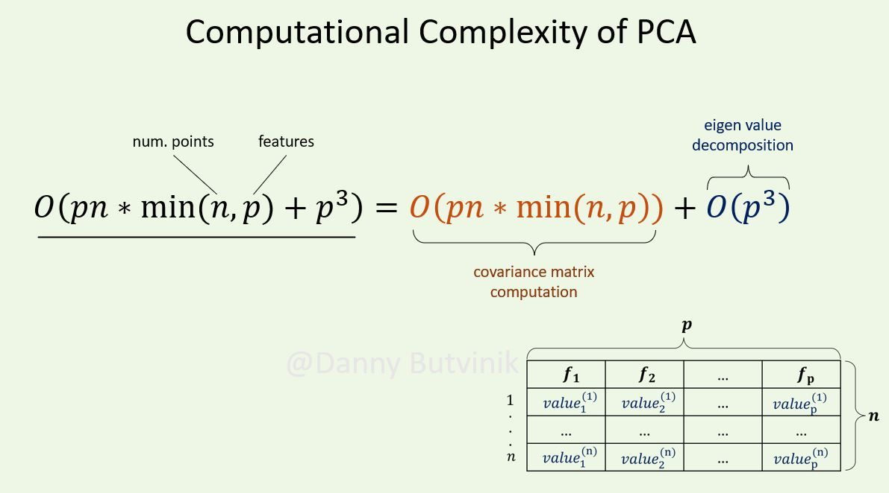

/ [Home](index.md)

# Principal Component Analysis

Principal Component Analysis(PCA) is a statistical method used to reduce the dimensionality of large data sets, by transforming a large set of variables into a smaller one that still has most of the information from the large set.

Reducing the number of variables in a data set results in decrease in accuracy, but the trick in dimensionality reduction is to trade a little accuracy for simplicity. Smaller data sets are easier to understand and visualize and make analyzing data much easier and faster.

 

**Created by Santhosh Kannan**

---

 

In data science and machine learning, Principal Component Analysis (PCA) is an unsupervised linear dimensionality reduction and data visualization technique for high-dimensional data.

PCA is a method that uses simple matrix operations from linear algebra and statistics to figure out how to project the original data into the same number of dimensions or fewer dimensions.

Also, because it is hard to learn anything from high-dimensional data, it takes a lot of processing power.

---

 