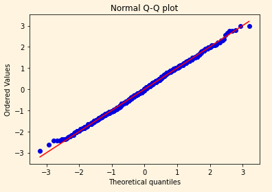

/ [Home](index.md)

# Quantile

From statistics and probability, quantiles are the points dividing the range of a probability data distribution into continuous intervals with equal probabilities.

Some special quantiles are 

* Quartiles (four groups)
* Deciles (ten groups)
* Percentiles (100 groups)

In machine learning, each bucket in quantile bucketing are termed as quantile.

Distributing values into buckets so that each bucket contains the same number of examples of a feature is called quantile bucketing.

The quantile-quantile plot is the graphical method for finding whether two samples of data came from the same population or not.

 

 

A q-q plot is a plot of the quantiles of the first data set against the quantiles of the second data set.

 

**Created by Snekha**

---

 