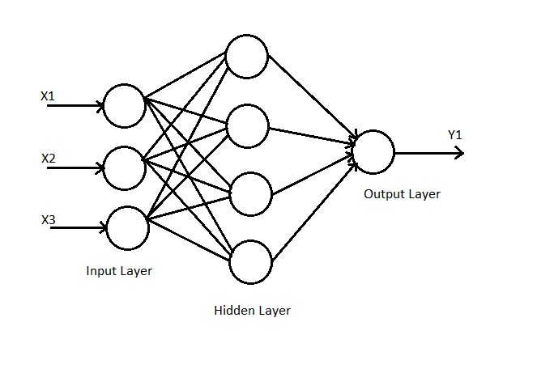

/ [Home](index.md)

# Radial Basis Function(RBF) Neural Networks

Radial Basis Function(RBF) Neural Networks are 3 layer Neural Networks. They have an input layer, a hidden layer, and output layer. The number of neurons in the hidden layer is always greater than the neurons in input layer. This is done to increase the data's dimensionality, which makes it possible for the Neural Network to separate linearly non-separable data. Each neuron in the hidden layer computes a value via the Radial Basis(Gaussian) Function.

 

**Created by Santhosh Kannan**

---

 
