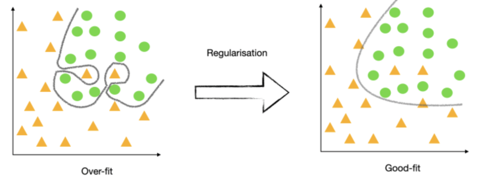

/ [Home](index.md)

# Regularization

Regularization is a technique to prevent the model from overfitting. Regularization is the process to simplify the resulted answer. Using Regularization, we can fit our machine learning model appropriately on a given test set and hence reduce the errors in it. 

There are two main types of regularization techniques: 
* Ridge Regularization
* Lasso Regularization

 

 