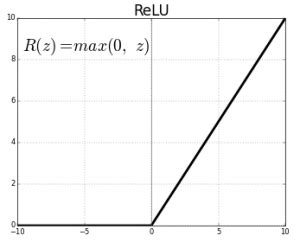

/ [Home](index.md)

# Rectified Linear Unit(ReLU)

ReLu is a non-linear activation function that is used in multi-layer neural networks or deep neural networks.

Here, R(z) is the ReLU activation function and z is the input variable.

Advantages

- Computation saving: the ReLu function is able to accelerate the training speed of deep neural networks compared to traditional activation functions like sigmoid functions since the derivative of ReLu is 1 for a positive input. Due to a constant, deep neural networks do not need to take additional time for computing error terms during training phase.

Disadvantages

- when input values are negative or approaching zero, the gradient of the function is zero. In such cases, backpropagation is not possible.

 

**Created by Santhosh Kannan**

---

 
