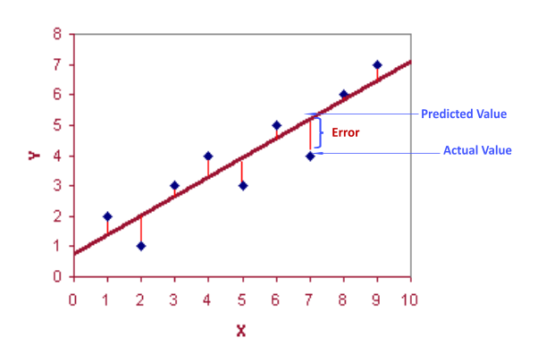

/ [Home](index.md)

# RMSE

Root Mean Square Error is the measure of how well a regression line fits the data points. RMSE can also be construed as Standard Deviation in the residuals. 

 

 

RMSE is NOT scale invariant and hence comparison of models using this measure is affected by the scale of the data. For this reason, RMSE is commonly used over standardized data.
RMSE represents the square root of the variance of the residuals.

 

 

The RMSE is particularly useful for comparing the fit of different regression models. The error for RMSE is given in terms of the target, whilst MSE is not