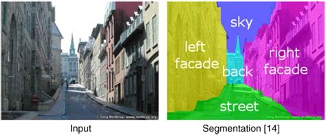

/ [Home](index.md)

# Semantic Segmentation

Semantic Segmentation is the technique of detecting, segmenting, and classifying every individual object in an image. It does not distinguish between different instances of the same class, giving all a single label. Semantic segmentation uses encoder-decoder method to classify objects in images.

 

**Created by Santhosh Kannan**

---

 
