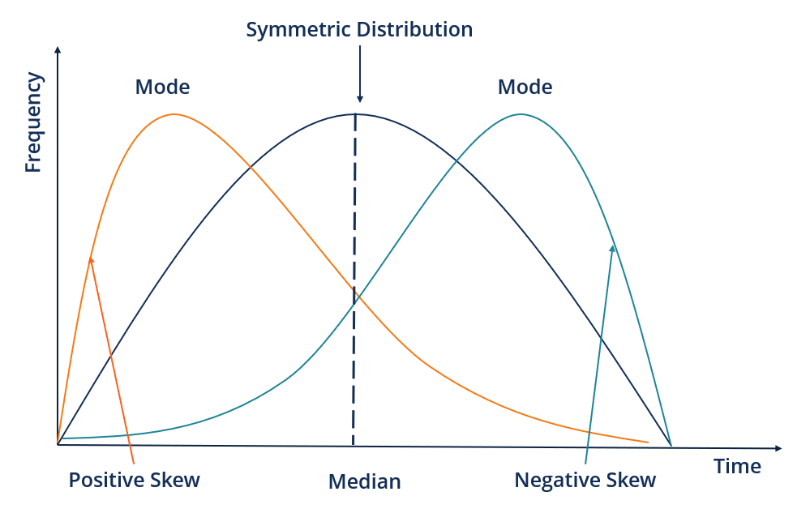

/ [Home](index.md)

# Skewness

Skewness is a quantifiable measure of how distorted a data sample is from the normal distribution. In normal distribution, the data is represented graphically in a bell-shaped curve, where the mean (average) and mode (maximum value in the data set) are equal. A normal distribution is without any skewness, as it is symmetrical on both sides.

 

 

Types of Skewness
* Positive Skewness
* Negative Skewness
