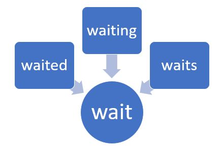

/ [Home](index.md)

# Stemming 

Stemming is the process of reducing a word to its stem or root format. Let us take an example. Consider three words, “branched”, “branching” and “branches”. They all can be reduced to the same word “branch”. After all, all the three convey the same idea of something separating into multiple paths or branches. Again, this helps reduce complexity while retaining the essence of meaning carried by these three words.

 

 