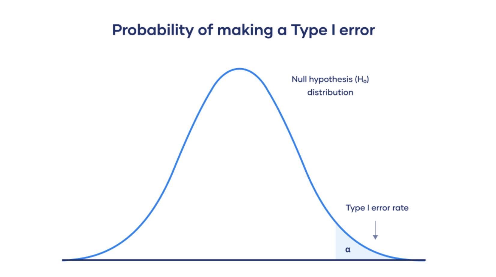

/ [Home](index.md)

# Type I Error 

 

 

A Type I error means rejecting the null hypothesis when it’s actually true. It means concluding that results are statistically significant when, in reality, they came about purely by chance or because of unrelated factors.

 

 

