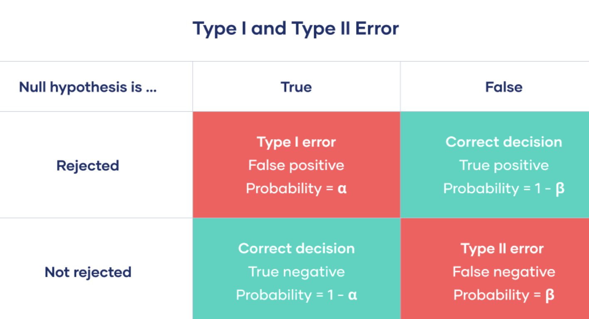
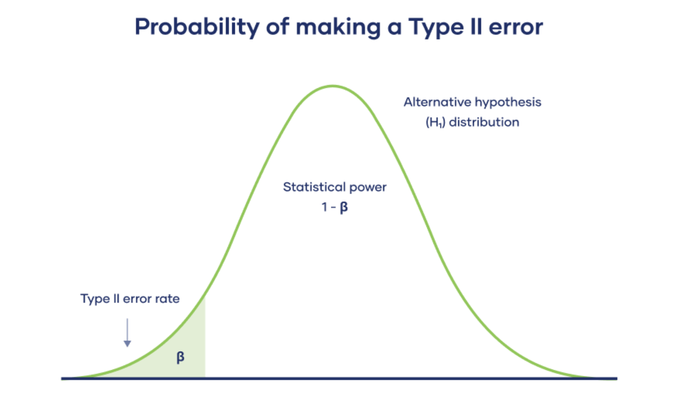

/ [Home](index.md)

# Type II Error 

 

 

A Type II error means not rejecting the null hypothesis when it’s actually false. 

This is not quite the same as "accepting" the null hypothesis, because hypothesis testing can only tell you whether to reject the null hypothesis.

Instead, a Type II error means failing to conclude there was an effect when there actually was. 

In reality, your study may not have had enough statistical power to detect an effect of a certain size.

 

 

The Type I and Type II error rates influence each other. That’s because the significance level (the Type I error rate) affects statistical power, which is inversely related to the Type II error rate.

